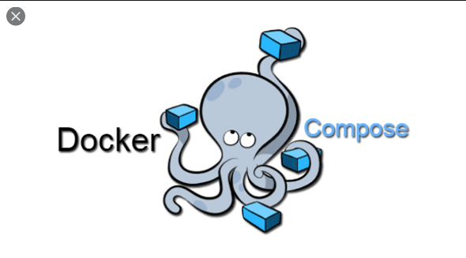
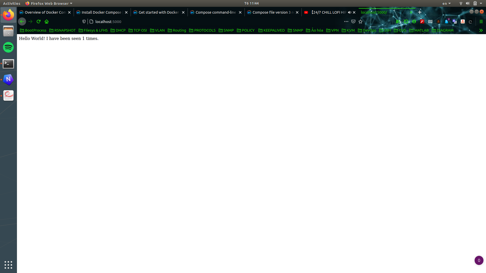

# Docker-Compose




**Mục lục**
- [Docker-Compose](#docker-compose)
- [1. Tổng quan về Docker Compose](#1-tổng-quan-về-docker-compose)
- [2. Cú pháp trong file Docker Compose](#2-cú-pháp-trong-file-docker-compose)
    - [build](#build)
    - [restart](#restart)
    - [environment](#environment)
    - [depends_on](#depends_on)
    - [container_name](#container_name)
- [3. Các lệnh với Docker Compose](#3-các-lệnh-với-docker-compose)
    - [Kiểm tra phiên bản của Docker Compose](#kiểm-tra-phiên-bản-của-docker-compose)
    - [Kiểm tra file cấu hình Docker Compose](#kiểm-tra-file-cấu-hình-docker-compose)
    - [Thực hiện Build lại cấu hình của Service](#thực-hiện-build-lại-cấu-hình-của-service)
- [4. Ứng dụng sử dụng Flask và Redis với Docker Compose](#4-ứng-dụng-sử-dụng-flask-và-redis-với-docker-compose)
- [5. Ứng dụng xây dựng ứng dụng Wordpress và Redis với Docker](#5-ứng-dụng-xây-dựng-ứng-dụng-wordpress-và-redis-với-docker)
- [6. Xây dựng LEMP Stack](#6-xây-dựng-lemp-stack)
  - [Tạo file `index.php` cho dịch vụ php](#tạo-file-indexphp-cho-dịch-vụ-php)
  - [Tạo file cấu hình cho Nginx](#tạo-file-cấu-hình-cho-nginx)
  - [Tạo Dockerfile cho dịch vụ Php](#tạo-dockerfile-cho-dịch-vụ-php)
  - [Tạo file Docker Compose](#tạo-file-docker-compose)

# 1. Tổng quan về Docker Compose

Docker Compose là một công cụ cho phép chúng ta thực hiện tạo ra một cụm các Container (Multi-Container)  hoạt động với nhau để chạy 1 ứng dụng và các tài nguyên của ứng dụng này sẽ được Docker Compose quản lý ( Network, Cơ sở dữ liệu ... )

Docker Compose được ứng dụng trong nhiều giai đoạn khác nhau của Workflow như Dev stage, Test stage , ...

Docker Compose hoạt động dựa trên 3 bước cơ bản là :

1. Tạo ra một file Dockerfile → Đảm bảo ứng dụng của bạn có thể sử dụng tại bất cứ đâu
2. Tạo ra một file Docker Compose trong đó định nghĩa các service và các thông số của service để giúp cho hệ thống hoạt động
3. Sử dụng lệnh `docker-compose up` để khởi động ứng dụng hay cụm Container này lên

Các ứng dụng của Docker Compose :

- Cho phép tạo ra các môi trường độc lập với nhau trên cùng 1 Host
- Lưu trữ lại các dữ liệu của Container ngay cả khi Container Exit
- Khi tiến hành Reboot Cluster thì chỉ tạo lại các Container đã bị thay đổi ( như là bị remove ), còn đối với các Container thì sẽ tiến hành sử dụng luôn

Để cài đặt Docker Compose ta thực hiện như sau

```bash
# Tải phiên bản ổn định ( Stable ) của Docker Compose về
sudo curl -L "https://github.com/docker/compose/releases/download/1.27.4/docker-compose-$(uname -s)-$(uname -m)" -o /usr/local/bin/docker-compose
# Cấp quyền cho Docker Compose
sudo chmod +x /usr/local/bin/docker-compose
# Kiểm tra lại việc cài đặt
$ docker-compose --version
docker-compose version 1.27.4, build 1110ad01
```

# 2. Cú pháp trong file Docker Compose

### build

Các thiết lập cấu hình khi thực hiện Build Image `build: <path-to-docker-file>`:

```bash
version: "3.9"
service:
  web:
    build: .
# Hoac su dung
#   build:
#     context: . # Đường dẫn thực hiện Build
#     dockerfile: dockerfilev1 # Dockerfile được chỉ định build
#     arg: # giá trị các biến môi trường khi thực hiện Build 
#       buildno: 1 # Đánh số phiên bản 
```

### restart

Định nghĩa chính sách thực hiện khi Container Exit

```bash
restart: "no" # Không thực hiện việc Restart Container
restart: always # Luôn thực hiện Restart Container
restart: on-failure # Chỉ thực hiện Restart Container khi Container gặp lỗi
restart: unless-stopped # Thực hiện Restart Container, không thực hiện Container gặp lệnh Stop
```

### environment

Các biến môi trường được sử dụng, nhập theo cú pháp như sau :

```bash
environment:
  USER: Tuan-Anh # Biến môi trường USER có giá trị là Tuan-Anh
  PASSWORD: word1234 # Biến môi trường PASSWORD có giá trị là word1234
```

Nếu muốn sử dụng với `build` thì cần thực hiện sử dụng định nghịa biến môi trường với `arg`

```bash
service:
  redis: # Dịch vụ Redis
    image: redis # Tải Image redis:latest
  db: # Dịch vụ Database
    image: postgres # Tải Image postgres:latest
  web: # Dịch vụ Web
    depends_on: # Khởi động sau các dịch vụ 
      - db
      - redis

```

### depends_on

Do một số loại dịch vụ khi thực hiện khởi động thì cần một số các dịch vụ khác trong cụm Multi-Container khởi động trước để đảm bảo hệ thống hoạt động trơn tru với nhau. Ví dụ:

```bash
nginx: # dịch vụ Nginx
    depends_on: # sẽ phụ thuộc vào ~ Sẽ khởi động sau 
      - php # Dịch vụ Php
```

→ Khi khởi động dịch vụ `nginx` thì nó sẽ khởi động dịch vụ `php` trước

### container_name

Đặt tên cho Container khi nó được khởi động với Docker Compose:

```bash
nginx: # Dịch vụ Nginx
    container_name: lemp-nginx # Tên của Container sau khi khởi động
```

→ Container sau khi khởi động sẽ có tên là `lemp-nginx` 

Một số lệnh khác tham khảo tại : [Docker Document](https://docs.docker.com/compose/compose-file/)

# 3. Các lệnh với Docker Compose

### Kiểm tra phiên bản của Docker Compose

```bash
(19:19:15) ○ [root@ubun-server-2] ~
→ docker-compose version # Câu lệnh kiểm tra phiên bản
docker-compose version 1.27.4, build 40524192
docker-py version: 4.3.1
CPython version: 3.7.7
OpenSSL version: OpenSSL 1.1.0l  10 Sep 2019
```

### Kiểm tra file cấu hình Docker Compose

```bash
(19:20:14) ○ [root@ubun-server-2] ~/dock-comp
→ docker-compose config # Câu lệnh kiểm tra cấu hình
services:
  db:
    image: redis
    restart: always
  wordpress:
    image: wordpress:latest
    ports:
    - published: 8000
      target: 80
    restart: always
version: '3.9'
```

Nếu có lỗi trong file cấu hình thì sẽ nhận được kết quả

```bash
(19:21:50) ○ [root@ubun-server-2] ~/dock-comp
→ docker-compose config
ERROR: The Compose file './docker-compose.yml' is invalid because:
Unsupported config option for service: 'wordpress'
```

### Thực hiện Build lại cấu hình của Service

Đối với các Service không sử dụng Image mà tiến hành Build từ đầu, thì chúng ta có thể sử dụng lệnh `docker-compose build <Tên-Service>` để Build lại Service trong trường hợp có thay đổi trong Dockerfile

```bash
(19:31:15) ○ [root@ubun-server-2] ~/build-dck
→ docker-compose build ubun
Building ubun
Step 1/3 : FROM ubuntu
 ---> f643c72bc252
Step 2/3 : RUN apt-get update
 ---> Using cache
 ---> 52d00c6ced8a
Step 3/3 : CMD ["echo", "Hello World]
 ---> Using cache
 ---> 2e79b5613cd2

Successfully built 2e79b5613cd2
Successfully tagged build-dck_ubun:latest
```

Tuy nhiên sẽ gặp lỗi nếu đối tượng được Build sử dụng Image :

```bash
(19:26:04) ○ [root@ubun-server-2] ~/dock-comp
→ docker-compose build db
db uses an image, skipping
```

# 4. Ứng dụng sử dụng Flask và Redis với Docker Compose

Đầu tiên, như đã nêu ở phần 1, chúng ta cần tọa 1 Docker File để đảm bảo việc triển khai hệ thống tại các host khác nhau. Nhưng trước hết chúng ta sẽ tạo 1 file Python để đếm số lần trang được truy cập có nội dung như sau :

```jsx
import time

import redis
from flask import Flask

app = Flask(__name__)
cache = redis.Redis(host='redis', port=6379)

def get_hit_count():
    retries = 5
    while True:
        try:
            return cache.incr('hits')
        except redis.exceptions.ConnectionError as exc:
            if retries == 0:
                raise exc
            retries -= 1
            time.sleep(0.5)

@app.route('/')
def hello():
    count = get_hit_count()
    return 'Hello World! I have been seen {} times.\n'.format(count)
```

 Tiếp theo tạo 1 file tên là `req.txt` chứa nội dung như sau :

```jsx
flask 
redis
```

Sau đó chúng ta cần tạo 1 Dockerfile :

```jsx
# Thuc hien su dung Image Python 3.7
FROM python:3.7-alpine 
# Chuyen duong dan lam viec sang /code
workdir /code 
# Thiet lap cac bien moi truon
ENV FLASK_APP=app.py 
ENV FLASK_RUN_HOST=0.0.0.0 
# Them cac Lib va Dependencies
RUN apk add --no-cache gcc musl-dev linux-headers
# Copy file req.txt vao /code
COPY req.txt req.txt 
# Cai dat Flask va Redis
RUN pip install -r req.txt
# Lang nghe tren Port 5000
EXPOSE 5000 
# Them cac file o thu muc chua Dockerfile vao /code
ADD . .  
# Command mac dinh
CMD ["flask", "run"]
```

Sau đó tạo 1 file `docker-compose.yml`

```jsx
version: "3.9" # su dung phien ban compose 3.9
services: # tien hanh dinh nghia cac service 
  web: # service web
    build: . # Cac Config duoc thuc hien khi tien hanh build. Tien hanh build tu duong dan hien tai
    ports: # Map port 
      - "5000:5000" # Map port 5000 cua host OS toi port 5000 cua service container
    volumes: 
      - .:/code # Bind Mount thu muc hien tai vao /code
    environment:
      FLASK_ENV: development
  redis: # service redis
    image: "redis:alpine" # Define phien ban redis su dung
```

Sau dó sử dụng câu lệnh `docker-compose up -d` để chạy cụm Container này 

```bash
(11:41:28) ○ [root@ubuntu] ~/test-docker 
→  docker-compose up -d
Creating test-docker_web_1   ... done
Creating test-docker_redis_1 ... done
```

*Ta sử dụng Option -d dể chạy Container ở Background*

Như vậy, sau khi hệ thống này hoạt động thì ta sẽ truy cập vào `[localhost:5000](http://localhost:5000)` ( Port EXPOSE trong dockerfile ) và nhận được kết quả sau



***→ Như vậy chúng ta đã thành công trong việc chạy 1 App sử dụng Flask và Redis***

# 5. Ứng dụng xây dựng ứng dụng Wordpress và Redis với Docker

Ở phần này chúng ta sẽ xây dựng 1 cụm Multi-Container sử dụng 2 Image là `wordpress` và `redis` để thực hiện chạy Wordpress

Quá trình khởi tạo như sau 

```bash
(20:39:08) ○ [root@ubun-server-2] ~
→ mkdir dock-comp
(20:39:08) ○ [root@ubun-server-2] ~
→ cd dock-comp/
(20:39:24) ○ [root@ubun-server-2] ~/dock-comp
→ nvim docker-compose.yml

```

Thực hiện chỉnh sửa nội dung như sau 

```bash
services: # Liệt kê các Service 
  db: # service db sử dụng redis
    image: redis # Tải phiên bản mới nhất của Image Redis
    restart: always # Thực hiện Restart Container mỗi khi Container này Exit
  wordpress: # Service Wordpress
    image: wordpress:latest # Tải phiên bản mới nhất của Image Wordpress
    ports:
      - "8000:80" # Mapping port 8000 của host với port 80 của Container
    restart: always # Thực hiện Restart Container mỗi khi Exit
```

Nhận được kết quả tương tự như sau :

```bash
...
c344123e6ac3: Pull complete
Digest: sha256:6cd92cb2791600e6e3c760c6b5c9adf5a7fc908c693876e7584ab4493292f1e1
Status: Downloaded newer image for wordpress:latest
Creating dock-comp_wordpress_1 ... done
Creating dock-comp_db_1        ... done
```

Khi liệt kê các Container đang hoạt động :

```bash
(20:41:39) ○ [root@ubun-server-2] ~/dock-comp
→ docker ps -a
CONTAINER ID        IMAGE               COMMAND                  CREATED             STATUS                    PORTS                  NAMES
4564dc90e7a8        redis               "docker-entrypoint.s…"   10 minutes ago      Up 10 minutes             6379/tcp               dock-comp_db_1
d0ee2182a846        wordpress:latest    "docker-entrypoint.s…"   10 minutes ago      Up 10 minutes             0.0.0.0:80
```

Và khi truy cập địa chỉ của Host tại port 8000 ta nhận được 


# 6. Xây dựng LEMP Stack


Chúng ta thực hiện xây dựng LEMP ( Linux - Nginx - Mariadb - Php ) Stack với 3 thành phần sau :

1. Nginx phiên bản mới nhất từ Docker Hub
2. Mariadb phiên bản 10.3.9
3. Php -fpm phiên bản 7.2

Đầu tiên chúng ta tạo 1 đường dẫn tên là `lemp-stack-dckcmp` để chứa các file cấu hình cho Docker Compose 

```bash
(09:03:24) ○ [root@ubuntu] ~ 
→ mkdir lemp-stack-dckcmp
```

## Tạo file `index.php` cho dịch vụ php

```bash
(09:03:45) ○ [root@ubuntu] ~/lemp-stack-dckcmp 
→ mkdir app/
(09:04:08) ○ [root@ubuntu] ~/lemp-stack-dckcmp/app 
→ nvim index.php
```

→ Sau đó thực hiện chỉnh sửa file với nội dung như sau 

```bash
<?php

$magicNumbers = [
    rand(0, 100),
    rand(100, 200),
    rand(0, 1000),
];

?>
<!DOCTYPE html>
<html>
    <head>
        <meta name="author" content="Steven Liebregt" />
        <title>Hello, world!</title>
        <style>
            table, th, td {
                border: 1px solid black;
                border-collapse: collapse;
            }
        </style>
    </head>
    <body>
        <h1>Hello, world!</h1>
        <p>Your magic numbers are:</p>
        <table>
            <tr>
                <th>#</th>
                <th>Number</th>
            <tr>
            <?php foreach ($magicNumbers as $index => $number): ?>
                <tr>
                    <td><?php echo $index; ?></td>
                    <td><?php echo $number; ?></td>
                </tr>
            <?php endforeach; ?>
        </table>
        <p>If you can see this properly, then it means PHP is working fine.</p>
    </body>
</html>
```

## Tạo file cấu hình cho Nginx

```bash
(09:05:21) ○ [root@ubuntu] ~/lemp-stack-dckcmp 
→ mkdir -p config/nginx
(09:05:37) ○ [root@ubuntu] ~/lemp-stack-dckcmp/config/nginx 
→ nvim nginx.conf
```

Chỉnh sửa file cấu hình này như sau 

```bash
server { # Cấu hình cho web Server
    index index.php index.html; # Các file Index mặc định của Web
    server_name localhost; # Tên của Server để sau này có thể truy cập
    error_log  /var/log/nginx/error.log; # Nơi lưu các Error Log
    access_log /var/log/nginx/access.log; # Nơi lưu các Access Log
    root /var/www/html; # Đường dẫn mặc định của Web Server

    location / { # Thực hiện cấu hình cho URI localhost/
        try_files $uri $uri/ /index.php$is_args$query_string;
        fastcgi_split_path_info ^(.+\.php)(/.+)$;
        fastcgi_pass php:9000; # Chuyển tiếp cho dịch vu php tại port 9000
        fastcgi_index index.php;
        include fastcgi_params;
        fastcgi_param SCRIPT_FILENAME $document_root$fastcgi_script_name;
        fastcgi_param PATH_INFO $fastcgi_path_info;
    }
}
```

## Tạo Dockerfile cho dịch vụ Php

```bash
(09:15:21) ○ [root@ubuntu] ~/lemp-stack-dckcmp 
→ mkdir -p docker
(09:15:21) ○ [root@ubuntu] ~/lemp-stack-dckcmp 
→ cd docker/
(09:16:09) ○ [root@ubuntu] ~/lemp-stack-dckcmp/docker 
→ nvim php.lemp
```

Chỉnh sửa theo nội dung

```bash
# Từ Image php phiên bản 7.2
FROM php:7.2-fpm
# Chạy các lệnh dưới
RUN apt-get update &&\
    apt-get install -y git zip
RUN curl --silent --show-error https://getcomposer.org/installer | php && \
    mv composer.phar /usr/local/bin/composer
```

## Tạo file Docker Compose

```bash
(09:19:01) ○ [root@ubuntu] ~/lemp-stack-dckcmp 
→ ls
app  config  docker  docker-compose.yml
(09:19:01) ○ [root@ubuntu] ~/lemp-stack-dckcmp 
→ nvim docker-compose.yml
```

Thêm vào file nội dung như sau:

```bash

services: # Định nghĩa các dịch vụ 
  php: # Dịch vụ Php
    build: # Tiến hành build dịch vụ 
      context: ./docker # Dockerfile được chứa tại đường dẫn
      dockerfile: php.lemp # Tên của Dockerfile
    container_name: lemp-php # Tên của Container sau khi khởi tạo 
    volumes: # Thực hiện Bind mount giữa Host và Container 
      - ./app:/var/www/html # Ánh xạ đường dẫn ./app vào trong đường dẫn /var/www/html
  nginx: # Dịch vụ nginx
    image: nginx:latest # Sử dụng Image mới nhất từ DockerHub
    container_name: lemp-nginx # Tên cảu Container
    ports: # Thực hiện Bind Port
      - 8080:80 # Map port 8080 của Host OS với Port 80 của Container
    depends_on: # Dịch vụ này được liên kết với dịch vụ Php
      - php
    restart: always # Luôn khởi dộng lại khi Container Exit
    volumes: # Thực hiện Bind mount giữa Host và Container 
      - ./app:/var/www/html
      - ./config/nginx:/etc/nginx/conf.d
  mysql: # Dich vu Mariadb
    image: mariadb:10.3.9 # Sử dụng Image Mariadb phiên bản 10.3.9
    container_name: lemp-mariadb # Tên của Container sau khi khởi động
    restart: always  # Luôn khởi động lại khi Exit
    environment: # Định nghĩa biến môi trường
      MYSQL_ROOT_PASSWORD: mariadb
    volumes: # Các dữ liệu của Mariadb sẽ được lưu tại đường dẫn hiện tại ( ~/lemp-stack-dckcmp )
      - ${PWD}
```

Sau khi thực hiện tạo file thì khởi động cụm Multi-Container này lên 

```bash
(09:28:13) ○ [root@ubuntu] ~/lemp-stack-dckcmp 
→ docker-compose up -d --build
Building php
Step 1/3 : FROM php:7.2-fpm
 ---> 28f52b60203d
Step 2/3 : RUN apt-get update &&    apt-get install -y git zip
 ---> Using cache
....
```

Sau đó kiêm tra lại 

```bash
(09:28:28) ○ [root@ubuntu] ~/lemp-stack-dckcmp 
→ docker ps -a
CONTAINER ID        IMAGE                   COMMAND                  CREATED             STATUS              PORTS                  NAMES
a27e28ff99f1        nginx:latest            "/docker-entrypoint.…"   37 minutes ago      Up 37 minutes       0.0.0.0:8080->80/tcp   lemp-nginx
d1a9d88a0584        lemp-stack-dckcmp_php   "docker-php-entrypoi…"   37 minutes ago      Up 37 minutes       9000/tcp               lemp-stack-dckcmp_php_1
4ce86e208d8b        mariadb:10.3.9          "docker-entrypoint.s…"   37 minutes ago      Up 37 minutes       3306/tcp               lemp-mariadb
```

→Qúa trình khởi tạo đã thành công

Thực hiện truy cập địa chỉ `[localhost:8080](http://localhost:8080)` và nhận được kết quả sau 


→ Quá trình thử nghiệm đã thành công !