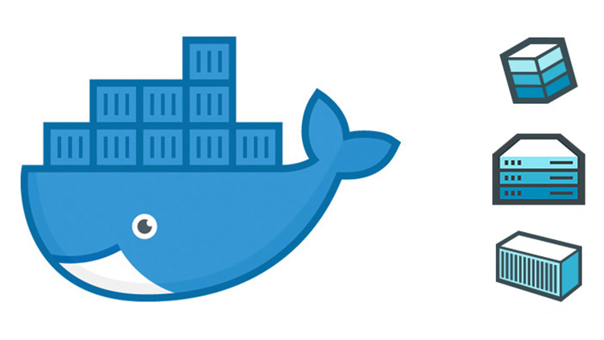

# Docker-Monitor



Sau khi đã biết các lệnh để tạo, chạy, dừng các Container. Tiếp theo chúng ta sẽ cần phải giám sát các Container này. 

**Mục lục**
- [Docker-Monitor](#docker-monitor)
- [1. Thực hiện xem các lệnh cấu thành Image](#1-thực-hiện-xem-các-lệnh-cấu-thành-image)
- [2. Xem các thông tin về Container](#2-xem-các-thông-tin-về-container)
- [3. Xem Logs của Container](#3-xem-logs-của-container)
- [4. Xem các thay đổi trong các đường dẫn của Container](#4-xem-các-thay-đổi-trong-các-đường-dẫn-của-container)

# 1. Thực hiện xem các lệnh cấu thành Image

Do về cơ bản, Container chỉ là một Image đang chạy ( running ), vậy nên chúng ta cần phải biết được trong quá trình khởi tạo thì Image đã thực hiện những thay đổi nào. Ta sẽ sử dụng lệnh sau để xem :

```bash
(20:43:53) ○ [root@ubun-server-2] ~
→ docker history busybox:latest
IMAGE               CREATED             CREATED BY                                      SIZE                COMMENT
219ee5171f80        6 days ago          /bin/sh -c #(nop)  CMD ["sh"]                   0B
<missing>           6 days ago          /bin/sh -c #(nop) ADD file:85e5bcb27fcc24f6a…   1.23MB
```

→ Các lệnh này được thực hiện theo thứ tự từ dưới lên trên. Với Image bussy box, đầu tiên sẽ thực hiện thêm File `85e5b...` sau đó chạy lệnh `sh` ( Theo chế độ mặc định ).

# 2. Xem các thông tin về Container

Việc xem cấu hình Container tương tự như khi xem cấu hình vủa Docker Volume hay Image `docker inspect <Container-ID/Container-Name>`:

```bash
(20:46:27) ○ [root@ubun-server-2] ~
→ docker ps -a
CONTAINER ID        IMAGE               COMMAND                  CREATED             STATUS                     PORTS               NAMES
5650a745e150        alpine              "/bin/sh"                12 hours ago        Exited (255) 3 hours ago                       host2
dddddefb10a6        nginx               "/docker-entrypoint.…"   6 days ago          Exited (137) 5 days ago                        nervous_margulis
b94b259099ce        nginx               "/docker-entrypoint.…"   6 days ago          Exited (0) 6 days ago                          boring_meitner
(20:46:29) ○ [root@ubun-server-2] ~
→ docker inspect  host2
[
    {
        "Id": "5650a745e150920215197cf1752e8673418a583a018d2b5903e2d8d68274d5a5",
        "Created": "2020-12-10T01:34:50.099639169Z",
        "Path": "/bin/sh",
        "Args": [],
        "State": {
            "Status": "exited",
            "Running": false,
            "Paused": false,
            "Restarting": false,
            "OOMKilled": false,
....
```

→ Kết quả nhận được sẽ là các thông số của Container 

Tuy nhiên, nếu bạn chỉ muốn xem các thông số về RAM,CPU,.. thì sẽ sử dụng lệnh `docker stats <Container-ID/Container-Name>`

```bash
(20:49:33) ○ [root@ubun-server-2] ~
→ docker stats 56
CONTAINER ID        NAME                CPU %               MEM USAGE / LIMIT     MEM %               NET I/O             BLOCK I/O           PIDS
5650a745e150        host2               0.00%               1.129MiB / 1.914GiB   0.06%               1.09kB / 0B         16.4kB / 0B         1     0
```

→ Container này có id `5650a745e150` sử dụng 0% CPU , ~1.1Mb bộ nhớ , ...

*Nếu bạn muốn liệt kê thông số của tất cả các Container thì sử dụng thêm option  `--all`* 

# 3. Xem Logs của Container

Để thực hiện xem các lệnh đã thực hiện bên trong Container ta sử dụng lệnh `docker logs <Container-ID/Container-Name>`:

```bash
(20:55:05) ○ [root@ubun-server-2] ~
→ docker logs 56
/ #
/ # cd /r
/bin/sh: cd: can't cd to /r: No such file or directory
/ # cd /root/
~ # ls
file-from-host-os
~ # touch hello
touch: hello: Read-only file system
```

→ Như vậy ta thu được kết quả là các Logs của 1 Container tương ứng.

# 4. Xem các thay đổi trong các đường dẫn của Container

Để xem các thay đổi trong cấu trúc thư mục của Container ta thực hiện lệnh 

```bash
(20:56:54) ○ [root@ubun-server-2] ~
→ docker diff boring_meitner
C /var
C /var/cache
C /var/cache/nginx
A /var/cache/nginx/client_temp
A /var/cache/nginx/fastcgi_temp
A /var/cache/nginx/proxy_temp
A /var/cache/nginx/scgi_temp
A /var/cache/nginx/uwsgi_temp
C /etc
C /etc/nginx
C /etc/nginx/conf.d
C /etc/nginx/conf.d/default.conf
```

Với `boring_meitner` là tên Container bạn muốn quan sát

Trong đó các chữ cái đầu tiên biểu diễn cho các thao tác :

- C : Đường dẫn hoặc file được cập nhật
- A : Đường dẫn hoặc file được thêm
- D : Đường dẫn hoặc file bị xóa

---