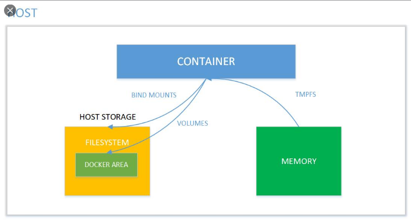

# Docker-volume



Volume là một cơ chế cho phép khắc phục nhược điểm của Container : Đó là khi Container chuyển trạng thái sang không hoạt động thì toàn bộ dữ liệu ghi trên Container cũng sẽ mất toàn bộ ( Unconsistent ) → Nhờ có Volume mà các dữ liệu trên Container sẽ được ghi ra tại một phân vùng trên Host OS → Có thể sử dụng lại dữ liệu này khi tạo 1 Container mới hoặc cũng có thể chia sẻ cho nhiều Container khác. 

**Mục Lục**
- [Docker-volume](#docker-volume)
- [1. Liệt kê các Docker Volume](#1-liệt-kê-các-docker-volume)
- [2. Tạo Docker Volume](#2-tạo-docker-volume)
- [3. Ánh xạ Volume Container (-v)](#3-ánh-xạ-volume-container--v)
- [4. Ánh xạ 1 Volume Container ( - -mount)](#4-ánh-xạ-1-volume-container-----mount)
- [5. Xóa các Volume không sử dụng](#5-xóa-các-volume-không-sử-dụng)

# 1. Liệt kê các Docker Volume

Để xem các Volume đang có trên hệ thống, ta sử dụng lệnh :

```bash
(08:11:17) ○ [root@ubun-server-2] ~
→ docker volume ls
DRIVER              VOLUME NAME
```

→ Như vậy, hiện tại chưa có Docker Volume nào

# 2. Tạo Docker Volume

Để khởi tạo 1 Volume dùng cú pháp sau `docker volume create <vol-name>` :

```bash
(08:11:20) ○ [root@ubun-server-2] ~
→ docker volume create 1st-vol
1st-vol
(08:13:05) ○ [root@ubun-server-2] ~
→ docker volume ls
DRIVER              VOLUME NAME
local               1st-vol
```

Nếu muốn xem các thông số của Volume này :

```bash
(08:15:46) ○ [root@ubun-server-2] ~
→ docker inspect 1st-vol
[
    {
        "CreatedAt": "2020-12-10T08:13:05+07:00",
        "Driver": "local",
        "Labels": {},
        "Mountpoint": "/var/lib/docker/volumes/1st-vol/_data",
        "Name": "1st-vol",
        "Options": {},
        "Scope": "local"
    }
]
```

→ Ta sẽ nhận được 1 số thông tin như ngày khởi tạo, Driver, đường dẫn, tên ,...

# 3. Ánh xạ Volume Container (-v)

Để khắc phục nhược điểm đã kể đến của Container, ta sẽ ánh xạ thư mục của Container sang 1 thư mục của Host OS. Ví dụ :

```bash
(08:24:43) ○ [root@ubun-server-2] ~/test/cont-data
→ touch file-from-host-os
(08:24:53) ○ [root@ubun-server-2] ~/test/cont-data
→ docker run -it --name host1 -v /root/test/cont-data/:/root/ alpine
/ # cd /root/
~ # ls
file-from-host-os
```

Đầu tiên ta tạo một file tên là `file-from-host-os` . Sau đó, ta sử dụng có pháp `docker run ..... -v <host-directory:container-directory> <image>` . Cuối cùng khi khởi tạo Container ta truy cập vào đường dẫn tương ứng và cũng đã có được file tương ứng từ Host OS. Lưu ý : Nếu không muốn Container thay đổi dữ liệu, ta thêm option `:ro` vào cuối câu lệnh. Như vậy, khi Container muốn ghi dữ liệu lên đường dẫn đã được chỉ định tại option `-v` thì sẽ gặp lỗi

```bash
~ # touch hello
touch: hello: Read-only file system
```

# 4. Ánh xạ 1 Volume Container ( - -mount)

Đầu tiên chúng ta tạo 1 Volume thông qua :

```bash
(19:54:22) ○ [root@ubun-server-2] ~
→ docker volume create 1st-vol
1st-vol
(19:54:29) ○ [root@ubun-server-2] ~
→ docker volume ls
DRIVER              VOLUME NAME
local               1st-vol
```

→ Như vậy ta đã có được 1 Volume, tiếp theo ta sẽ tạo 1 file trong Volume này để kiểm tra sau khi ánh xạ ( Mount ) vào container thì sẽ xuất hiện file này 

```bash
(19:59:17) ○ [root@ubun-server-2] ~
→ docker inspect 1st-vol
[
    {
        "CreatedAt": "2020-12-10T19:59:12+07:00",
        "Driver": "local",
        "Labels": {},
        "Mountpoint": "/var/lib/docker/volumes/1st-vol/_data",
        "Name": "1st-vol",
        "Options": {},
        "Scope": "local"
    }
]
(19:59:23) ○ [root@ubun-server-2] ~
→ cd /var/lib/docker/volumes/1st-vol/_data
(19:59:33) ○ [root@ubun-server-2] /var/lib/docker/volumes/1st-vol/_data
→ touch hello-from-host
```

Tiếp theo đó ta sẽ tạo 1 Container sử dụng Volume này 

```bash
(19:57:59) ○ [root@ubun-server-2] ~
→ docker run -it --mount source=1st-vol,target=/home/ alpine
(19:59:43) ○ [root@ubun-server-2] /var/lib/docker/volumes/1st-vol/_data
→ docker attach 9f
/ # cd /home/
/home # ls
hello-from-host
```

→ Như vậy việc ánh xạ đã thành công

# 5. Xóa các Volume không sử dụng

Để thực hiện điều này, ta sẽ sử dụng lệnh sau `docker volume prune`:

```bash
(20:02:31) ○ [root@ubun-server-2] /var/lib/docker/volumes/1st-vol/_data
→ docker volume prune
WARNING! This will remove all local volumes not used by at least one container.
Are you sure you want to continue? [y/N] y
Deleted Volumes:
1st-vol

Total reclaimed space: 0B
```

---