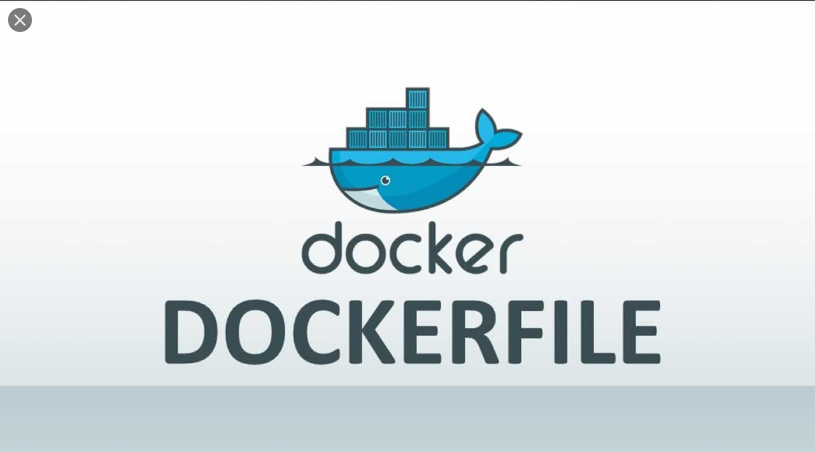

# Dockerfile



Trong quá trình sử dụng Docker, đôi khi chúng ta sẽ muốn thực hiện tạo 1 file Image của riêng mình trong đó có các thông số được thiết lập dựa trên trường hợp mong muốn. Docker hiểu được điều này và cung cấp cho người sử dụng một phương pháp để có thể dễ dàng xây dựng một Docker Image riêng thông qua cơ chế Dockerfile 

**Mục lục**


# 1. Các chỉ dẫn ( Instrucion ) trong Dockerfile

Dockerfile chỉ là 1 file text đơn giản cho phép người sử dụng xây dựng nên Image của riêng mình thông qua lệnh `dockerbuild` . Trong Dockerfile có các Instruction như sau :

### FROM

Đây là chỉ dẫn để chúng ta có được một Platform Image ( ~ Base Image )→ cho phép chúng ta xây dựng thêm các Image Layer ở trên. Ví dụ :

```bash
(05:04:19) ○ [root@ubun-server-2] ~/dockerfile
→ nvim Dockerfile
FROM ubuntu:latest
~
~
```

→ Chúng ta thực hiện tạo 1 Image trên nền Image đã có sẵn từ Dockerhub `ubuntu` phiên bản mới nhất

### RUN

Chỉ dẫn này sẽ giúp chúng ta thực hiện tạo thêm các Image Layer trong Image mới được tạo ra theo nhu cầu. Lưu ý: Vì mỗi khi chạy 1 chỉ dẫn RUN thì sẽ tạo nên 1 Image mới nên chúng ta nên hạn chế tối đa việc sử dụng Instruction này quá nhiều lần trong một Dockerfile mà nếu có thể thì nên kết hợp các câu lệnh khác nhau trong cùng một chỉ dẫn RUN. Ví dụ 

```bash
RUN apt-get update && \
apt-get install neovim -y && \
apt-get install net-tools -y
```

### ADD

Đây là loại chỉ dẫn giúp chúng ta thêm các file ở đường dãn hiện tại chứa Dockerfile và thêm vào trong Container

```bash
ADD . .
```

→ Ta sẽ thêm toàn bộ các file hiện tại trong đường dẫn chứa Dockerfile vào trong Container 

### EXPOSE

Đối với một số các Image nhất định thì cần phải thực hiện Mapping Port để có thể truy cập sử dụng Container ( Ví dụ như Nginx ). Chỉ dẫn này sẽ giúp cho cấu hình cho Container khi chạy sẽ lắng nghe trên Port được yêu cầu :

```bash
EXPOSE 80
```

→ Container khi chạy sẽ lắng nghe tại Port 80 

  

### ENV

Để thiết lập một số biến môi trường trong Image thì sẽ sử dụng chỉ dẫn này `ENV <key>=<value>`

```bash
ENV A=10
```

→ Tuy nhiên, có một số các biến môi trường khi được thiết lập sẽ ảnh hưởng đên quá trình hoạt động của Container nên cần lưu ý.

### VOLUME

Chỉ thi tạo một Volume được chia sẻ giữa các Container 

```bash
VOLUME /var/lib/docker/volumes/2nd-vol/_data
```

### ENTRYPOINT

Đây là 1 tập các lệnh được thực thi khi khởi tạo Container ( Có thể viết dưới dạng file script )

```bash
ENTRYPOINT ["Hello"]
# Hoac
ENTRYPOINT ["/Init-script.sh"]
```

### CMD

Đây là một lệnh ở dạng Default ( Nếu không có giá trị cụ thể được yêu cầu ) khi khởi tạo Container. Người sử dụng có thể dễ dàng ghi đè giá trị này. Syntax có dạng như sau `CMD ["executable","param1","param2"]` . Ví dụ 

```bash
CMD ["Tuan-Anh"]
```

# 2. Tạo Image và tạo 1 Container chạy Image này

Ta xét 1 Docker file có dạng như sau :

```bash
ROM ubuntu:latest
RUN apt-get update && \
apt-get install neovim -y && \
apt-get install net-tools -y
ADD . .
EXPOSE 80
ENV A=10
VOLUME /var/lib/docker/volumes/2nd-vol/_data
ENTRYPOINT ["echo","hello"]
CMD ["Tuan-Anh"]
```

Sau đó sử dụng lệnh `docker build -t <Image-name:Tag> <Dockerfile-Directory>`

```bash
(05:28:36) ○ [root@ubun-server-2] ~/dockerfile
→ docker build -t n-img:v1 .
Sending build context to Docker daemon  2.048kB
Step 1/8 : FROM ubuntu:latest
 ---> f643c72bc252
Step 2/8 : RUN apt-get update && apt-get install neovim -y && apt-get install net-tools -y
 ---> Running in 41f4f80fd0cb
Get:1 http://archive.ubuntu.com/ubuntu focal InRelease [265 kB]
...
```

Sau đó, để xem các Image Layer của Image này thì sử dụng cú pháp `docker history <image-name>:<tag>`:

```bash
(05:33:33) ○ [root@ubun-server-2] ~/dockerfile
→ docker history n-img:v1
IMAGE               CREATED              CREATED BY                                      SIZE                COMMENT
f0f4151ada1d        About a minute ago   /bin/sh -c #(nop)  CMD ["Tuan-Anh"]             0B
139bbaa282b5        About a minute ago   /bin/sh -c #(nop)  ENTRYPOINT ["echo" "hello…   0B
904e8f302655        About a minute ago   /bin/sh -c #(nop)  VOLUME [/var/lib/docker/v…   0B
dfde156b6b50        About a minute ago   /bin/sh -c #(nop)  ENV A=10                     0B
dc92bdf79a27        About a minute ago   /bin/sh -c #(nop)  EXPOSE 80                    0B
6ec478a44740        About a minute ago   /bin/sh -c #(nop) ADD dir:b897d45b3d5fe039de…   222B
d16f26565847        About a minute ago   /bin/sh -c apt-get update && apt-get install…   89.8MB
f643c72bc252        2 weeks ago          /bin/sh -c #(nop)  CMD ["/bin/bash"]            0B
<missing>           2 weeks ago          /bin/sh -c mkdir -p /run/systemd && echo 'do…   7B
<missing>           2 weeks ago          /bin/sh -c [ -z "$(apt-get indextargets)" ]     0B
<missing>           2 weeks ago          /bin/sh -c set -xe   && echo '#!/bin/sh' > /…   811B
<missing>           2 weeks ago          /bin/sh -c #(nop) ADD file:4f15c4475fbafb3fe…   72.9MB
```

Khi sử dụng 1 Container sử dụng Image này thì :

```bash
(05:36:52) ○ [root@ubun-server-2] ~/dockerfile
→ docker run -it --name cont1 n-img:v1
hello Tuan-Anh
```

Tuy nhiên nếu ta thêm giá trị biến vào cuối câu lệnh 

```bash
(05:37:06) ○ [root@ubun-server-2] ~/dockerfile
→ docker run -it --name cont2 n-img:v1 Nam
hello Nam
```

→ Như vậy giá trị biên đã bị thay đổi → Đúng như lý thuyết đã đề cập ở trên mục 1.

---

# Nguồn tham khảo

[Dockerfile reference](https://docs.docker.com/engine/reference/builder/#entrypoint)

[Sử dụng Dockerfile để tự động tạo các image trong Docker](https://xuanthulab.net/su-dung-dockerfile-de-tu-dong-tao-cac-image-trong-docker.html)