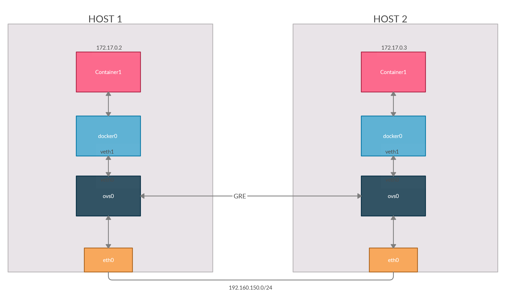

# LAB1-Docker-Network-OvS-GRE

Bài LAB thực hiện kết nối Docker Container trên Multihost ( Ở bài này là 2 host )

**Mô hình**




***⇒ Mục đích: Sau khi thiết lập các thông số, Container tại 2 Host có thể kết nối với nhau.*** 

**Yêu cầu**

- Kiến thức về Docker, Docker Network

    Tham khảo tại

    []()

- Kiến thức về sử dụng OpenvSwitch và GRE

    Tham khảo tại 

    [tuananh2508/LinuxVcc](https://github.com/tuananh2508/LinuxVcc/blob/master/Virtualization/OVS(OpenVSwitch)/OPENVSWITCH/Ly-thuyet-GRE.md#2-gre-frame-format)

    [tuananh2508/LinuxVcc](https://github.com/tuananh2508/LinuxVcc/blob/master/Virtualization/OVS(OpenVSwitch)/OPENVSWITCH/Ly-thuyet-OVS.md)

**Mục lục**
- [LAB1-Docker-Network-OvS-GRE](#lab1-docker-network-ovs-gre)
- [1. Thiết lập tại HOST 1](#1-thiết-lập-tại-host-1)
  - [Thiết lập OvS Bridge](#thiết-lập-ovs-bridge)
  - [Thiết lập IP của Bridge `docker0`](#thiết-lập-ip-của-bridge-docker0)
  - [Tạo VETH Tunnel để kết nối 2 Bridge](#tạo-veth-tunnel-để-kết-nối-2-bridge)
  - [Tạo Port dạng GRE để kết nối giữa 2 HOST](#tạo-port-dạng-gre-để-kết-nối-giữa-2-host)
  - [Tạo 1 Docker Container](#tạo-1-docker-container)
- [2. Thiết lập tại HOST 2](#2-thiết-lập-tại-host-2)

# 1. Thiết lập tại HOST 1

## Thiết lập OvS Bridge

Do chúng ta sẽ sử dụng OpenvSwitch để kết nối các Container nên đầu tiên ta cần tạo 1 Bridge để làm nhiệm vụ này :

```bash
(09:16:16) ○ [root@ubun-server] ~
→ ovs-vsctl add-br ovs0
(09:16:48) ○ [root@ubun-server] ~
→ ovs-vsctl show
282bd701-ac48-4e50-a655-33eb0dfd1310
    Bridge ovs0
        Port ovs0
            Interface ovs0
                type: internal
    ovs_version: "2.13.1"
```

→ Ở đây ta tạo 1 Bridge tên là `ovs0` và đã thành công

## Thiết lập IP của Bridge `docker0`

Mặc định, Bridge này sẽ có địa chỉ `172.17.0.1/24` và sẽ tương tự tại Multihost → Ta có thể đổi địa địa chỉ của Bridge này để tránh nhầm lần sau trong hệ thống. 

Đầu tiên chúng ta cần chuyển Bridge `docker0` sang trạng thái Down thông qua công cụ `ip link` rồi sau đó xóa Bridge `docker0` này đi 

```bash
(09:46:44) ○ [root@ubun-server] ~
→ ip l s docker0 down
(09:58:19) ○ [root@ubun-server] ~
→ ip l s docker0 down
(09:59:08) ○ [root@ubun-server] ~
→ brctl delbr docker0
```

Tiếp theo ta sẽ chỉnh sửa file Service của Docker tại đường dẫn `/lib/systemd/system/docker.service` , tại mục `ExecStart ...` ta sẽ thêm vào cuối dòng này `--bip="<IP/Subnet>"` :

```bash
ExecStart=/usr/bin/dockerd -H fd:// --containerd=/run/containerd/containerd.sock --bip="192.168.219.1/24"
```

Sau đó, Reload lại các Daemon và khởi động lại Docker :

```bash
(10:10:45) ○ [root@ubun-server] /etc/docker
→ systemctl daemon-reload
(10:10:50) ○ [root@ubun-server] /etc/docker
→ systemctl restart docker
(10:10:54) ○ [root@ubun-server] /etc/docker
→ ip a s docker0
6: docker0: <NO-CARRIER,BROADCAST,MULTICAST,UP> mtu 1500 qdisc noqueue state DOWN group default
    link/ether 02:42:4c:4a:2d:e8 brd ff:ff:ff:ff:ff:ff
    inet 192.168.219.1/24 brd 192.168.219.255 scope global docker0
       valid_lft forever preferred_lft forever
(10:11:00) ○ [root@ubun-server] /etc/docker
→ ip l s docker0 up
```

→ Như vậy việc thay đổi địa chỉ của Docker Bridge đã thành công. 

*Hoặc bạn cũng có thể thực hiện sửa đổi trong `/etc/docker/daemon.json`*

## Tạo VETH Tunnel để kết nối 2 Bridge

VETH hay Virtual Ethernet là một kĩ thuật đặc biệt cho phép trung chuyển lưu lượng mạng giữa 2 đầu kết nối. Kĩ thuật này tương tự 1 dạng tunnel, dữ liệu vào 1 đầu sẽ được chuyển ra đầu còn lại. 

Chúng ta cần tạo 1 VETH Tunnel để kết nối 2 Bridge là `docker0` và `ovs0` 

```bash
(09:16:52) ○ [root@ubun-server] ~
→ ip l a veth0 type veth peer name veth1
(09:24:11) ○ [root@ubun-server] ~
→ brctl addif docker0 veth1
(09:25:09) ○ [root@ubun-server] ~
→ brctl show
bridge name     bridge id               STP enabled     interfaces
docker0         8000.0242b61c74df       no              veth1
virbr0          8000.525400e2bda6       yes             virbr0-nic
(09:25:13) ○ [root@ubun-server] ~
→ ovs-vsctl add-port ovs0 veth0
(09:25:26) ○ [root@ubun-server] ~
→ ovs-vsctl show
282bd701-ac48-4e50-a655-33eb0dfd1310
    Bridge ovs0
        Port veth0
            Interface veth0
        Port ovs0
            Interface ovs0
                type: internal
    ovs_version: "2.13.1"
```

→ Như vậy, chúng ta đã tạo ra 1 VETH với 

- Chúng ta đã tạo ra 1 VETH với 2 đầu kết nối được đặt tên là `veth0` và `veth1`
- Sau đó, gán giao diện `veth1` vào Bridge `docker0`
- Tiếp tục, gán giao diện `veth0` vào Bridge `ovs0`

## Tạo Port dạng GRE để kết nối giữa 2 HOST

```bash
(09:25:30) ○ [root@ubun-server] ~
→ ovs-vsctl add-port ovs0 gre0 -- set interface gre0 type=gre options:remote_ip=192.168.150.128
(09:28:56) ○ [root@ubun-server] ~
→ ovs-vsctl show
282bd701-ac48-4e50-a655-33eb0dfd1310
    Bridge ovs0
        Port veth0
            Interface veth0
        Port gre0
            Interface gre0
                type: gre
                options: {remote_ip="192.168.150.128"}
        Port ovs0
            Interface ovs0
                type: internal
    ovs_version: "2.13.1"
```

→ Ta đã có được 1 Port tên `gre0` thực hiện việc kết nối với HOST 2 có địa chỉ IP `192.168.150.128`

## Tạo 1 Docker Container

Cuối cùng, ta cần tạo 1 Docker Cotainer để kiểm tra việc kết nối sau này :

```bash
(10:19:39) ○ [root@ubun-server] /etc/docker
→ docker run -it --name host1 alpine
/ # (10:19:46) ○ [root@ubun-server] /etc/docker
→ docker ps -a
CONTAINER ID        IMAGE               COMMAND             CREATED             STATUS              PORTS               NAMES
109b202fb3d9        alpine              "/bin/sh"           8 seconds ago       Up 7 seconds                            host1
```

→ Ở đây ta sử dụng Image Alpine để khởi tạo Container và đặt tên Container này là `host1` với các Option `-it` sẽ tạo ra một cửa số terminal cho Container. 

# 2. Thiết lập tại HOST 2

Các công việc tương tự diễn ra tại HOST 2 

```bash
(06:55:49) ○ [root@ubun-server] ~
→ ovs-vsctl add-br ovs0
(06:55:54) ○ [root@ubun-server] ~
→ ip l a veth0 type veth peer name veth1
(06:56:37) ○ [root@ubun-server] ~
→ brctl addif docker0 veth1
(06:56:45) ○ [root@ubun-server] ~
→ ovs-vsctl add-port ovs0 veth0
(06:56:59) ○ [root@ubun-server] ~
→ ip l s veth0 up
(06:57:04) ○ [root@ubun-server] ~
→ ip l s veth1 up
(06:57:31) ○ [root@ubun-server] ~
→ ovs-vsctl add-port ovs0 gre0 -- set interface gre0 type=gre options:remote_ip=192.168.150.128
(06:57:36) ○ [root@ubun-server] ~
```

Sau đó tạo 1 Container :

```bash
(06:57:36) ○ [root@ubun-server] ~
→ docker run -it --name host2 alpine
(06:57:48) ○ [root@ubun-server] ~
→ docker run -it --name host3 alpine
/ # ip a s
1: lo: <LOOPBACK,UP,LOWER_UP> mtu 65536 qdisc noqueue state UNKNOWN qlen 1000
    link/loopback 00:00:00:00:00:00 brd 00:00:00:00:00:00
    inet 127.0.0.1/8 scope host lo
       valid_lft forever preferred_lft forever
2: gre0@NONE: <NOARP> mtu 1476 qdisc noop state DOWN qlen 1000
    link/gre 0.0.0.0 brd 0.0.0.0
3: gretap0@NONE: <BROADCAST,MULTICAST> mtu 1462 qdisc noop state DOWN qlen 1000
    link/ether 00:00:00:00:00:00 brd ff:ff:ff:ff:ff:ff
4: erspan0@NONE: <BROADCAST,MULTICAST> mtu 1450 qdisc noop state DOWN qlen 1000
    link/ether 00:00:00:00:00:00 brd ff:ff:ff:ff:ff:ff
20: eth0@if21: <BROADCAST,MULTICAST,UP,LOWER_UP,M-DOWN> mtu 1500 qdisc noqueue state UP
    link/ether 02:42:ac:11:00:03 brd ff:ff:ff:ff:ff:ff
    inet 172.17.0.3/24 brd 172.17.0.255 scope global eth0
       valid_lft forever preferred_lft forever
```

→ Lí do chúng ta cần thực hiện tạo thêm `host3` để do địa chỉ IP của `host2` và `host1` giống nhau : `172.17.0.2` → Sau khi tạo `host3` ta sẽ xóa `host2` . Cuối cùng thực hiện việc ping từ `host3` đến `host1`

```bash
(06:58:59) ○ [root@ubun-server] ~
→ docker attach 78
/ # ping 172.17.0.2
PING 172.17.0.2 (172.17.0.2): 56 data bytes
64 bytes from 172.17.0.2: seq=0 ttl=64 time=1.794 ms
64 bytes from 172.17.0.2: seq=1 ttl=64 time=0.764 ms
^C
--- 172.17.0.2 ping statistics ---
2 packets transmitted, 2 packets received, 0% packet loss
round-trip min/avg/max = 0.764/1.279/1.794 ms
```

→ Như vậy việc kết nối 2 Container ( Có thể kết nối Multi Container) tại 2 Server đã thành công