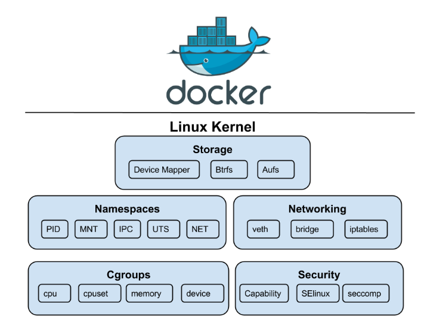

# Namespace



**Mục lục**
- [Namespace](#namespace)
- [1. Khái niệm Namespace](#1-khái-niệm-namespace)
- [2. Các loại Namespace](#2-các-loại-namespace)
- [3. Các câu lệnh cơ bản với Namespace](#3-các-câu-lệnh-cơ-bản-với-namespace)
  - [3.1 Liệt kê các Namespace trên hệ thống](#31-liệt-kê-các-namespace-trên-hệ-thống)
  - [3.2 Thực hiện chạy 1 Process trong 1 Namespace](#32-thực-hiện-chạy-1-process-trong-1-namespace)
  - [3.3 Xem các Namespace của 1 Process](#33-xem-các-namespace-của-1-process)
- [Nguồn tham khảo](#nguồn-tham-khảo)

# 1. Khái niệm Namespace

Linux Namespace là một khái niệm cốt lõi cùng với Cgroup giúp cấu thành nên Container Runtime hiện nay. Namespace là một tính năng do Kernel cung cấp cho phép người sử dụng cô lập các tiến trình ( hay còn được gọi là Process ) . Các Process thuộc một Namespace thì chỉ có thể biết về các Process khác thuộc cùng Namespace đó. 

→ Điều này cho phép chúng ta cô lập các Container một cách hiệu quả. Giả sử chúng ta có 2 Container A và B. Trong trường hợp không có Namespace thì sẽ có thể xảy ra trường hợp, các tiến trình thuộc Container A sẽ đọc được và sẽ vô tình ( hoặc cố tình ) đóng một số tiến trình khác của Container B. Vì vậy nên, việc cô lập các Container là điều vô cùng cần thiết, để cho các tiến trình thuộc một Container sẽ không thể ảnh hưởng đến quá trình hoạt động của tiến trình thuộc Container khác. 

Tuy nhiên, chúng ta cũng cần lưu ý rằng, Namespace không hề thực hiện quy định tài nguyên cho các Process, điều này được thực hiện bởi `Cgroup` ( Tham khảo tại : )

[]()

# 2. Các loại Namespace

Trên hệ thống Linux, thông thường sẽ bao gồm các Namespace sau :

1. UTS - cô lập hostname và domainname

    Ví dụ :

    ```bash
    tuananh@localcomputer:~$ sudo unshare -u /bin/bash
    root@localcomputer:/home/tuananh# 
    root@localcomputer:/home/tuananh# hostname namespace
    root@localcomputer:/home/tuananh# hostname
    namespace
    root@localcomputer:/home/tuananh# exit
    tuananh@localcomputer:~$ hostname
    localcomputer
    ```

    → Đầu tiên, chúng ta tạo ra 1 Process với lệnh `unshare` cho phép tiến trình này chạy trong 1 UTS Namespace của riêng nó 

2. IPC - cô lập tài nguyên giao tiếp liên tiến trình(IPC)
3. PID - cô lập vùng số cấp cho ID của tiến trình

    Ví dụ

    ```bash
    tuananh@localcomputer:~$ sudo unshare --fork --pid  --mount-proc /bin/bash
    root@localcomputer:/home/tuananh# ps aux
    USER         PID %CPU %MEM    VSZ   RSS TTY      STAT START   TIME COMMAND
    root           1  0.0  0.2  12700  4136 pts/1    S    16:41   0:00 /bin/bash
    root           8  0.0  0.1  14348  3596 pts/1    R+   16:41   0:00 ps aux
    ```

    → Thông qua lệnh `unshare` chúng ta đã cô lập tiến trình `/bin/bash` và khi thực hiện lệnh `ps -aux`  thì nó cũng không hề nhận biết về các tiến trình khác → Thể hiện ở việc nó đang tự coi nó là Process có PID là 1  

4. Network - cô lập giao diện mạng

    Tham khảo thêm tại :

    [](https://github.com/tuananh2508/LinuxVcc/blob/master/Virtualization/OVS(OpenVSwitch)/OPENVSWITCH/Linux-network-namespace.md)

5. User - cô lập về UID/GID
6. Cgroup - cô lập về thư mục root của tính năng cgroups
7. Mount - cô lập về các mount point 

# 3. Các câu lệnh cơ bản với Namespace

## 3.1 Liệt kê các Namespace trên hệ thống

Để liệt kê các Namespace đang có trên hệ thống :

```bash
tuananh@localcomputer:~$ lsns
        NS TYPE   NPROCS   PID USER    COMMAND
4026531835 cgroup     63  2159 tuananh /lib/systemd/systemd --user
4026531836 pid        63  2159 tuananh /lib/systemd/systemd --user
4026531837 user       63  2159 tuananh /lib/systemd/systemd --user
4026531838 uts        63  2159 tuananh /lib/systemd/systemd --user
4026531839 ipc        63  2159 tuananh /lib/systemd/systemd --user
4026531840 mnt        63  2159 tuananh /lib/systemd/systemd --user
4026531992 net        63  2159 tuananh /lib/systemd/systemd --user
```

→ Như vậy chúng ta đã biết về các namespace , thể loại , PID , được thực hiện bởi User nào. 

## 3.2 Thực hiện chạy 1 Process trong 1 Namespace

Để thực hiện tạo 1 Process và gán nó vào một Namespace cụ thể, ta thưc hiện :

```bash
tuananh@localcomputer:~$ sudo nsenter --pid --uts --ipc --mount -t 2605 sh
```

→ Chúng ta sử dụng lệnh `nsenter` ( Cho phép chạy tiến trình dưới Namespace khác ) cùng với các option 

- pid : Cho phép truy cập vào PID Namespace của Process `sh`
- uts : Cho phép truy cập vào UTS Namespace của Process `sh`
- ipc : Cho phép truy cập vào IPC Namespace của Process `sh`
- mount : Cho phép truy cập vào Mount Namespace của Process `sh`

## 3.3 Xem các Namespace của 1 Process

Thông thường, các Process sẽ thuộc vào các Namespace xác định, để tiến hành xem các Namespace của Process đó, ta cần truy cập vào thư mực `/proc`  :

```bash
tuananh@localcomputer:/$ cd /proc/2605/ns
tuananh@localcomputer:/proc/2605/ns$ ls -al
total 0
dr-x--x--x 2 tuananh tuananh 0 Thg 11 27 17:11 .
dr-xr-xr-x 9 tuananh tuananh 0 Thg 11 27 17:11 ..
lrwxrwxrwx 1 tuananh tuananh 0 Thg 11 27 17:16 cgroup -> 'cgroup:[4026531835]'
lrwxrwxrwx 1 tuananh tuananh 0 Thg 11 27 17:11 ipc -> 'ipc:[4026531839]'
lrwxrwxrwx 1 tuananh tuananh 0 Thg 11 27 17:11 mnt -> 'mnt:[4026531840]'
lrwxrwxrwx 1 tuananh tuananh 0 Thg 11 27 17:16 net -> 'net:[4026531992]'
lrwxrwxrwx 1 tuananh tuananh 0 Thg 11 27 17:11 pid -> 'pid:[4026531836]'
lrwxrwxrwx 1 tuananh tuananh 0 Thg 11 27 17:16 pid_for_children -> 'pid:[4026531836]'
lrwxrwxrwx 1 tuananh tuananh 0 Thg 11 27 17:16 user -> 'user:[4026531837]'
lrwxrwxrwx 1 tuananh tuananh 0 Thg 11 27 17:11 uts -> 'uts:[4026531838]'
```

→ Ở đây ta thực hiện truy cập vào xem Namespace của tiến trình có PID là 206 rồi liệt kê các Namespace mà nó thuộc về.

---

# Nguồn tham khảo

[Giới thiệu về Linux Namespaces](https://blogd.net/linux/gioi-thieu-ve-linux-namespaces/)

[nsenter(1) - Linux manual page](https://man7.org/linux/man-pages/man1/nsenter.1.html)

**Sách : *Linux "Containers and Virtualization: A Kernel Perspective" viết bởi Shashank Mohan Jain***
