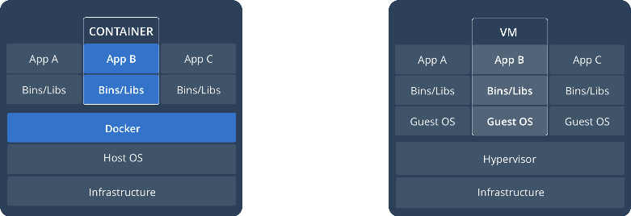

# Tong-quan-Docker

**Mục lục**
- [Tong-quan-Docker](#tong-quan-docker)
- [1. Tổng quan về Docker](#1-tổng-quan-về-docker)
- [2. Cơ cấu và đặc điểm của Docker](#2-cơ-cấu-và-đặc-điểm-của-docker)
- [3. Phân biệt Docker File, Docker Image và Docker Container](#3-phân-biệt-docker-file-docker-image-và-docker-container)
  - [3.1 Docker File](#31-docker-file)
  - [3.2 Docker Image](#32-docker-image)
  - [3.3 Docker Container](#33-docker-container)
# 1. Tổng quan về Docker

Docker là một ứng dụng cho phép cô lập các thành phần biến môi trường trên hệ thống. Cho phép việc chạy các App độc lập trong môi trường riêng đối với Host OS. Docker hoạt động trên cơ chế Container. Docker cho phép việc rút ngắn thời gian từ Dev → giai đoạn vận hành thực sự của App.

# 2. Cơ cấu và đặc điểm của Docker

Docker cho phép việc khởi tạo, chạy các Package hay ứng dụng trong một môi trường được gọi là Container dựa trên công công nghệ Containerization. Trong Container sẽ bao gồm tất cả những điều kiện tối thiểu để cho phép ứng dụng có thể chạy được. So với VM, thì các Container sẽ không cần một tầng quản lý đó là Hypervisor mà sẽ trực tiếp chia sẻ các tài nguyên với Host Kernel → Cải thiện tốc độ của Container so với VM. 

Docker có các đặc điểm cơ bản sau :

1. *Linh hoạt* : Cho phép việc đóng gói Container các ứng dụng hay các Package
2. *Kích thước nhỏ gon* : So với VM, điều này được thể hiện rõ rệt. Kích thước của Container thường là rất nhỏ so với VM bởi trong Container chỉ bao gồm các thành phần tối thiểu của App. Cùng với đó, các COntainer còn chia sẻ tài nguyên với Host Kernel → Cho phép việc quản lý tài nguyên tốt hơn.
3. *Nhỏ gọn* : Docker cho phép việc tải, chạy và chỉnh sửa các Image ở bất cứ đâu
4. *Độc lập* : Các Container được cô lập với nhau thông qua 2 cơ chế `namespace` và `cgroup` → việc chỉnh sửa hay hoạt dộng của 1 Container không hề ảnh hưởng tới Container khác
5. *Dễ dàng tăng số lượng* : Docker cho phép bạn chạy các bản sao chép của 1 Image một cách độc lập tại cùng một Server hay tại nhiều Server khác nhau → Đơn giản hóa quá trình Deploy 

# 3. Phân biệt Docker File, Docker Image và Docker Container

Đây là 2 khái niệm vô cùng cơ bản trong Docker. Ta cần hiểu các khái niệm này trước khi thử nghiệm chạy Docker lần đầu

## 3.1 Docker File

Docker có thể thực hiện chạy một tập các lệnh để tập hợp các Images Layer lại với nhau. Một Docker File chính là 1 file text chứa những câu lệnh cụ thể này.  

## 3.2 Docker Image

1 Docker Image được coi là 1 tập các Source Code, Dependencies, Lib và các công cụ cần thiết khác cần thiết để thực hiện chạy App ( trong Container ). Mỗi khi bạn pull 1 Image về thì đây là 1 filesystem không thể thực hiện thay đổi hay còn có thể hiểu là Read-Only. 

Docker Image cũng có thể hiểu rằng nó chỉ là 1 *template.* Bạn cần phải chạy 1 Container để có thể thực hiện chạy Images ( Container chính là 1 images trong trạng thái hoạt động ). Mỗi khi tạo Container thì bạn có thể hiểu đơn giản rằng, bạn đang thêm tạo 1 bản Read-Write của Imges và cũng đồng nghĩa với việc rằng bạn đang thêm 1 container layer lên trên các Images Layer. Điều này có thể được minh họa qua hình dưới:

Bạn có thể tạo được nhiều Images chỉ từ 1 Image duy nhất. Trong quá trình sử dụng Container, khi người sử dụng muốn lưu trạng thái hiện tại của Container thì sẽ tạo ra 1 Image mới từ trạng thái đó. Image được khởi tạo này cũng sẽ chuyển sang trạng thái Immuteable ( không thể thực hiện thay đổi )

## 3.3 Docker Container

Docker Container đơn giản chỉ là một môi trường ảo hóa độc lập. Bạn có thể hiểu rằng Container chỉ là 1 Image ở trạng thái Running và trong Container bao gồm các Image Layer từ Docker Image đã có sẵn và thêm một lớp Container Layer lên trên cùng cho phép chỉnh sửa và chạy các ứng dụng trong Docker Images. Như đã nói ở trên, nếu trong quá trình sử dụng, bạn muốn chỉnh sửa bất kì thông tin hay lưu lại trạng thái hiện giờ của Container thì có thể thực hiện tạo 1 Images mới. Bất kì 1 Container nào chạy trên hệ thống đều được coi là 1 tiến trình ( Process ). Điều đặc biệt đó chính là việc 1 Container sẽ chỉ giao tiếp với các Filesystem của nó - các file này được cung cấp bởi Docker Image. 

---