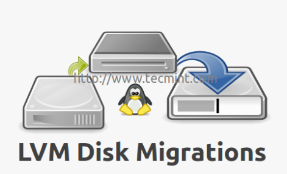

# Migrate LVM



Migrate là 1 chức năng cho phép chúng ta chuyển dung lượng dữ liệu giữa các volume LVM mà không làm mất đi dữ liệu trên ổ cứng ban đầu.

**Yêu cầu**

- Kiến thức cơ bản và các thao tác với các LVM Volume :

    Có thể tham khảo tại : [Create-Delete-Extend-Reduce-LVM](https://github.com/tuananh2508/LinuxVcc/blob/master/Linux/PROJECT%20LINUX/Logical-Volume-Management/Create-Delete-Extend-Reduce-LVM.md)

- 1 Server sử dụng OS Linux ( Trong bài viết sủ dụng OS **Debian 10** )

    1 Logical Volume đã có sẵn trên Server ( Nếu chưa có bạn có thể tham khảo link trên để thực hiện tạo . Trong ví dụ tại bài, LV có tên là `lv0` ) 

    1 Phân vùng có thể sử dụng làm LVM Volume ( Trong ví dụ tại bài, phân vùng này là `/dev/sda1` )

**Mô hình Logic trong ví dụ**


*Kết quả mong muốn: Dữ liệu ban đầu chứa trên `/dev/sdb1` sẽ được chuyển sang `/dev/sda1`* 

**Mục lục**
- [1. Thực hiện kiểm tra phân Logical Volume :](#1-thực-hiện-kiểm-tra-phân-logical-volume-)
- [2. Thực hiện thêm phân vùng mới vào VG](#2-thực-hiện-thêm-phân-vùng-mới-vào-vg)
- [3. Thực hiện việc Migrate](#3-thực-hiện-việc-migrate)
- [Nguồn tham khảo](#nguồn-tham-khảo)

# 1. Thực hiện kiểm tra phân Logical Volume :

Đầu tiên, chúng ta sẽ thực hiện kiểm tra Logical Volume đã có sẵn trên hệ thống để thực hiện Migrate :

```bash
root@debian:~# lvscd 
  LV   VG  Attr       LSize   Pool Origin Data%  Meta%  Move Log Cpy%Sync Convert
  lv0  vg0 -wi-a----- 512.00m
```

*Trong trường hợp đang xét, chúng ta có 1 Logical Volume dung lượng 512MB có tên là `lv0` thuộc Volume Group `vg0` và đã được mount tới thư mục `/mnt/lvm` của hệ thống*

Sau đó, ta sẽ thực hiện kiểm tra Disk đang được liên kết với Logical Volume này thông qua câu lệnh:

```bash
root@debian:~# lvs -a  -o+devices
  LV   VG  Attr       LSize   Pool Origin Data%  Meta%  Move Log Cpy%Sync Convert Devices
  lv0  vg0 -wi-a----- 512.00m                                                     /dev/sdb1(0)
```

→ *Hiện tại `/dev/sdb1` đang thực hiện liên kết với LV này* 

Cuối cùng, để thực hiện việc kiểm tra sau khi Migrate, chúng ta sẽ thực hiện tạo 1 File Text `hello` tại đường dẫn `/mnt/lvm` :

```bash
root@debian:/mnt/lvm# echo "Hello From the Original Disk" >> hello
```

# 2. Thực hiện thêm phân vùng mới vào VG

Như mô hình đã xét ở trên, ta thực hiện việc thêm phân vùng khả dụng là `/dev/sda1` vào Volume Group `vg0` . Bước đầu tiên đó là cần tạo Physical Volume :

```bash
root@debian:~# vgextend vg0 /dev/sda1
  Volume group "vg0" successfully extended
root@debian:~# vgdisplay -v
...
--- Physical volumes ---
  PV Name               /dev/sdb1
  PV UUID               jdn6bw-dQyD-kI0w-Br2U-hLTD-gbDp-0DOsap
  PV Status             allocatable
  Total PE / Free PE    249 / 121

  PV Name               /dev/sda1
  PV UUID               NHtKZP-HBNv-keEv-xwIZ-Tp2V-cJSW-e02JSp
  PV Status             allocatable
  Total PE / Free PE    249 / 249
```

*Tại câu lệnh đầu tiên, ta thực hiện việc mở thêm `/dev/sda1` vào VG `vg0` bằng cách sử dụng câu lệnh `vgextend` . Sau đó tại câu lệnh tiếp theo, ta thực hiện kiểm tra kết quả thông qua lệnh `vgdisplay` với Option `-v` sẽ giúp ta liệt kê các PV và LV của Group. Với kết quả nhận được, ta nhận thấy việc thêm `/dev/sda1` đã thành công.*

# 3. Thực hiện việc Migrate

Sau khi đã thực hiện 2 bước trên, chúng ta đã sẵn sàng cho việc Migrate LVM Volume. Chúng ta sẽ thực hiện câu lệnh :

```bash
root@debian:~# lvconvert -m 1 /dev/vg0/lv0 /dev/sda1
Are you sure you want to convert linear LV vg0/lv0 to raid1 with 2 images enhancing resilience? [y/n]: y
  Logical volume vg0/lv0 successfully converted.
```

*Với câu lệnh `lvconvert` và Option `-m` tại giá trị 1 sẽ giúp chúng ta thực hiện tạo 1 Mirror của Logical Volume  `lv0` tại `/dev/sda1` . Câu lệnh này sẽ thực hiện 2 bản sao chép : 1 bản Linear Volume ( sdb ) và 1 bản Copy ( sda )*

Việc kiểm tra kết quả được thực hiện như sau:

```bash
root@debian:~# lvs -a -o+devices
  LV             VG  Attr       LSize   Pool Origin Data%  Meta%  Move Log Cpy%Sync Convert Devices
  lv0            vg0 rwi-a-r--- 512.00m                                    100.00           lv0_rimage_0(0),lv0_rimage_1(0)
  [lv0_rimage_0] vg0 iwi-aor--- 512.00m                                                     /dev/sdb1(0)
  [lv0_rimage_1] vg0 iwi-aor--- 512.00m                                                     /dev/sda1(1)
  [lv0_rmeta_0]  vg0 ewi-aor---   4.00m                                                     /dev/sdb1(128)
  [lv0_rmeta_1]  vg0 ewi-aor---   4.00m                                                     /dev/sda1(0)
```

*Việc sử dụng lệnh `lvs` với Option `-a` và `-o+devices` sẽ giúp chúng ta liệt kê ra các thông tin chi tiết về Logical Volume và các thiết bị được liên kết với LV. Thông qua đó, ta nhận thấy rằng, dữ liệu của LV hiện tại đã được lưu tại cả `/dev/sda1` và `/dev/sdb1` .*

Sau khi đã chắc chắn rằng, việc Migrate đã được thực hiện xong ( thường có thể nhận biết qua thông số `Cpy%Sync` ở lệnh `lvs` ) thì chúng ta có thể thực hiện việc xóa Disk `/dev/sdb1` khỏi LV :

```bash
root@debian:~# lvconvert -m 0 /dev/vg0/lv0 /dev/sdb1
Are you sure you want to convert raid1 LV vg0/lv0 to type linear losing all resilience? [y/n]: y
  Logical volume vg0/lv0 successfully converted.
root@debian:~# lvs -a -o+devices
  LV   VG  Attr       LSize   Pool Origin Data%  Meta%  Move Log Cpy%Sync Convert Devices
  lv0  vg0 -wi-a----- 512.00m                                                     /dev/sda1(1)
```

*Với câu lệnh `lvconvert` và Option `-m` tại giá trị 0 sẽ giúp ta thực hiện việc xóa Disk `sdb1` tại LV `lv0` . Để kiểm tra, ta sử dụng câu lệnh 2 và nhận thấy sau khi thực hiện câu lệnh `lvconvert` thì Disk duy nhất liên kết với Logical Volume `lv0` hiện tại chỉ còn `/dev/sda1` → Việc thực hiện thành công*  

Cuối cùng, sau khi thực hiện xong, chúng ta sẽ kiểm tra lại dữ liệu trên file `hello` tại đường dẫn `/mnt/lvm` có bị mất hay thổi không :

```bash
root@debian:/mnt/lvm# cat hello
Hello From The Original Disk
```

*→ Việc Migrate thành công và dữ liệu trên Logical Volume **không** hề bị thay đổi* 

---

## Nguồn tham khảo

[BoTranVan/thuctap012017](https://github.com/BoTranVan/thuctap012017/blob/master/TVBO/docs/LVM/docs/lvm-migrating.md#check-result)

[Migrating LVM Partitions to New Logical Volume (Drive) - Part VI](https://www.tecmint.com/lvm-storage-migration/)

[lvconvert(8) - Linux man page](https://linux.die.net/man/8/lvconvert)

[lvcreate(8) - Linux man page](https://linux.die.net/man/8/lvcreate)

[lvs(8) - Linux man page](https://linux.die.net/man/8/lvs)

[vgdisplay(8) - Linux man page](https://linux.die.net/man/8/vgdisplay)
