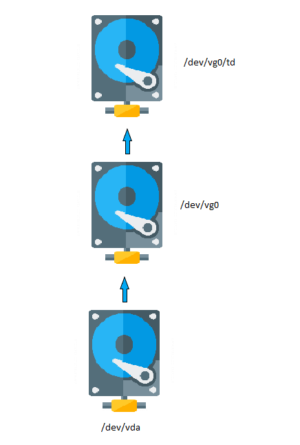

# Restore-LVM-Part

Trong quá trình sử dụng, đôi khi chúng ta sẽ gặp phải các trường hợp như: Lỡ xóa nhầm 1 Logical Volume có dữ liệu quan trọng hay có thể mục Metadata của LVM Disk gặp lỗi khiến cho hệ thống không thể truy cập vào LVM Disk đó. Ở bài viết này, chúng ta sẽ tìm hiểu phương thức để có thể khôi phục dữ liệu cũng như Metadata của LVM Disk dựa trên cơ chế tự động Backup của LVM.

**Yêu cầu**

- Kiến thức lý thuyết và cách sử dụng cơ bản với LVM Volume :

    Tham khảo tại :

    [tuananh2508/LinuxVcc](https://github.com/tuananh2508/LinuxVcc/blob/master/Linux/PROJECT%20LINUX/Logical-Volume-Management/Create-Delete-Extend-Reduce-LVM.md)

**Mô hình Logic**



**Mục lục**
- [1. Tạo Physical Volume, Volume Group và Logical Volume](#1-tạo-physical-volume-volume-group-và-logical-volume)
- [2. Trong trường hợp LVM Volume mất Metadata](#2-trong-trường-hợp-lvm-volume-mất-metadata)
  - [2.1 Khôi phục Physical Volume](#21-khôi-phục-physical-volume)
  - [2.2 Khôi phục Volme Group và Logical Volume](#22-khôi-phục-volme-group-và-logical-volume)
  - [2.3 Tiến hành kiểm tra dữ liệu](#23-tiến-hành-kiểm-tra-dữ-liệu)
- [3. Trong trường hợp mất Logical Volume](#3-trong-trường-hợp-mất-logical-volume)

# 1. Tạo Physical Volume, Volume Group và Logical Volume

*Nếu bạn đã có PV,VG và LV sẵn thì có thể bỏ qua bước này*

Đầu tiên chúng ta sẽ thực hiện kiểm tra các disk có thể thực hiện tạo LVM Volume thông qua :

```bash
root@debian:~# lvmdiskscan
  /dev/vda  [    1000.00 MiB]
  /dev/sda1 [      <4.00 GiB]
  /dev/sda3 [       1.00 GiB]
  /dev/sda5 [    1022.00 MiB]
  1 disk
  3 partitions
  0 LVM physical volume whole disks
  0 LVM physical volumes
```

→ Disk `/dev/vda` có thể thực hiện tạo LVM Volume

Quá trình tạo được thực hiện như sau

```bash
root@debian:~# pvcreate /dev/vda
  Physical volume "/dev/vda" successfully created.
root@debian:~# vgcreate vg0 /dev/vda
  Volume group "vg0" successfully created
root@debian:~# lvcreate -n td -l 100%FREE vg0 
Logical volume "td" created.
root@debian:/etc/lvm/backup# mkfs.ext4 /dev/vg0/td
```

*Ở đây chúng ta thực hiện tạo ra 1 PV từ `/dev/vda` sau đó sử dụng lệnh `vgcreate` để tạo ra 1 VG từ PV chúng ta có được từ lệnh trước. Cuối cùng là tạo ra 1 LV có tên là `td` và có kích thước bằng toàn bộ số Logical Extent khả dụng trong VG và định dạng LVM Volume thành Filesystem*

Sau khi thực hiện, ta kiểm tra kết quả 

```bash
root@debian:~# pvs
  PV         VG  Fmt  Attr PSize   PFree
  /dev/vda   vg0 lvm2 a--  996.00m    0
root@debian:~# vgs
  VG  #PV #LV #SN Attr   VSize   VFree
  vg0   1   1   0 wz--n- 996.00m    0
root@debian:~# lvs
  LV   VG  Attr       LSize   Pool Origin Data%  Meta%  Move Log Cpy%Sync Convert
  td   vg0 -wi-a----- 996.00m
```

→ Như vậy việc khởi tạo đã thành công

Để kiểm tra tính toàn vẹn của dữ liệu sau khi khôi phục, ta thực hiện tạo 1 file để kiểm tra 

```bash
root@debian:/etc/lvm/backup# mount /dev/vg0/td /mount/disk/
root@debian:/etc/lvm/backup# cd /mount/disk/
root@debian:/mount/disk# touch hello
root@debian:/mount/disk# md5sum hello
d41d8cd98f00b204e9800998ecf8427e  hello
```

→ Vậy sau khi thực hiện restore dữ liệu thì ta cũng sẽ phải nhận được 1 mã md5 tương tự

# 2. Trong trường hợp LVM Volume mất Metadata

Nếu trong trường hợp Metadata của LVM bị lỗi, thì chúng ta sẽ không thể thực hiện truy cập vào LVM Volume, để có thể thử nghiệm trường hợp này, chúng ta sẽ sử dụng lệnh `wipefs` ( Lệnh này chỉ thực hiện xóa phần dữ liệu Metadata chứ không làm thay đổi dữ liệu bên trong của LVM Volume) :

```bash
root@debian:~# wipefs --all --backup -f /dev/vda
/dev/vda: 8 bytes were erased at offset 0x00000218 (LVM2_member): 4c 56 4d 32 20 30 30 31
root@debian:~# pvs
root@debian:~# vgs
root@debian:~# lvs
```

*→ Ta sử dụng option `--all` và `backup` với lệnh `wipefs` để thực hiện xóa toàn bộ Metadata của `/dev/vda` và thực hiện tạo 1 file backup trong thư mục Home của User thực hiện lệnh `wipefs` . Sau khi thực hiện, ta nhận thấy đã không còn truy cập được vào LVM Volume này*

Để khôi phục dữ liệu Metadata, đầu tiên chúng ta cần truy cập đường dẫn `/etc/lvm/backup` . Đây là nơi chứa các file Backup cho các Volume Group, chứa các thông tin về PV và LV trong VG đó. 

```bash
root@debian:~# cd /etc/lvm/backup/
root@debian:/etc/lvm/backup# cat vg0
vg0 {
        id = "y4Medv-lQni-3zmi-bdgW-k1Ju-85K3-6G92Rp"
        seqno = 2
        format = "lvm2"                 # informational
        status = ["RESIZEABLE", "READ", "WRITE"]
        flags = []
        extent_size = 8192              # 4 Megabytes
        max_lv = 0
        max_pv = 0
        metadata_copies = 0

        physical_volumes {

                pv0 {
                        id = "jj9j9G-TpKX-WcFs-S45v-iun1-xYNP-HLLTlh"
                        device = "/dev/vda"     # Hint only

                        status = ["ALLOCATABLE"]
                        flags = []
                        dev_size = 2048000      # 1000 Megabytes
                        pe_start = 2048
                        pe_count = 249  # 996 Megabytes
                }
        }

        logical_volumes {

                td {
                        id = "CFhw4s-5Nyg-nBXp-ELZK-zU3q-MZsr-IZxUQ4"
                        status = ["READ", "WRITE", "VISIBLE"]
                        flags = []
                        creation_time = 1605449362      # 2020-11-15 09:09:22 -0500
                        creation_host = "debian"
                        segment_count = 1

                        segment1 {
                                start_extent = 0
                                extent_count = 249      # 996 Megabytes

                                type = "striped"
                                stripe_count = 1        # linear

                                stripes = [
                                        "pv0", 0
                                ]
                        }
                }
        }

}
```

***Ở đây chúng ta cần chú ý mục ID của PV thuộc VG `vg0`***

## 2.1 Khôi phục Physical Volume

Đầu tiên chúng ta cần thực hiện khôi phục Physical Volume  

```bash
root@debian:/etc/lvm/backup# pvcreate --test --uuid "jj9j9G-TpKX-WcFs-S45v-iun1-xYNP-HLLTlh" --restorefile /etc/lvm/backup/vg0 /dev/vda
TEST MODE: Metadata will NOT be updated and volumes will not be (de)activated.
  Couldn't find device with uuid jj9j9G-TpKX-WcFs-S45v-iun1-xYNP-HLLTlh.
  Physical volume "/dev/vda" successfully created.
```

→ Nếu kết quả trả về 'successfully created' thì chúng ta sẽ thực hiện loại bỏ Option `test` và lặp lại câu lệnh trên

*Trong đó*

- `test` : Option này cho phép chúng ta chạy 1 Dry Test trước khi thực thi câu lệnh gây ra sự thay đổi thực tế
- `*uuid` : Mục chứa ID của Physical Volume chúng ta có được ở pahafn trên*
- `*restorefile` : Đường dẫn tới file backup*
- `*/dev/vda` : Disk chúng ta sẽ thực hiện khôi phục PV*

Kết quả nhận được sau khi thành công 

```bash
root@debian:/etc/lvm/backup# pvs
  PV         VG Fmt  Attr PSize    PFree
  /dev/vda      lvm2 ---  1000.00m 1000.00m
```

**Chú ý** nếu gặp phải lỗi sau thì chúng ta cần thực hiện các bước dưới ( Lỗi gây ra do Filesystem chưa được Un-mount và chúng ta sẽ thực hiện điều đó thông qua công cụ `dmsetup` )

```bash
Can't open /dev/vda exclusively.  Mounted filesystem?
Can't open /dev/vda exclusively.  Mounted filesystem?
```

```bash
root@debian:/etc/lvm/backup# lsblk
NAME     MAJ:MIN RM  SIZE RO TYPE MOUNTPOINT
sda        8:0    0    6G  0 disk
├─sda1     8:1    0    4G  0 part /
├─sda2     8:2    0    1K  0 part
├─sda3     8:3    0    1G  0 part
└─sda5     8:5    0 1022M  0 part [SWAP]
vda      254:0    0 1000M  0 disk
└─vg0-td 253:0    0  996M  0 lvm
root@debian:/etc/lvm/backup# dmsetup remove /dev/mapper/vg0-td
```

*→ Ở đây chúng ta thấy rằng `/dev/vda` có 1 phân vùng đó là `vg0-td` ( Có Major Number là 253 và Minor Number là 0 ). Với câu lệnh thứ 2, ta sẽ thực hiện loại bỏ phần device này với `dmsetup`* 

## 2.2 Khôi phục Volme Group và Logical Volume

Tiếp theo chúng ta tiến hành khôi phục Volume Group thông qua công cụ `vgcfgrestore`

```bash
root@debian:/etc/lvm/backup# vgcfgrestore -f /etc/lvm/backup/vg0 vg0
  Restored volume group vg0.
```

*Ở đây chúng ta sử dụng option `-f` để chỉ định đường dẫn tới file Backup và sau đó chỉ địn tên VG được khôi phục* 

Tuy nhiên, sau khi khôi phục thì VG và LV sẽ ở trạng thái Inactive → Cần thực hiện chuyển sang trạng thái Active với công cụ `vgchange` 

```bash
root@debian:/etc/lvm/backup# lvscan
  inactive          '/dev/vg0/td' [996.00 MiB] inherit
root@debian:/etc/lvm/backup# vgchange -a y vg0
  1 logical volume(s) in volume group "vg0" now active
root@debian:/etc/lvm/backup# lvscan
  ACTIVE            '/dev/vg0/td' [996.00 MiB] inherit
```

→ Thông qua lệnh `vgchange` với option `-a y` ( Active - Yes ) thì chúng ta đã thành công trong việc chuyển trạng thái của VG và Volume Group sang Active.

## 2.3 Tiến hành kiểm tra dữ liệu

```bash
root@debian:/etc/lvm/backup# mount /dev/vg0/td /mount/disk/
root@debian:/etc/lvm/backup# cd /mount/disk/
root@debian:/mount/disk# md5sum hello
d41d8cd98f00b204e9800998ecf8427e  hello
```

⇒ Như vậy, sau quá trình khôi phục dữ liệu thì dữ liệu không hề bị thay đổi so với ban đầu

# 3. Trong trường hợp mất Logical Volume

Việc khôi phục LV tương đối đơn giản và khá giống với phần 2. Giả sử chúng ta đã xóa nhầm 1 LV có dữ liệu :

```bash
root@debian:/# lvremove /dev/vg0/td
Do you really want to remove active logical volume vg0/td? [y/n]: y
  Logical volume "td" successfully removed
```

Để khôi phục, ta sẽ thực hiện liệt kê ra các bản Backup do LVM đã tự động thực hiện 

```bash
root@debian:/# vgcfgrestore vg0 --list 
...
File:         /etc/lvm/archive/vg0_00185-1753209614.vg
  VG name:      vg0
  Description:  Created *before* executing 'lvremove /dev/vg0/td'
  Backup Time:  Sun Nov 15 10:02:54 2020

  File:         /etc/lvm/backup/vg0
  VG name:      vg0
  Description:  Created *after* executing 'lvremove /dev/vg0/td'
  Backup Time:  Sun Nov 15 10:02:54 2020
```

*Trong đó* 

- `*vg0` : Là tên của VG là LV thuộc vào*
- `*list` : Option cho phép việc thực hiện liệt kê các bản Backup*

→ Như vậy, ta thấy rằng bản Backup `vg0_00185-1753209614.vg` đã lưu dữ liệu **trước khi** chúng ta thực hiện lệnh xóa Logical Volume. Vậy nên để thực hiện khôi phục Logical Volume mà ta cần, thì chúng ta sẽ tiến hành khôi phục Logical Volume về file Backup đó.

```bash
root@debian:/# vgcfgrestore -f /etc/lvm/archive/vg0_00185-1753209614.vg vg0
  Restored volume group vg0.
root@debian:/# lvs
  LV   VG  Attr       LSize   Pool Origin Data%  Meta%  Move Log Cpy%Sync Convert
  td   vg0 -wi------- 996.00m
```

→ Việc khôi phục đã thành công, Logcal Volume `td` đã được khôi phục, quá trình hoàn tất

---

[Document Display | HPE Support Center](https://support.hpe.com/hpesc/public/docDisplay?docId=kc0129469en_us&docLocale=en_US)

[How to recover deleted Logical volume (LV) in LVM using vgcfgrestore](https://www.thegeekdiary.com/how-to-recover-deleted-logical-volume-lv-in-lvm-using-vgcfgrestore/)

[RHEL / CentOS : How to rebuild LVM from Archive (metadata backups)](https://www.thegeekdiary.com/corruption-or-accidental-deletion-in-lvm-how-to-rebuild-lvm-from-archive-metadata-backups-in-rhel-centos/)

[](https://www.golinuxcloud.com/recover-lvm2-partition-restore-vg-pv-metadata/)
