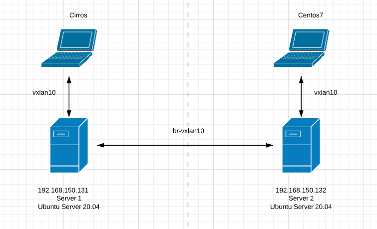

# LAB-LinuxBridge-VxLan

**Ý tưởng bài LAB** :

[doxuanson - Overview](https://github.com/doxuanson)

**Yêu cầu**

- 2 Server sử dụng Server Linux ( Trong bài sử dụng **Ubuntu Server 20.04** )
- Trên các Server đã cài đặt các Package QEMU-KVM
- 1 VM trên mỗi Server
    - Trong bài sử dụng
        1. Trên Server 1: VM sử dụng OS **Centos 7**
        2. Trên Server 2: Vm sử dụng OS **Cirros 0.5.1**
    - Cách cài đặt VM tham khảo tại :
[tuananh2508/LinuxVcc](https://github.com/tuananh2508/LinuxVcc/blob/master/Virtualization/QEMU&KVM/KVM%26QEMU.md)

- Kiến thức cũng như thao tác cơ bản với QEMU-KVM và Linux Bridge

    Tham khảo tại :
[tuananh2508/LinuxVcc](https://github.com/tuananh2508/LinuxVcc/tree/master/Virtualization)

- Kiến thức về VxLan :
    
    Tham khảo tại :
    [tuananh2508/LinuxVcc](https://github.com/tuananh2508/LinuxVcc/blob/master/Virtualization/OVS(OpenVSwitch)/OPENVSWITCH/Ly-thuyet-VxLan.md)

**Mô hình**



***⇒ Mục đích: Sau khi thiết lập các thông số, thì tại Centos7 có thể ping được Cirros và Cirros có thể truy cập được Internet thông qua Server 2***

**Mục lục**
- [LAB-LinuxBridge-VxLan](#lab-linuxbridge-vxlan)
- [1. Tiến hành khởi động 2 VM](#1-tiến-hành-khởi-động-2-vm)
- [2. Tạo Linux Bridge `br-vxlan10` và thêm port VM, Port VxLAN vào Bridge](#2-tạo-linux-bridge-br-vxlan10-và-thêm-port-vm-port-vxlan-vào-bridge)
- [3. Thiết lập trên các VM](#3-thiết-lập-trên-các-vm)
- [Nguồn tham khảo](#nguồn-tham-khảo)

# 1. Tiến hành khởi động 2 VM

Sau khi 2 Server khởi động, ta sẽ bật VM trên các máy lên :

Tại Server 1: 

```bash
root@ubun-server:~# virsh start cirros
Domain cirros started
```

Tại Server 2:

```bash
root@ubun-server-2:~# virsh start centos
Domain centos started
```

# 2. Tạo Linux Bridge `br-vxlan10` và thêm port VM, Port VxLAN vào Bridge

Các bước dưới đây được thực hiện tại 2 Server :

```bash
ip link add vxlan10 type vxlan id 10 group 239.1.1.1 dstport 0 dev ens33
ip link add br-vxlan10 type bridge
ip link set vxlan10 master br-vxlan10
ip link set vxlan10 up
**i**p link set br-vxlan10 up
```

*Trong đó* 

- *Với câu lệnh 1, ta tiến hành tạo 1 Port ( hay có thể gọi là Interface ) có tên là `vxlan10` có loại Port là `vxlan` và có ID là `10` thuộc 1 nhóm multicast có địa chỉ `239.1.1.1` sử dụng port 0 ( Chỉ định sử dụng Port mặc định ) và Port này được thêm vào interface `ens33` ( Có địa chỉ `192.168.150.128` tại Server 1 - `192.168.150.131` tại Server 2)*
- *Tiếp theo, ta tạo 1 Linux Bridge tên là `br-vxlan10`*
- *Sau đó sẽ gán port `vxlan10` vào Bridge vừa tạo là `br-vxlan10`*
- *2 câu lệnh cuối sẽ thực hiện chuyển trạng thái cảu `vxlan10` và `br-vxlan10` sang UP*

Tuy nhiên, ở chế độ mặc định ( Nếu không chỉnh sửa file config của VM ) thì các VM sẽ tự động nhận Network `default` và thuộc Linux Bridge `virbr0` , vậy nên chúng ta cần phải xóa các Port này khỏi Bridge mặc định ( **Công việc được thực hiện tại 2 Server** ) :

```bash
root@ubun-server-2:~# brctl show
bridge name     bridge id               STP enabled     interfaces
br-vxlan10              8000.56a990572988       no              vxlan10
virbr0          8000.525400929c28       yes             virbr0-nic
                                                        vnet0
root@ubun-server-2:~# brctl delif virbr0 vnet0
root@ubun-server-2:~# brctl addif br-vxlan10 vnet0
root@ubun-server-2:~# brctl show
bridge name     bridge id               STP enabled     interfaces
br-vxlan10              8000.56a990572988       no              vnet0
                                                        vxlan10
virbr0          8000.525400929c28       yes             virbr0-nic
```

*Giải thích*

- *Với câu lệnh đầu tiên, ta kiểm tra các Bridge hiện tại trên Server*
- *Sau đó, ta sẽ xóa Port `vnet0` khỏi Bridge `virbr0` và thêm vào Bridge `br-vxlan10`*

    ( Diễn ra tại câu lệnh 2 và 3 )

- *Cuối cùng ta kiểm tra lại cấu hình Bridge trên Server*

***Lưu ý*** : tại Server 2 ( Server chứa VM Centos 7 ) cần cấu hình thêm IP cho Bride `br-vxlan10` để phục vụ mục đích là Switch này sẽ làm Default Gateway cho toàn bộ dải mạng `10.0.0.0/24` :

```bash
root@ubun-server-2:~# ip a a 10.0.0.2/24 dev br-vxlan10
```

*Ở đây lấy ví dụ đặt địa chỉ IP cho Bridge là `10.0.0.2`*

# 3. Thiết lập trên các VM

Tại 2 Server ta tiến hành truy cập các VM thông qua lệnh `virsh console` và tiến hành đặt địa chỉ IP và Default gateway:

Tại Server 1 ( Chứa VM Cirros ) :

```bash
root@ubun-server:~# virsh console cirros                                                                                Connected to domain cirros                                                                                              Escape character is ^]
...
$ ip a a 10.0.0.3/24 dev eth0
$ sudo ip route add defautl via 10.0.0.2
```

Tại Server 2 ( Chứa VM Centos )

```bash
root@ubun-server-2:~# virsh console centos                                                                     [161/161]Connected to domain centos
Escape character is ^]
[root@localhost ~]# ip a f eth0
[root@localhost ~]# ip a a 10.0.0.1/24 dev eth0
[root@localhost ~]# ping 10.0.0.3
PING 10.0.0.3 (10.0.0.3) 56(84) bytes of data.
64 bytes from 10.0.0.3: icmp_seq=1 ttl=64 time=2.07 ms
64 bytes from 10.0.0.3: icmp_seq=2 ttl=64 time=2.83 ms

--- 10.0.0.3 ping statistics ---
2 packets transmitted, 2 received, 0% packet loss, time 1002ms
rtt min/avg/max/mdev = 2.078/2.454/2.831/0.379 ms
[root@localhost ~]# ip route add default via 10.0.0.2
```

*→ Như vậy 2 VM đã có thể kết nối với nhau*

Tuy nhiên để có thể thực hiện kết nối ra Internet bên ngoài thì chúng ta cần thực hiện NAT Masquerade trên Server 2 → Thay đổi địa chỉ IP nguồn của các gói tin từ dải mạng `10.0.0.0/24` :

```bash
root@ubun-server-2:~# iptables -t nat -A POSTROUTING -s 10.0.0.0/24 -j MASQUERADE
```

Sau đó ta thực hiện việc ping để kiểm tra việc kết nối với Internet tại 2 VM :

```bash
$ ping 8.8.8.8
PING 8.8.8.8 (8.8.8.8): 56 data bytes
64 bytes from 8.8.8.8: seq=0 ttl=127 time=30.246 ms
64 bytes from 8.8.8.8: seq=1 ttl=127 time=32.077 ms
64 bytes from 8.8.8.8: seq=2 ttl=127 time=30.321 ms
^C
--- 8.8.8.8 ping statistics ---
3 packets transmitted, 3 packets received, 0% packet loss
round-trip min/avg/max = 30.246/30.881/32.077 ms
```

```bash
[root@localhost ~]# ping 1.1.1.1
PING 1.1.1.1 (1.1.1.1) 56(84) bytes of data.
64 bytes from 1.1.1.1: icmp_seq=1 ttl=127 time=28.3 ms
64 bytes from 1.1.1.1: icmp_seq=2 ttl=127 time=26.5 ms
64 bytes from 1.1.1.1: icmp_seq=3 ttl=127 time=28.1 ms
64 bytes from 1.1.1.1: icmp_seq=4 ttl=127 time=27.6 ms

--- 1.1.1.1 ping statistics ---
4 packets transmitted, 4 received, 0% packet loss, time 3008ms
rtt min/avg/max/mdev = 26.584/27.657/28.317/0.700 ms
```

*→ Như vậy cả 2 VM đã kết nối với Internet thành công* 

Thông qua việc sử dụng Wireshark ta sẽ thấy được địa chỉ IP của cả VM đã được sử dụng NAT để chuyển địa chỉ nguồn sang `192.168.150.132` :


***⇒ Bài LAB được thực hiện thành công*** 

---

# Nguồn tham khảo

[How to create overlay networks using Linux Bridges and VXLANs](https://ilearnedhowto.wordpress.com/2017/02/16/how-to-create-overlay-networks-using-linux-bridges-and-vxlans/)