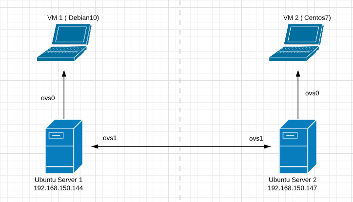

# LAB-3-KVM-OvS-VxLan

*Bài Lab thực hiện kết hợp ứng dụng và lý thuyết về VxLAN và OpenvSwitch dựa trên nền kiến thức ảo hóa QEMU/KVM.*

**Yêu cầu**

- Kiến thức về QEMU/KVM và thành thạo các thao tác quản lý Network với công cụ `virsh`
- Kiến thức về OVS, cài đặt các package của OvS và thành thạo các thao tác cơ bản với `ovs-vsctl`

    Tham khảo tại:

    [tuananh2508/LinuxVcc](https://github.com/tuananh2508/LinuxVcc/blob/master/Virtualization/OVS(OpenVSwitch)/OPENVSWITCH/Ly-thuyet-OVS.md)

- Kiến thức về cách hoạt dộng của VxLAN

    Tham khảo tại:

    []()

**Mô hình**



Trong đó có các thông số sau :

- 2 Server để thực hiện tạo 1 máy ảo trên mỗi Server (Trong bài sử dụng **Ubuntu Server 20.04**). Trên cả 2 Server đã tiến hành cài đặt các Package liên quan tới OvS
    - Server 1 có địa chỉ các dải mạng
        - ens33 : `192.168.150.144`
        - ens38 : `192.168.98.138`
        - ens39 : `192.168.26.129`
    - Server 2 có địa chỉ các dải mạng
        - ens33 : `192.168.150.147`
        - ens38 : `192.168.98.146`
        - ens39 : `192.168.26.128`
- VM sử dụng trên Ubuntu Server 1 có tên `debian` ( Sử dụng OS Debian10)
- VM sử dụng trên Ubuntu Server 2 có tên `centos` ( Sử dụng OS Centos7)

***Mục đích: Sau khi thực hiện các thiết lập thông số, chúng ta có thể thực hiện ping từ VM1 sang VM2***

**Mục lục**

# 1. Thực hiện tạo Bridge `ovs0` và `ovs1`

Trong bài LAB này, chúng ta sẽ thực hiện tạo 2 Bridge `ovs0` và `ovs1` trên cả 2 Server. Với `ovs0` sẽ thực hiện kết nối VM, port VxLan là `vxl0` tới Bridge ảo này. Trong khi đó, đối với `ovs1` sẽ thực hiện việc tạo 1 Tunnel giữa 2 Server để có thể kết nối 2 VxLAN này với nhau. Ý nghĩa của port này chính là việc tách biệt lưu lượng của Hypervisor và lưu lượng của VxLAN. 

## 1.1 Thực hiện xóa Interface của VM khỏi Linux Bridge

Công việc này được thực hiện tại cả 2 Server. Do khi khởi tạo VM, nếu không được thiết lập các thông số ban đầu, thì theo mặc định VM sẽ tự động được thêm vào 1 Linux Bridge mặc định là `virbr0` .  Việc thực hiện xóa Port của Linux Bridge được thực hiện như sau:

```bash
root@ubun-server:~# brctl show
bridge name     bridge id               STP enabled     interfaces
virbr0          8000.525400379997       yes             virbr0-nic
                                                        vnet0
root@ubun-server:~# brctl delif virbr0 vnet0
root@ubun-server:~# brctl show
bridge name     bridge id               STP enabled     interfaces
virbr0          8000.525400379997       yes             virbr0-nic
```

```bash
root@ubun-server-2:~# brctl show
bridge name     bridge id               STP enabled     interfaces
virbr0          8000.525400929c28       yes             virbr0-nic
                                                        vnet0
root@ubun-server-2:~# brctl delif virbr0 vnet0
root@ubun-server-2:~# brctl show
bridge name     bridge id               STP enabled     interfaces
virbr0          8000.525400929c28       yes             virbr0-nic
```

*Đầu tiên chúng ta thực hiện việc kiểm tra Linux Bridge `virbr0` sau đó thực hiện xóa Interface `vnet0`. Cuối cùng là thực hiện kiểm tra lại thay đổi.*

## 1.2 Tạo Network tại 2 Server

Công việc tiếp theo đó là thực hiện tạo Network, tại cả 2 Server tiến hành :

*Tiến hành truy cập đường dẫn Network của Libvirt*

```bash
cd /etc/libvirt/qemu/networks/
nvim ovs.xml
```

*File `ovs.xml` có nội dung như sau ( trong đó `ovs` là tên Network còn `ovs0` là tên Bridge bạn **sẽ tạo** ở bước bên dưới )*

```bash
<network>
  <name>ovs</name>
  <forward mode='bridge'/>
  <bridge name='ovs0'/>
  <virtualport type='openvswitch'/>
</network>
```

*Sau khi đã có được file cấu hình `ovs.xml` ta thực hiện tạo và khởi động Network này thông qua lệnh `virsh net-*`*

```bash
virsh net-define ovs.xml
virsh net-start ovs
virsh net-autostart ovs
```

## 1.3 Thực hiện tạo 2 OvS Bridge `ovs0` và `ovs1`

Việc thực hiện tạo Bridge `ovs0` được thực hiện như sau. Tại Server 1 :

```bash
root@ubun-server:~# ovs-vsctl add-br ovs0
root@ubun-server:~# ovs-vsctl add-port ovs0 vnet0
root@ubun-server:~# ovs-vsctl add-port ovs0 ens38
root@ubun-server:~# dhclient ovs0
cmp: EOF on /tmp/tmp.ErNQbEHHMm which is empty
root@ubun-server:~# ip a f ens38
root@ubun-server:~# ovs-vsctl add-port ovs0 vxl0 -- set interface vxl0 type=vxlan options:remote_ip=192.168.26.128
```

*Giải thích*

- *Với câu lệnh thứ 1, chúng ta thực hiện tạo 1 OvS có tên là `ovs0`*
- Với câu lệnh thứ 2 và thứ 3, ta lần lượt thêm các port là `vnet0` và `ens38` vào Bridge `ovs0`
- Sau đó, tại câu lệnh thứ 4 và thứ 5, việc cấp địa chỉ IP cho Bridge `ovs0` ( bạn cũng có thể đặt địa chỉ IP tĩnh, nếu thực hiện theo cách này, không cần thêm Port `ens38`) được diễn ra ; sau khi có được địa chỉ IP ta sẽ thực hiện xóa địa chỉ IP của `ens38`
- Cuối cùng, chúng ta thêm một port VxLAN là `vxl0` vào Bridge có địa chỉ Remote IP là `192.168.26.128`

Tại Server 2, công việc tương tự được lặp lại

```bash
root@ubun-server-2:~# ovs-vsctl add-br ovs0
root@ubun-server-2:~# ovs-vsctl add-port ovs0 vnet0
root@ubun-server-2:~# ovs-vsctl add-port ovs0 ens38
root@ubun-server-2:~# dhclient ovs0
root@ubun-server-2:~# ip a f ens38
root@ubun-server-2:~# ovs-vsctl add-port ovs0 vxl0 -- set interface vxl0 type=vxlan options:remote_ip=192.168.26.129
```

*Ở đây khi thực hiện cấu hình Port `vxl0` chúng ta thực hiện thay đổi Remote IP thành IP ở Server 1 là `192.168.26.129`*

Sau đó chúng ta thực hiện tạo Bridge `ovs1` để có thể thực hiện Tunnel giữa 2 Server. Trên Server 1, nhập các lệnh sau:

```bash
root@ubun-server:~# ovs-vsctl add-br ovs1
root@ubun-server:~# ovs-vsctl add-port ovs1 ens39
root@ubun-server:~# dhclient ovs1
cmp: EOF on /tmp/tmp.dsrrFRhFR2 which is empty
root@ubun-server:~# ip a f ens39
```

*Tại câu lệnh thứ nhất, ta thực hiện thêm 1 Bridge là `ovs1` sau đó thêm vào Port này giao diện mạng `ens39` . Cuối cùng là công việc yêu cầu địa chỉ IP ( hoặc bạn cũng có thể đặt IP tĩnh, nếu bạn sử dụng cách này thì không cần thêm Port `ens39` ) và xóa địa chỉ IP mạng hiện tại của `ens39`*

Công việc tương tự được thực hiện tại Server thứ 2 :

```bash
root@ubun-server-2:~# ovs-vsctl add-br ovs1
root@ubun-server-2:~# ovs-vsctl add-port ovs1 ens39
root@ubun-server-2:~# dhclient ovs1
cmp: EOF on /tmp/tmp.tWm6Ynn8VQ which is empty
root@ubun-server-2:~# ip a f ens39
```

⇒ Sau khi thực hiện các bước trên, chúng ta thực hiện kiểm tra lại sự thay đổi

```bash
root@ubun-server:~# ovs-vsctl show
399eb6fe-51d2-4bca-ade7-e1fa41e5c7f9
    Bridge ovs1
        Port ovs1
            Interface ovs1
                type: internal
        Port ens39
            Interface ens39
    Bridge ovs0
        Port ovs0
            Interface ovs0
                type: internal
        Port vnet0
            Interface vnet0
        Port vxl0
            Interface vxl0
                type: vxlan
                options: {remote_ip="192.168.26.128"}
        Port ens38
            Interface ens38
    ovs_version: "2.13.1"
```

```bash
root@ubun-server-2:~# ovs-vsctl show
5fad0b3c-2e85-4bb5-b599-d77a9aa2aa0e
    Bridge ovs1
        Port ovs1
            Interface ovs1
                type: internal
        Port ens39
            Interface ens39
    Bridge ovs0
        Port ovs0
            Interface ovs0
                type: internal
        Port ens38
            Interface ens38
        Port vxl0
            Interface vxl0
                type: vxlan
                options: {remote_ip="192.168.26.129"}
        Port vnet0
            Interface vnet0
    ovs_version: "2.13.1"
```

*→ Ta nhận thấy rằng các thay đổi ta thực hiện đã được cập nhật thành công*

# 2. Thực hiện việc kiểm tra ping giữa 2 VM

Sau khi đã thực hiện xong các bước trên, chúng ta sẽ truy cập 2 VM để thực hiện việc Ping giữa 2 VM để đảm bảo tính kết nối giữa 2 VxLAN. Tại VM1 :

```bash
root@ubun-server:/etc/libvirt/qemu/networks# virsh console debian
Connected to domain debian
Escape character is ^]

root@debian:~# ping 192.168.98.145
PING 192.168.98.145 (192.168.98.145) 56(84) bytes of data.
64 bytes from 192.168.98.145: icmp_seq=1 ttl=64 time=3.15 ms
64 bytes from 192.168.98.145: icmp_seq=2 ttl=64 time=3.38 ms
64 bytes from 192.168.98.145: icmp_seq=3 ttl=64 time=0.780 ms
^C
--- 192.168.98.145 ping statistics ---
3 packets transmitted, 3 received, 0% packet loss, time 8ms
rtt min/avg/max/mdev = 0.780/2.437/3.384/1.175 ms
```

→ Thực hiện ping thành công 3/3 packet

Tương tự tại VM2:

```bash
root@ubun-server-2:~# virsh console centos
Connected to domain centos
Escape character is ^]

CentOS Linux 7 (Core)
Kernel 3.10.0-1127.19.1.el7.x86_64 on an x86_64

localhost login: root
Password:
Last login: Sat Nov 14 01:15:35 on ttyS0
[root@localhost ~]# ping 192.168.98.139
PING 192.168.98.139 (192.168.98.139) 56(84) bytes of data.
64 bytes from 192.168.98.139: icmp_seq=1 ttl=64 time=1.19 ms
64 bytes from 192.168.98.139: icmp_seq=2 ttl=64 time=0.682 ms

--- 192.168.98.139 ping statistics ---
2 packets transmitted, 2 received, 0% packet loss, time 1008ms
rtt min/avg/max/mdev = 0.682/0.940/1.199/0.260 ms

```

→ Việc ping thành công với việc ping 2/2 packet thành công

---

BUG
Re-Occur
```
root@ubun-server-2:~# brctl delif virbr0 vnet0
root@ubun-server-2:~# ovs-vsctl add-br0
ovs-vsctl: unknown command 'add-br0'; use --help for help
root@ubun-server-2:~# ovs-vsctl add-br ovs0
root@ubun-server-2:~# ovs-vsctl add-port vnet0
ovs-vsctl: 'add-port' command requires at least 2 arguments
root@ubun-server-2:~# ovs-vsctl add-port ovs0 vnet0
root@ubun-server-2:~# ovs-vsctl add-port ovs0 vxlan0 -- set interface vxl0 type=vxlan0 options:remote_ip=192.168.26.129
ovs-vsctl: no row "vxl0" in table Interface
root@ubun-server-2:~# ovs-vsctl add-port ovs0 vxl0 -- set interface vxl0 type=vxlan0 options:remote_ip=192.168.26.129
ovs-vsctl: Error detected while setting up 'vxl0': could not open network device vxl0 (Address family not supported by protocol).  See ovs-vswitchd log for details.
ovs-vsctl: The default log directory is "/var/log/openvswitch".
root@ubun-server-2:~# ovs-vsctl add-port ovs0 vxl0 -- set interface vxl0 type=vxlan options:remote_ip=192.168.26.129
ovs-vsctl: cannot create a port named vxl0 because a port named vxl0 already exists on bridge ovs0
root@ubun-server-2:~# ovs-vsctl del-port ovs0 vxl0
root@ubun-server-2:~# ovs-vsctl add-port ovs0 vxl0 -- set interface vxl0 type=vxlan options:remote_ip=192.168.26.129
root@ubun-server-2:~# ovs-vsctl add-port ens38
ovs-vsctl: 'add-port' command requires at least 2 arguments
root@ubun-server-2:~# ovs-vsctl add-port ovs0 ens38
root@ubun-server-2:~# dhclient ovs0
root@ubun-server-2:~# ip a f ens38
root@ubun-server-2:~# ovs-vsctl add

----
root@ubun-server-2:~# ovs-vsctl add-br ovs0
root@ubun-server-2:~# ovs-vsctl add-port ovs0 vnet0
root@ubun-server-2:~# ovs-vsctl add-port ovs0 vxl0 -- set interface vxl0 type=vxlan options:remote_ip=192.168.26.129
root@ubun-server-2:~# ip a s ens39
4: ens39: <BROADCAST,MULTICAST,UP,LOWER_UP> mtu 1500 qdisc fq_codel state UP group default qlen 1000
    link/ether 00:0c:29:ba:26:27 brd ff:ff:ff:ff:ff:ff
    inet 192.168.26.128/24 brd 192.168.26.255 scope global dynamic ens39
       valid_lft 1530sec preferred_lft 1530sec
root@ubun-server-2:~# ovs-vsctl add-port ovs0 ens38
root@ubun-server-2:~# dhclient ovs0
root@ubun-server-2:~# ip a f ens38
root@ubun-server-2:~# ovs-vsctl add-br ovs1
root@ubun-server-2:~# ovs-vsctl add-port ovs1 ens39
root@ubun-server-2:~# dhclient ovs1
root@ubun-server-2:~# dhclient ovs1
RTNETLINK answers: File exists
root@ubun-server-2:~# ip a f ens39
root@ubun-server-2:~# virsh console centos

```


