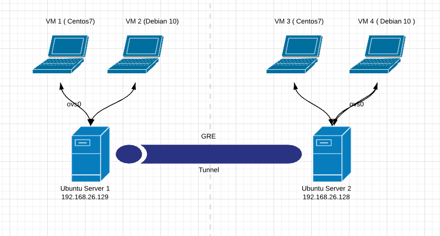

# LAB số 4 : Ứng dụng lý thuyết GRE

*Bài LAB thực hiện ứng dụng lý thuyết về Generic Routing Encapsulation* 

**Yêu cầu**

- Kiến thức về OVS

    Tham khảo tại :

    [tuananh2508/LinuxVcc](https://github.com/tuananh2508/LinuxVcc/blob/master/Virtualization/OVS(OpenVSwitch)/OPENVSWITCH/Ly-thuyet-OVS.md)

- Kiến thức về QEMU/KVM:

    Tham khảo tại :

    [tuananh2508/LinuxVcc](https://github.com/tuananh2508/LinuxVcc/blob/master/Virtualization/QEMU&KVM/KVM%26QEMU.md)

- 2 Server để thực hiện host 2 VM ( Trong bài sử dụng Ubuntu Server 20.04 )

    2 VM có OS là Centos 7

**Mô hình**



**Mục Lục**

# 1. Cấu hình tại Server 1

Đầu tiên chúng ta cần tạo 1 Bridge `ovs0` :

```bash
root@ubun-server:/# ovs-vsctl add-br ovs0
```

*Thông qua câu lệnh `ovs-vsctl` thì chúng ta đã khởi tạo ( `add-br` ) có tên là `ovs0`*

Sau khi đã tiến hành các bước trên, chúng ta sẽ thêm các Port của VM vào Bridge đã có sẵn. Ở chế độ mặc định thì các VM sẽ thuộc vào Linux Bridge `virbr0` , nên chúng ta cần tiến hành xóa ( Nếu VM của bạn không thuộc `virbr0` thì có thể bỏ qua bước này ) :

```bash
root@ubun-server:~# brctl show
bridge name     bridge id               STP enabled     interfaces
virbr0          8000.525400379997       yes             virbr0-nic
                                                        vnet0
                                                        vnet1
root@ubun-server:~# brctl delif virbr0 vnet0
root@ubun-server:~# brctl show
bridge name     bridge id               STP enabled     interfaces
virbr0          8000.525400379997       yes             virbr0-nic
```

Tiếp theo, ta sẽ thêm các Port VM và Port GRE vào Bridge `ovs0` :

```bash
root@ubun-server:/# ovs-vsctl add-port ovs0 vnet0
root@ubun-server:/# ovs-vsctl add-port ovs0 vnet1
root@ubun-server:/# ovs-vsctl add-port ovs0 gre0 -- set interface gre0 type=gre options:remote_ip=192.168.26.128
```

*Trong đó `192.168.26.128` là địa chỉ IP tại Server 2 và `gre0` là tên Port GRE ta khởi tạo*

**Lưu ý: Ở đây chúng ta sẽ không tiến hành thêm Port `ens39` vào các Bridge tại các Server!!!**

# 2. Cấu hình tại Server 2

Đầu tiên chúng ta cần tạo 1 Bridge `ovs0`  :

```bash
root@ubun-server-2:/# ovs-vsctl add-br ovs0
```

*Thông qua câu lệnh `ovs-vsctl` thì chúng ta đã khởi tạo ( `add-br` ) có tên là `ovs0`*

Sau khi đã tiến hành các bước trên, chúng ta sẽ thêm các Port của VM vào Bridge đã có sẵn. Ở chế độ mặc định thì các VM sẽ thuộc vào Linux Bridge `virbr0` , nên chúng ta cần tiến hành xóa ( Nếu VM của bạn không thuộc `virbr0` thì có thể bỏ qua bước này ) :

```bash
root@ubun-server-2:~# brctl show
bridge name     bridge id               STP enabled     interfaces
virbr0          8000.525400379997       yes             virbr0-nic
                                                        vnet0
                                                        vnet1
root@ubun-server-2:~# brctl delif virbr0 vnet0
root@ubun-server-2:~# brctl show
bridge name     bridge id               STP enabled     interfaces
virbr0          8000.525400379997       yes             virbr0-nic
```

Tiếp theo, ta sẽ thêm các Port VM và Port GRE vào Bridge `ovs0` :

```bash
root@ubun-server-2:/# ovs-vsctl add-port ovs0 vnet0
root@ubun-server-2:/# ovs-vsctl add-port ovs0 vnet1
root@ubun-server-2:/# ovs-vsctl add-port ovs0 gre0 -- set interface gre0 type=gre options:remote_ip=192.168.26.129
```

*Trong đó `192.168.26.129` là địa chỉ IP tại Server 1 và `gre0` là tên Port GRE ta khởi tạo*

**Lưu ý: Ở đây chúng ta sẽ không tiến hành thêm Port `ens39` vào các Bridge tại các Server!!!**

# 3. Tạo Network tại 2 Server

Công việc tiếp theo là khởi tạo 1 Network để có thể kết nối 2 VM tới Network này. Đầu tiên chúng ta cần tạo 1 file `ovs.xml` tại đường dẫn `/etc/libvirt/qemu/networks/` có nội dung như sau :

```bash
<network>
  <name>ovs</name>
  <forward mode='bridge'/>
  <bridge name='ovs0'/>
  <virtualport type='openvswitch'/>
</network>
```

*Trong đó*

- `ovs` : Tên Network ta sẽ khởi tạo
- `ovs0` : Tên của Bridge ta đã tạo trước đó

Sau khi đã có được file xml thì chúng ta sẽ sử dụng `virsh` để có thể tạo Network :

```bash
root@ubun-server-2:/etc/libvirt/qemu/networks# virsh net-define ovs.xml
root@ubun-server-2:/etc/libvirt/qemu/networks# virsh net-start ovs
root@ubun-server-2:/etc/libvirt/qemu/networks# virsh net-autostart ovs
root@ubun-server-2:/etc/libvirt/qemu/networks# virsh net-list --all
 Name      State    Autostart   Persistent
--------------------------------------------
 default   active   yes         yes
 ovs       active   yes         yes
```

*Thông qua*

- Câu lệnh 1, ta tiến hành khởi tạo 1 Network từ file xml có được
- Câu lệnh 2, việc thực hiện khởi động Network được tiến hành
- Câu lệnh 3, chuyển chế độ của Network sang tự khởi động mỗi khi máy Boot
- Câu lệnh 4, Kiểm tra việc khởi tạo Network

**Công việc này được lặp lại tại Server 1**!

# 4. Kiểm tra việc Ping giữa 2 VM và xem bản tin tại Wireshark

Thực hiện truy cập vào 2 VM đặt địa chỉ IP tĩnh

Tại VM-1

```bash
[root@localhost ~]# ip a f eth0
[root@localhost ~]# ip a a 192.168.26.219/24 dev eth0
```

Tại VM-3

```bash
[root@localhost ~]# ip a f eth0
[root@localhost ~]# ip a a 192.168.26.220/24 dev eth0
```

Tại VM-2

```bash
root@debian:~# ip a f ens2
root@debian:~# ip a a 192.168.26.211/24 dev ens2
```

Tại VM-4

```bash
root@debian:~# ip a f ens2
root@debian:~# ip a a 192.168.26.210/24 dev ens2
```

Sau đó tại VM-3 sẽ ping VM-1

```bash
[root@localhost ~]# ping 192.168.26.219
PING 192.168.26.219 (192.168.26.219) 56(84) bytes of data.
64 bytes from 192.168.26.219: icmp_seq=1 ttl=64 time=3.04 ms
64 bytes from 192.168.26.219: icmp_seq=2 ttl=64 time=0.896 ms
64 bytes from 192.168.26.219: icmp_seq=3 ttl=64 time=1.36 ms

--- 192.168.26.219 ping statistics ---
3 packets transmitted, 3 received, 0% packet loss, time 2006ms
rtt min/avg/max/mdev = 0.896/1.767/3.041/0.921 ms
```

→ Việc Ping thành công với 3/3 gói tin thành công

Và tương tự VM-2 sẽ ping VM-4

```bash
root@debian:~# ping 192.168.26.210
PING 192.168.26.210 (192.168.26.210) 56(84) bytes of data.
64 bytes from 192.168.26.210: icmp_seq=1 ttl=64 time=3.63 ms
64 bytes from 192.168.26.210: icmp_seq=2 ttl=64 time=1.16 ms
64 bytes from 192.168.26.210: icmp_seq=3 ttl=64 time=3.19 ms
^C
--- 192.168.26.210 ping statistics ---
3 packets transmitted, 3 received, 0% packet loss, time 8ms
rtt min/avg/max/mdev = 1.155/2.657/3.631/1.077 ms
```

→ Việc Ping thành công với 3/3 gói tin thành công

Để kiểm tra xem có 2 VM có thực sự dùng giao thức GRE không, chúng ta sẽ sẽ dụng phần mềm **WireShark** để bắt gói tin


→ Như vậy trong trường hợp đầu tiên ( VM3 ping VM1) đã có thêm tiêu đề GRE trong bản tin.


→ Và tương tự trong trường hợp thứ hai ( VM2 ping VM4) đã có thêm tiêu đề GRE trong bản tin 

⇒ Như vậy đã có sự xuất hiện của **GRE Header** và **Outer IP Header** trong cả 2 trường hợp → Chứng tỏ các bản tin của ta đã sử dụng GRE Tunnel .

---

# Nguồn tham khảo

[Connecting VMs Using Tunnels - Open vSwitch 2.14.90 documentation](https://docs.openvswitch.org/en/latest/howto/tunneling/)