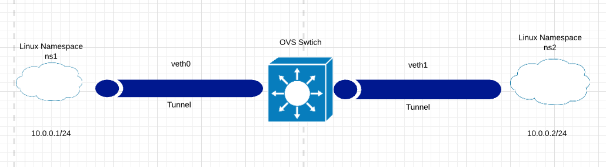

# LAB-Linux-NameSpace

**Mục lục**
- [LAB-Linux-NameSpace](#lab-linux-namespace)
- [Bài LAB 1: Thực hiện kết nối 2 Namespace thông qua Virtual Ethernet](#bài-lab-1-thực-hiện-kết-nối-2-namespace-thông-qua-virtual-ethernet)
  - [1. Thiết lập Linux Network Namspace](#1-thiết-lập-linux-network-namspace)
  - [2. Thêm đường liên kết Virtual Ethernet và gán các Interface vào Linux Namespace tương ứng](#2-thêm-đường-liên-kết-virtual-ethernet-và-gán-các-interface-vào-linux-namespace-tương-ứng)
  - [3. Tạo OVS Bridge và thêm `veth0` và `veth1` vào `ovs0`](#3-tạo-ovs-bridge-và-thêm-veth0-và-veth1-vào-ovs0)
  - [4. Truy cập 2 Linux Namespace và thực hiện Ping](#4-truy-cập-2-linux-namespace-và-thực-hiện-ping)
- [Bài LAB 2: Sử dụng OVS port để kết nối các Linux Namepsace](#bài-lab-2-sử-dụng-ovs-port-để-kết-nối-các-linux-namepsace)
  - [1. Thiết lập OvS Bridge và thêm các Port `tap0` và `tap1`](#1-thiết-lập-ovs-bridge-và-thêm-các-port-tap0-và-tap1)
  - [2. Gán Port `tap0` và `tap1` vào Linux Namespace](#2-gán-port-tap0-và-tap1-vào-linux-namespace)
  - [3. Truy cập các Linux Namespace đặt IP và tiến hành Ping](#3-truy-cập-các-linux-namespace-đặt-ip-và-tiến-hành-ping)
- [Bài LAB 3 : Cung cấp DHCP cho các Linux Namespace](#bài-lab-3--cung-cấp-dhcp-cho-các-linux-namespace)
  - [1. Tạo các Linux Network Namespace](#1-tạo-các-linux-network-namespace)
  - [2. Gán các Port OvS vào Linux Namespace `DHCP1` và `DHCP2`](#2-gán-các-port-ovs-vào-linux-namespace-dhcp1-và-dhcp2)
  - [3. Tạo Virtual Ethernet kết nối Linux Namespace và OvS](#3-tạo-virtual-ethernet-kết-nối-linux-namespace-và-ovs)
  - [4. Truy cập 2 Namespace yêu cầu đỉa chỉ IP từ DHCP Server](#4-truy-cập-2-namespace-yêu-cầu-đỉa-chỉ-ip-từ-dhcp-server)
- [Nguồn tham khảo](#nguồn-tham-khảo)

# Bài LAB 1: Thực hiện kết nối 2 Namespace thông qua Virtual Ethernet

**Yêu cầu**

- Một hệ thống sử dụng OS Linux ( Trong ví dụ sử dụng **Ubuntu Server 20.04** )
- Trên hệ thống đã cài đặt OpenvSwitch và biết thực hiện các thao tác cơ bản với OVS

    Tham khảo tại : [tuananh2508/LinuxVcc](https://github.com/tuananh2508/LinuxVcc/blob/master/Virtualization/OVS(OpenVSwitch)/OPENVSWITCH/Ly-thuyet-OVS.md)

- Lý thuyết cơ bản về Linux Namespace và các thao tác cơ bản  :

    Tham khảo tại : [tuananh2508/LinuxVcc](https://github.com/tuananh2508/LinuxVcc/blob/master/Virtualization/OVS(OpenVSwitch)/OPENVSWITCH/Linux-network-namespace.md)

**Mô hình**



***⇒Mục đích : Sau khi tiến hành thiết lập các thông số sẽ tiến hành ping thông từ `ns1` sang `ns2`***

## 1. Thiết lập Linux Network Namspace

Ở trong ví dụ này, ,chúng ta sẽ thiết lập 2 Linux Namespace có tên là `ns1` và `ns2` :

```bash
root@ubun-server:~# ip netns add ns1
root@ubun-server:~# ip netns add ns2
root@ubun-server:~# ip netns show
ns2
ns1
```

*Thông qua việc sử dụng câu lệnh `ip netns` và option `add` chúng ta đã thêm được 2 Linux Network Namspace mới đó là `ns1` và `ns2` .Ở câu lệnh cuối cùng ta tiến hành kiểm tra và thấy đã xuất hiện 2 LN ta vừa thiết lập*

## 2. Thêm đường liên kết Virtual Ethernet và gán các Interface vào Linux Namespace tương ứng

**Virtual Ethernet** hay còn gọi tắt là VETH là 1 kĩ thuật đặc biệt. Nó hoạt động tương đối giống với 1 Tunnel , cho phép việc truyền dữ liệu tại 1 đầu và dữ liệu sẽ được truyền tải tới đầu còn lại của Tunnel.

Ta tiến thành khởi tạo 2 VETH theo cú pháp :

```bash
root@ubun-server:~# ip link add veth0 type veth peer name eth0-ns1
root@ubun-server:~# ip link add veth1 type veth peer name eth0-ns2
root@ubun-server:~# ip link show | grep veth
15: eth0-ns1@veth0: <BROADCAST,MULTICAST,M-DOWN> mtu 1500 qdisc noop state DOWN mode DEFAULT group default qlen 1000
16: veth0@eth0-ns1: <BROADCAST,MULTICAST,M-DOWN> mtu 1500 qdisc noop state DOWN mode DEFAULT group default qlen 1000
17: eth0-ns2@veth1: <BROADCAST,MULTICAST,M-DOWN> mtu 1500 qdisc noop state DOWN mode DEFAULT group default qlen 1000
18: veth1@eth0-ns2: <BROADCAST,MULTICAST,M-DOWN> mtu 1500 qdisc noop state DOWN mode DEFAULT group default qlen 1000
```

*Tại 2 câu lệnh đầu ta sử dụng lệnh `ip link add` để tạo ra 2 VETH là `veth0` và `veth1` trong đó có chỉ định loại interface là veth và tại mỗi interface ta chỉ định `peer name` phù hợp. Tại câu lệnh cuối, ta thấy các sự thay đổi của ta đã thành công.*

Công việc tiếp theo đó là thêm các Interface tương ứng với Linux Namespace :

```bash
root@ubun-server:~# ip link set eth0-ns1 netns ns1
root@ubun-server:~# ip link set eth0-ns2 netns ns2
root@ubun-server:~# ip netns exec ns1 ip a s
1: lo: <LOOPBACK> mtu 65536 qdisc noop state DOWN group default qlen 1000
    link/loopback 00:00:00:00:00:00 brd 00:00:00:00:00:00
15: eth0-ns1@if16: <BROADCAST,MULTICAST> mtu 1500 qdisc noop state DOWN group default qlen 1000
    link/ether b6:82:9e:dd:2c:83 brd ff:ff:ff:ff:ff:ff link-netnsid 0
root@ubun-server:~# ip netns exec ns2 ip a s
1: lo: <LOOPBACK> mtu 65536 qdisc noop state DOWN group default qlen 1000
    link/loopback 00:00:00:00:00:00 brd 00:00:00:00:00:00
17: eth0-ns2@if18: <BROADCAST,MULTICAST> mtu 1500 qdisc noop state DOWN group default qlen 1000
    link/ether 4a:26:f8:41:e8:ca brd ff:ff:ff:ff:ff:ff link-netnsid 0

```

*Như vậy, với câu lệnh 1 và 2 ta đã tiến hành gán các Interface tương ứng với các Linux Namepsace lần lượt là `ns1` và `ns2`*. *Sau đó việc kiểm tra được diễn ra câu lệnh 3.*

## 3. Tạo OVS Bridge và thêm `veth0` và `veth1` vào `ovs0`

Việc tạo  1 OvS Bridge và thêm các Port vào được diễn ra như sau :

```bash
root@ubun-server:~# ovs-vsctl add-br ovs0
root@ubun-server:~# ovs-vsctl add-port ovs0 veth0
root@ubun-server:~# ovs-vsctl add-port ovs0 veth1
root@ubun-server:~# ovs-vsctl show
399eb6fe-51d2-4bca-ade7-e1fa41e5c7f9
    Bridge ovs0
        Port veth1
            Interface veth1
        Port veth0
            Interface veth0
        Port ovs0
            Interface ovs0
                type: internal
    ovs_version: "2.13.1"
root@ubun-server:~# ip link set veth1 up
root@ubun-server:~# ip link set veth0 up
```

*Thông qua việc thực hiện câu lệnh 1, ta đã tạo được 1 Bridge tên là `ovs0` và tiếp theo là chúng ta thêm các Port ( là các đầu còn lại của VETH ) vào OvS Bridge này. Cuối cùng, ta chuyển trạng thái hoạt động của 2 Interface này sang UP.*

## 4. Truy cập 2 Linux Namespace và thực hiện Ping

Ta truy cập các LN đã tạo ở bước 1 và đặt IP cho các interface tại các Linux Namespace này, tại LN `ns1` :

```bash
root@ubun-server:~# ip netns exec ns1 bash
root@ubun-server:~# ip a s
1: lo: <LOOPBACK> mtu 65536 qdisc noop state DOWN group default qlen 1000
    link/loopback 00:00:00:00:00:00 brd 00:00:00:00:00:00
15: eth0-ns1@if16: <BROADCAST,MULTICAST> mtu 1500 qdisc noop state DOWN group default qlen 1000
    link/ether b6:82:9e:dd:2c:83 brd ff:ff:ff:ff:ff:ff link-netnsid 0
root@ubun-server:~# ip add a 10.0.0.1/24 dev eth0-ns1
	root@ubun-server:~# ip link set eth0-ns1 up
```

*Việc truy cập Linux Network Namspace này được thực hiện qua lệnh `ip netns` , sau đó ta sẽ liệt kê các Interface thuộc LN `ns1` và tiến hành đặt địa chỉ cho Interface `eth0-ns1` là `10.0.0.1/24` . Sau đó thực hiện chuyển trạng thái của giao diện này sang UP*

Công việc tương tự được thực hiện tại `ns2`

```bash
root@ubun-server:~# ip netns exec ns2 bash
root@ubun-server:~# ip a s
1: lo: <LOOPBACK> mtu 65536 qdisc noop state DOWN group default qlen 1000
    link/loopback 00:00:00:00:00:00 brd 00:00:00:00:00:00
17: eth0-ns2@if18: <BROADCAST,MULTICAST> mtu 1500 qdisc noop state DOWN group default qlen 1000
    link/ether 4a:26:f8:41:e8:ca brd ff:ff:ff:ff:ff:ff link-netnsid 0
root@ubun-server:~# ip adđ a 10.0.0.2/24 dev eth0-ns2
root@ubun-server:~# ip link set eth0-ns2 up
```

Tại `ns2` tiến hành ping địa chỉ của Interface thuộc `ns1` 

```bash
PING 10.0.0.1 (10.0.0.1) 56(84) bytes of data.
64 bytes from 10.0.0.1: icmp_seq=1 ttl=64 time=0.211 ms
64 bytes from 10.0.0.1: icmp_seq=2 ttl=64 time=0.034 ms
64 bytes from 10.0.0.1: icmp_seq=3 ttl=64 time=0.035 ms
^C
--- 10.0.0.1 ping statistics ---
3 packets transmitted, 3 received, 0% packet loss, time 2054ms
rtt min/avg/max/mdev = 0.034/0.093/0.211/0.083 ms
```

→  Việc Ping đã thành công và quá trình thực hiện bài LAB đã thành công

# Bài LAB 2: Sử dụng OVS port để kết nối các Linux Namepsace

**Yêu cầu**

- Một hệ thống sử dụng OS Linux ( Ở ví dụ này sử dụng **Ubuntu Server 20.04**)
- Kiến thức và thao tác cơ bản với OpenvSwitch

    Tham khảo tại

    [tuananh2508/LinuxVcc](https://github.com/tuananh2508/LinuxVcc/blob/master/Virtualization/OVS(OpenVSwitch)/OPENVSWITCH/Ly-thuyet-OVS.md)

**Mô hình**


***⇒ Mục đích : Sau khi thiết lập các thông số, ta sẽ ping được từ LN `ns1` sang `ns2`***

## 1. Thiết lập OvS Bridge và thêm các Port `tap0` và `tap1`

Đầu tiên, để thực hiện mô hình này, chúng ta sẽ cần phải tạo 1 OvS Bridge để kết nối các Linux Namespace với nhau :

```bash
root@ubun-server:~# ovs-vsctl add-br ovs0
root@ubun-server:~# ovs-vsctl add-port ovs0 tap0 -- set interface tap0 type=internal
root@ubun-server:~# ovs-vsctl add-port ovs0 tap1 -- set interface tap1 type=internal
root@ubun-server:~# ovs-vsctl show
399eb6fe-51d2-4bca-ade7-e1fa41e5c7f9
    Bridge ovs0
        Port tap1
            Interface tap1
                type: internal
        Port ovs0
            Interface ovs0
                type: internal
        Port tap0
            Interface tap0
                type: internal
    ovs_version: "2.13.1"
root@ubun-server:~# ip link set tap0 up
root@ubun-server:~# ip link set tap1 up
```

*Việc tạo 1 Bridge OvS được diễn ra ở câu lệnh 1. Tiếp theo đó là việc tạo ra 2 Port dạng Interal ( Là Local Port của Bridge) `tap0` và `tap1`*. *Tiếp theo chúng ta sẽ chuyển trạng thái các Port này sang UP*

## 2. Gán Port `tap0` và `tap1` vào Linux Namespace

*Ta tạo các Linux Namespace là `ns1` và `ns2` và gán các port `tap0`  ( với `ns1`) và `tap1` (với `ns2` ):*

```bash
root@ubun-server:~# ip netns add ns1
root@ubun-server:~# ip netns add ns2
root@ubun-server:~# ip link set tap0 netns ns1
root@ubun-server:~# ip link set tap1 netns ns2
```

## 3. Truy cập các Linux Namespace đặt IP và tiến hành Ping

Tại Linux Namespace `ns1`  :

```bash
root@ubun-server:~# ip netns exec ns1 bash
root@ubun-server:~# ip a s
1: lo: <LOOPBACK> mtu 65536 qdisc noop state DOWN group default qlen 1000
    link/loopback 00:00:00:00:00:00 brd 00:00:00:00:00:00
9: tap0: <BROADCAST,MULTICAST> mtu 1500 qdisc noop state DOWN group default qlen 1000
    link/ether 1a:28:04:46:de:e1 brd ff:ff:ff:ff:ff:ff
root@ubun-server:~# ip a a 10.0.0.1/24 dev tap0
root@ubun-server:~# ip l s tap0 up
root@ubun-server:~# exit
```

*→ Việc truy cập LN `ns1` được diễn ra ở câu lệnh thứ nhất, sau đó ta tiến hành đặt IP cho Interface `tap0` và chuyển trạng thái sang UP*

Công việc tương tự diễn ra tại `ns2` :

```bash
root@ubun-server:~# ip netns exec ns2 bash
root@ubun-server:~# ip a s
1: lo: <LOOPBACK> mtu 65536 qdisc noop state DOWN group default qlen 1000
    link/loopback 00:00:00:00:00:00 brd 00:00:00:00:00:00
10: tap1: <BROADCAST,MULTICAST> mtu 1500 qdisc noop state DOWN group default qlen 1000
    link/ether fa:bf:ea:80:d9:1d brd ff:ff:ff:ff:ff:ff
root@ubun-server:~# ip a a 10.0.0.2/24 dev tap1
root@ubun-server:~# ip l s tap1 up
```

Cuối cùng tại `ns2` ta ping địa chỉ của `ns1` :

```bash
root@ubun-server:~# ping 10.0.0.1
PING 10.0.0.1 (10.0.0.1) 56(84) bytes of data.
64 bytes from 10.0.0.1: icmp_seq=1 ttl=64 time=0.233 ms
64 bytes from 10.0.0.1: icmp_seq=2 ttl=64 time=0.081 ms
^C
--- 10.0.0.1 ping statistics ---
2 packets transmitted, 2 received, 0% packet loss, time 1023ms
rtt min/avg/max/mdev = 0.081/0.157/0.233/0.076 ms
```

→  Việc Ping đã diễn ra thành công → Việc thực hiện bài LAB thành công

# Bài LAB 3 : Cung cấp DHCP cho các Linux Namespace

*Bài LAB thực hiện kết hợp các kĩ thuật từ các bài LAB 1 và 2 để thực hiện cung cấp DHCP cho LN*

**Yêu cầu**

- Một hệ thống sử dụng OS Linux ( Trong ví dụ là **Ubuntu Server 20.04**)
- Kiến thức và các thao tác cơ bản với OvS

    Tham khảo tại:

    [tuananh2508/LinuxVcc](https://github.com/tuananh2508/LinuxVcc/blob/master/Virtualization/OVS(OpenVSwitch)/OPENVSWITCH/Ly-thuyet-OVS.md)

**Mô hình**


*Trong đó, `ns1` và `DHCP1` thuộc VLAN 100 ; `ns2` và `DHCP2` thuộc VLAN 200*

 ***⇒ Mục đích : Sau khi tiến hành thiết lập cấu hình, tại Linux Network Namepsace `ns1` và `ns2` sẽ nhận được IP của DHCP tương ứng***

## 1. Tạo các Linux Network Namespace

Ở ví dụ này ta cần tạo tổng cộng là 4 Network Namspace là : `ns1` ,  `ns2` và `DHCP1` , `DHCP2`

```bash
root@ubun-server:~# ip netns add DHCP1
root@ubun-server:~# ip netns add DHCP2
root@ubun-server:~# ip netns add ns1
root@ubun-server:~# ip netns add ns2
root@ubun-server:~# ip netns show
DHCP2
DHCP1
ns2
ns1
```

Thông qua việc sử dụng lệnh `ip netns` ta đã tạo được 4 Linux Namespace 

## 2. Gán các Port OvS vào Linux Namespace `DHCP1` và `DHCP2`

Chúng ta sẽ tiến hành tạo 1 OvS Bridge và thêm các Port là `tap0` và `tap1` vào các Linux Namespace tương ứng với mô hình

```bash
root@ubun-server:~# ovs-vsctl add-br ovs0
root@ubun-server:~# ovs-vsctl add-port ovs0 tap0 -- set interface tap0 type=internal
root@ubun-server:~# ovs-vsctl set port tap0 tag=100
root@ubun-server:~# ovs-vsctl add-port ovs0 tap1 -- set interface tap1 type=internal
root@ubun-server:~# ovs-vsctl set port tap1 tag=200
root@ubun-server:~# ip l s tap0 netns DHCP1
root@ubun-server:~# ip l s tap1 netns DHCP2
```

Sau đó, ta sẽ truy cập vào các Namespace này và thực hiện cung cấp DHCP thông qua `dnsmasq` ( 1 công cụ có kích thước nhỏ có chức năng cung cấp DNS và 1 DHCP Server hỗ trợ cho DHCPv6) 

```bash
root@ubun-server:~# ip netns exec DHCP1 bash
root@ubun-server:~# ip l set tap0 up
root@ubun-server:~# ip a a 10.0.0.1/24 dev tap0
root@ubun-server:~# exit
root@ubun-server:~# ip netns exec DHCP2 bash
root@ubun-server:~# ip a a 10.0.0.2/24 dev tap1
root@ubun-server:~# ip l s tap1 up
root@ubun-server:~# exit
root@ubun-server:~# ip netns exec DHCP1 dnsmasq --interface=tap0 --dhcp-range=10.0.0.10,10.0.0.100,255.255.255.0
root@ubun-server:~# ip netns exec DHCP2 dnsmasq --interface=tap1 --dhcp-range=10.0.0.20,10.0.0.200,255.255.255.0
```

*Ta đã truy cập Namespace `DHCP1` và `DHCP2` thông qua câu lệnh 1 và 5. Sau đó tại mỗi Namespace tiến hành cấu hình IP và chuyển trạng thái của Interface `tap*` sang UP. Cuối cùng, tại Root Network Namespace ta sẽ cấu hình `dnsmasq` cho các Network Namspace tại câu lệnh 9 và 10. Trong đó `interface` là cổng tương ứng mà ta sẽ thực hiện cài đặt việc cung cấp địa chỉ IP qua DHCP; `dhcp-range` chỉ định pool cấp IP và Subnet Mask*

## 3. Tạo Virtual Ethernet kết nối Linux Namespace và OvS

*Ta tiến hành tạo 2 Virtual Ethernet là `veth0` và `veth1`, gán 2 Interface là `eth0-ns1` và `eth0-ns2` vào Linux Network Namspace `ns1` và `ns2` , cuối cùng là sử dụng `ip netns` để chuyển các Interface `eth0-ns1` và `eth0-ns2` sang trạng thái UP:*

```bash
root@ubun-server:~# ip l a veth0 type veth peer name eth0-ns1
root@ubun-server:~# ip l a veth1 type veth peer name eth0-ns2
root@ubun-server:~# ip l s eth0-ns1 netns ns1
root@ubun-server:~# ip l s eth0-ns2 netns ns2
root@ubun-server:~# ip netns exec ns1 ip l s eth0-ns1 up
root@ubun-server:~# ip netns exec ns2 ip l s eth0-ns2 up

```

*Sau đó, ta sẽ tiến hành việc thêm các Interface là `veth0` và `veth1` vào OvS Bridge `ovs0` và đặt chúng vào VLAN 100 và VLAN 200 tương ứng trong mô hình*

```bash
root@ubun-server:~# ip l s veth0 up
root@ubun-server:~# ip l s veth1 up
root@ubun-server:~# ovs-vsctl add-port ovs0 veth0 -- set port veth0 tag=100
root@ubun-server:~# ovs-vsctl add-port ovs0 veth1 -- set port veth0 tag=200
```

## 4. Truy cập 2 Namespace yêu cầu đỉa chỉ IP từ DHCP Server

Tại Namespace `ns1` 

```bash
root@ubun-server:~# ip netns exec ns1 bash
root@ubun-server:~# dhclient eth0-ns1
root@ubun-server:~# ip a s
1: lo: <LOOPBACK,UP,LOWER_UP> mtu 65536 qdisc noqueue state UNKNOWN group default qlen 1000
    link/loopback 00:00:00:00:00:00 brd 00:00:00:00:00:00
    inet 127.0.0.1/8 scope host lo
       valid_lft forever preferred_lft forever
    inet6 ::1/128 scope host
       valid_lft forever preferred_lft forever
15: eth0-ns1@if16: <BROADCAST,MULTICAST,UP,LOWER_UP> mtu 1500 qdisc noqueue state UP group default qlen 1000
    link/ether 96:3d:bd:a8:e4:db brd ff:ff:ff:ff:ff:ff link-netnsid 0
    inet 10.0.0.17/24 brd 10.0.0.255 scope global dynamic eth0-ns1
       valid_lft 2850sec preferred_lft 2850sec
    inet6 fe80::943d:bdff:fea8:e4db/64 scope link
       valid_lft forever preferred_lft forever
```

Tại Namespace `ns2`

```bash
root@ubun-server:~# ip netns exec ns2 bash
root@ubun-server:~# dhclient eth0-ns2
root@ubun-server:~# ip a s
1: lo: <LOOPBACK,UP,LOWER_UP> mtu 65536 qdisc noqueue state UNKNOWN group default qlen 1000
    link/loopback 00:00:00:00:00:00 brd 00:00:00:00:00:00
    inet 127.0.0.1/8 scope host lo
       valid_lft forever preferred_lft forever
    inet6 ::1/128 scope host
       valid_lft forever preferred_lft forever
17: eth0-ns2@if18: <BROADCAST,MULTICAST,UP,LOWER_UP> mtu 1500 qdisc noqueue state UP group default qlen 1000
    link/ether 6a:0c:f1:fd:e5:92 brd ff:ff:ff:ff:ff:ff link-netnsid 0
    inet 10.0.0.184/24 brd 10.0.0.255 scope global dynamic eth0-ns2
       valid_lft 2843sec preferred_lft 2843sec
    inet6 fe80::680c:f1ff:fefd:e592/64 scope link
       valid_lft forever preferred_lft forever
```

***⇒ Như vậy tại cả 2 Namespace, các Interface tương ứng đã có địa chỉ IP mới thông qua việc yêu cầu IP từ DHCP Server → Bài LAB thực hiện thành công***

---

# Nguồn tham khảo

[hocchudong/thuctap012017](https://github.com/hocchudong/thuctap012017/blob/master/TamNT/Virtualization/docs/7.Linux_network_namespace.md#2)
