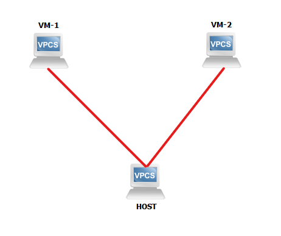

# Lab-1-LB-to-OVS

*Bài LAB thực hiện tạo 1 Bridge với OpenVSwitch để kết nối  2 VM trên Bridge → Sau khi thực hiện có thể thực hiện Ping thành công giữa 2 VM*

**Yêu cầu**

- Kiến thức về OVS cũng như cách sử dụng cơ bản với câu lệnh `ovs-vsctl`
- Một máy chủ Host và 2 VM đang hoạt động trên Host ( Ở ví dụ này các VM được tạo bằng QEMU-KVM)
- Một dải mạng mạng khả dụng ( Có thể là mạng nối ra External Network hoặc Host-only Network )

**Mô hình**



**Mục lục**
- [Lab-1-LB-to-OVS](#lab-1-lb-to-ovs)
- [Thực hiện bài LAB](#thực-hiện-bài-lab)
  - [Cài đặt Package OpenVSwitch](#cài-đặt-package-openvswitch)
  - [Bước 1: Thực hiện tạo Bridge giữa 2 VM](#bước-1-thực-hiện-tạo-bridge-giữa-2-vm)
  - [Bước 2 : Thêm giao diện mạng vào OVS Bridge](#bước-2--thêm-giao-diện-mạng-vào-ovs-bridge)
  - [Bước 3 : Thêm Port của VM vào OVS Bridge](#bước-3--thêm-port-của-vm-vào-ovs-bridge)
  - [Bước 4 : Yêu cầu địa chỉ IP mới cho các VM](#bước-4--yêu-cầu-địa-chỉ-ip-mới-cho-các-vm)
    - [Tại VM 1 :](#tại-vm-1-)
    - [Tại VM 2 :](#tại-vm-2-)
  - [Bước 5 : Tiến hành kiểm tra Ping giữa 2 VM](#bước-5--tiến-hành-kiểm-tra-ping-giữa-2-vm)
- [Nguồn tham khảo](#nguồn-tham-khảo)


# Thực hiện bài LAB

## Cài đặt Package OpenVSwitch

Đầu tiên, chúng ta cần thực hiện cài đặt Package OVS :

 *Trên Ubuntu / Debian*

```bash
sudo apt update
sudo apt upgrade
sudo apt install openvswitch-switch
```

## Bước 1: Thực hiện tạo Bridge giữa 2 VM

Tương tự như Linux Bride, thì chúng ta cũng cần tạo 1 Bridge giữa 2 VM để có thể thực hiện kết nối giữa 2 VM. Việc tiến hành được thực hiện như sau, đầu tiên ta thực hiện kiểm tra các Bridge trên hệ thống ( nếu có ) :

```bash
root@ubun-server:/# ovs-vsctl show
399eb6fe-51d2-4bca-ade7-e1fa41e5c7f9
    ovs_version: "2.13.1"
```

→ Hiện tại trên hệ thống không có Bridge nào đang hoạt động 

Vậy chúng ta cần thực hiện tạo 1 Bridge trên hệ thống qua việc thực hiện các lệnh sau :

```bash
root@ubun-server:/# ovs-vsctl add-br ovs
root@ubun-server:/# ovs-vsctl show
399eb6fe-51d2-4bca-ade7-e1fa41e5c7f9
    Bridge ovs
        Port ovs
            Interface ovs
                type: internal
    ovs_version: "2.13.1"
root@ubun-server:/#
```

*Thông qua :*

*Câu lệnh 1 : Chúng ta thực hiện tạo 1 Bridge tên là `ovs` thông qua câu lệnh `ovs-vsctl`*

*Câu lệnh 2 : Thực hiện kiểm tra việc khởi tạo Bridge. Kết quả nhận được đó là 1 Bridge `ovs`*

## Bước 2 : Thêm giao diện mạng vào OVS Bridge

Ta thực hiện việc kiểm thêm giao diện mạng ( Ở đây Interface khả dụng có tên là `ens38` ) vào trong OVS Bridge như sau. Kiểm tra giao diện mạng :

```bash
root@ubun-server:~# ip add show ens38
3: ens38: <BROADCAST,MULTICAST,UP,LOWER_UP> mtu 1500 qdisc fq_codel state UP group default qlen 1000
    link/ether 00:0c:29:04:c9:32 brd ff:ff:ff:ff:ff:ff
    inet 192.168.98.138/24 brd 192.168.98.255 scope global ens38
       valid_lft forever preferred_lft forever
    inet6 fe80::20c:29ff:fe04:c932/64 scope link
       valid_lft forever preferred_lft forever
```

Sau đó thực hiện thêm `ens38` vào OVS Bridge `ovs` , rồi yêu cầu địa chỉ IP cho Bride OVS ( Hoặc tại bước này bạn cũng có thể đặt IP tĩnh thông  qua lệnh `ip a add` ) :

```bash
root@ubun-server:~# ovs-vsctl add-port ovs ens38
root@ubun-server:~# dhclient ovs
```

Cuối cùng ta thực hiện xóa địa chỉ IP hiện tại của `ens38`, kiểm tra địa chỉ của `ens38` sau khi thực hiện xóa và kiểm tra IP của Bridge `ovs` :

```bash
root@ubun-server:~# ip add flush ens38
root@ubun-server:~# ip add show ens38
3: ens38: <BROADCAST,MULTICAST,UP,LOWER_UP> mtu 1500 qdisc fq_codel master ovs-system state UP group default qlen 1000
    link/ether 00:0c:29:04:c9:32 brd ff:ff:ff:ff:ff:ff
root@ubun-server:~# ip a s ovs
5: ovs: <BROADCAST,MULTICAST,UP,LOWER_UP> mtu 1500 qdisc noqueue state UNKNOWN group default qlen 1000
    link/ether 00:0c:29:04:c9:32 brd ff:ff:ff:ff:ff:ff
    inet 192.168.98.142/24 brd 192.168.98.255 scope global dynamic ovs
       valid_lft 1786sec preferred_lft 1786sec
    inet6 fe80::20c:29ff:fe04:c932/64 scope link
       valid_lft forever preferred_lft forever
```

*→ Hiện tại `ovs` đã có địa chỉ là `192.168.98.142`*

## Bước 3 : Thêm Port của VM vào OVS Bridge

Ở chế dộ mặc định, khi thực hiện tạo VM bằng QEMU/KVM thì nó sẽ được mặc định add vào 1 Bridge có tên là `virbr0` của Linux Bridge. 

```bash
root@ubun-server:/# brctl show
bridge name     bridge id               STP enabled     interfaces
virbr0          8000.525400379997       yes             virbr0-nic
                                                        vnet0
                                                        vnet1
```

Ta nhận thấy rằng trên Linux Bridge `virbr0` hiện đang có 2 giao diện của VM là `vnet0` và `vnet1`. Chúng ta cần thực hiện xóa Interface `vnet*` ra khỏi Linux Bridge để có thể sử dụng `vnet*` với OVS  

```bash
root@ubun-server:/# ip link set virbr0 down
root@ubun-server:/# brctl delif virbr0 vnet0
root@ubun-server:/# brctl delif virbr0 vnet1
root@ubun-server:/# brctl show
bridge name     bridge id               STP enabled     interfaces
virbr0          8000.525400379997       yes             virbr0-nic
```

*Trong đó :*

*Thông qua câu lệnh 1, chúng ta thực hiện chuyển trạng thái của Linux Bridge thành Down ( Không hoạt động )*

*Tại câu lệnh thứ 2 và thứ 3 , ta sẽ thực hiện xóa các giao diện mạng `vnet0` và `vnet1` khỏi Linux Bridge này*

*Việc kiểm tra kết quả được diễn ra tại câu lệnh thứ 4 qua lệnh `brctl show`*

Bước tiếp theo đó là việc thêm `vnet0` và `vnet1` vào OVS Bridge `ovs` :

```bash
root@ubun-server:~# ovs-vsctl add-port ovs vnet0
root@ubun-server:~# ovs-vsctl add-port ovs vnet1
root@ubun-server:~# ovs-vsctl show
399eb6fe-51d2-4bca-ade7-e1fa41e5c7f9
    Bridge ovs
        Port ens38
            Interface ens38
        Port vnet0
            Interface vnet0
        Port ovs
            Interface ovs
                type: internal
        Port vnet1
            Interface vnet1
    ovs_version: "2.13.1"
root@ubun-server:~#
```

*Giải thích*

*Tại câu lệnh 1 và 2, chúng ta thực hiện sử dụng câu lệnh `ovs-vsctl` để thêm port ( `add-port` ) `vnet0` và `vnet1`*

*Tại câu lệnh cuối thực hiện kiểm tra việc khởi tạo của 2 Port OVS .*

## Bước 4 : Yêu cầu địa chỉ IP mới cho các VM

Sau khi đã thực hiện tất cả các bước trên, thì bước tiếp theo chúng ta cần làm là yêu cầu địa chỉ IP mới cho các VM. .Việc này được thực hiện như sau

### Tại VM 1 :

Kiểm tra địa chỉ IP hiện tại của VM :

```bash
root@debian:~# ip a s
1: lo: <LOOPBACK,UP,LOWER_UP> mtu 65536 qdisc noqueue state UNKNOWN group default qlen 1000
    link/loopback 00:00:00:00:00:00 brd 00:00:00:00:00:00
    inet 127.0.0.1/8 scope host lo
       valid_lft forever preferred_lft forever
    inet6 ::1/128 scope host
       valid_lft forever preferred_lft forever
2: ens2: <BROADCAST,MULTICAST,UP,LOWER_UP> mtu 1500 qdisc pfifo_fast state UP group default qlen 1000
    link/ether 52:54:00:a6:7b:25 brd ff:ff:ff:ff:ff:ff
    inet 192.168.122.118/24 brd 192.168.122.255 scope global dynamic ens2
       valid_lft 1481sec preferred_lft 1481sec
    inet6 fe80::5054:ff:fea6:7b25/64 scope link
       valid_lft forever preferred_lft forever
```

 → Ta nhận thấy rằng hiện tại VM vẫn đang nhận địa chỉ của Linux Bridge ( thuộc dải mạng `192.168.122.0/24`  

Tiếp theo chúng ta sẽ xóa địa chỉ IP cũ này và yêu cầu địa chỉ IP mới :

```bash
root@debian:~# ip a flush ens2
root@debian:~# dhclient ens2
root@debian:~# ip add show
1: lo: <LOOPBACK,UP,LOWER_UP> mtu 65536 qdisc noqueue state UNKNOWN group default qlen 1000
    link/loopback 00:00:00:00:00:00 brd 00:00:00:00:00:00
    inet 127.0.0.1/8 scope host lo
       valid_lft forever preferred_lft forever
    inet6 ::1/128 scope host
       valid_lft forever preferred_lft forever
2: ens2: <BROADCAST,MULTICAST,UP,LOWER_UP> mtu 1500 qdisc pfifo_fast state UP group default qlen 1000
    link/ether 52:54:00:a6:7b:25 brd ff:ff:ff:ff:ff:ff
    inet 192.168.98.139/24 brd 192.168.98.255 scope global dynamic ens2
       valid_lft 1799sec preferred_lft 1799sec
```

*Sau khi thực hiện xóa địa chỉ IP qua lệnh thứ nhấ và yêu cầu địa chỉ IP mới tại câu lệnh thứ 2, thì ta nhận thấy kết quả nhận được tại câu lệnh thứ 3 đó chính là giao diện mạng `ens2` đã có địa chỉ mới là `192.168.98.139`* 

### Tại VM 2 :

Ta thực hiện tương tự lại các bước tại VM 1, đầu tiên là kiểm tra địa chỉ IP hiện tại :

```bash
	root@debian:~# ip a s
1: lo: <LOOPBACK,UP,LOWER_UP> mtu 65536 qdisc noqueue state UNKNOWN group default qlen 1000
    link/loopback 00:00:00:00:00:00 brd 00:00:00:00:00:00
    inet 127.0.0.1/8 scope host lo
       valid_lft forever preferred_lft forever
    inet6 ::1/128 scope host
       valid_lft forever preferred_lft forever
2: ens2: <BROADCAST,MULTICAST,UP,LOWER_UP> mtu 1500 qdisc pfifo_fast state UP group default qlen 1000
    link/ether 52:54:00:80:bf:5b brd ff:ff:ff:ff:ff:ff
    inet 192.168.122.145/24 brd 192.168.122.255 scope global dynamic ens2
       valid_lft 1627sec preferred_lft 1627sec
    inet6 fe80::5054:ff:fe80:bf5b/64 scope link
       valid_lft forever preferred_lft forever
```

Tiếp theo là việc yêu cầu địa chỉ mới :

```bash
root@debian:~# ip add flush ens2
root@debian:~# dhclient ens2
root@debian:~# ip add show ens2
2: ens2: <BROADCAST,MULTICAST,UP,LOWER_UP> mtu 1500 qdisc pfifo_fast state UP group default qlen 1000
    link/ether 52:54:00:80:bf:5b brd ff:ff:ff:ff:ff:ff
    inet 192.168.98.140/24 brd 192.168.98.255 scope global dynamic ens2
       valid_lft 1797sec preferred_lft 1797sec
```

## Bước 5 : Tiến hành kiểm tra Ping giữa 2 VM

Ta thực hiện việc Ping giữa 2 VM tại VM 2:

```bash
root@debian:~# ping 192.168.98.139
PING 192.168.98.139 (192.168.98.139) 56(84) bytes of data.
64 bytes from 192.168.98.139: icmp_seq=1 ttl=64 time=1.89 ms
64 bytes from 192.168.98.139: icmp_seq=2 ttl=64 time=3.52 ms
64 bytes from 192.168.98.139: icmp_seq=3 ttl=64 time=1.40 ms
64 bytes from 192.168.98.139: icmp_seq=4 ttl=64 time=3.32 ms
^C
--- 192.168.98.139 ping statistics ---
4 packets transmitted, 4 received, 0% packet loss, time 17ms
rtt min/avg/max/mdev = 1.401/2.531/3.515/0.907 ms

```

⇒ Kết quả nhận được là ta thực hiện gửi 4 gói tin thành công. Vậy việc thiết lập OVS Bridge giữa 2 VM đã được thực hiện thành công. 

---

# Nguồn tham khảo

[hocchudong/thuctap012017](https://github.com/hocchudong/thuctap012017/tree/master/TamNT/Virtualization/docs)

[hocchudong/thuctap012017](https://github.com/hocchudong/thuctap012017/blob/master/XuanSon/Virtualization/Virtual%20Switch/Open%20vSwitch/Lab_tinh_nang_forward_packet.md)

[Open vSwitch with KVM - Open vSwitch 2.14.90 documentation](https://docs.openvswitch.org/en/latest/howto/kvm/?highlight=kvm#setup)