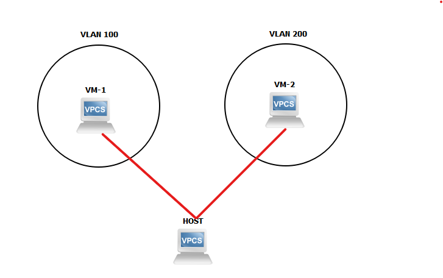

# Lab-2-OVS-VLAN

*Bài LAB thực hiện chia VLAN giữa các các PC ( Ở đây là các VM ) thông qua hoạt động với OVS.* 

**Mô hình**



**Yêu cầu**

- Kiến thức về OpenVSwitch và các thao tác lệnh cơ bản với OVS

    Có thể tham khảo tại 

    []()

- Kiến thức về VLAN , hiểu về cách hoạt động của VLAN
- 1 server Host thực hiện chạy 2 máy ảo VM QEMU/KVM ( Ở trạng thái Running )
- 1 dải mạng khả dụng trên server Host  ( Trong bài LAB này là `ens38` )

**Mục lục**
* [Thực hành bài LAB](#thực-hành-bài-lab)
    * [Bước 1 : Thực hiện tạo 1 Bridge bằng OpenVSwitch](#bước-1--thực-hiện-tạo-1-bridge-bằng-openvswitch)
    * [Bước 2 : Thực hiện thêm các port của VM vào VLAN thông qua OVS](#bước-2--thực-hiện-thêm-các-port-của-vm-vào-vlan-thông-qua-ovs)
    * [Bước 3 : Thực hiện Ping giữa 2 VM](#bước-3--thực-hiện-ping-giữa-2-vm)
* [Nguồn tham khảo:](#nguồn-tham-khảo)

# Thực hành bài LAB

## Bước 1 : Thực hiện tạo 1 Bridge bằng OpenVSwitch

Tương tự như Linux Bride, thì chúng ta cũng cần tạo 1 Bridge giữa 2 VM để có thể thực hiện kết nối giữa 2 VM. Việc tiến hành được thực hiện như sau, đầu tiên ta thực hiện kiểm tra các Bridge trên hệ thống ( nếu có ) :

```bash
root@ubun-server:/# ovs-vsctl show
399eb6fe-51d2-4bca-ade7-e1fa41e5c7f9
    ovs_version: "2.13.1"
```

→ Hiện tại trên hệ thống không có Bridge nào đang hoạt động 

Vậy chúng ta cần thực hiện tạo 1 Bridge trên hệ thống qua việc thực hiện các lệnh sau :

```bash
root@ubun-server:/# ovs-vsctl add-br ovs
root@ubun-server:/# ovs-vsctl show
399eb6fe-51d2-4bca-ade7-e1fa41e5c7f9
    Bridge ovs
        Port ovs
            Interface ovs
                type: internal
    ovs_version: "2.13.1"
root@ubun-server:/#
```

*Thông qua :*

*Câu lệnh 1 : Chúng ta thực hiện tạo 1 Bridge tên là `ovs` thông qua câu lệnh `ovs-vsctl`*

*Câu lệnh 2 : Thực hiện kiểm tra việc khởi tạo Bridge. Kết quả nhận được đó là 1 Bridge `ovs`*

Sau đó ta cần thực hiện tạo Network cho Bridge này thông qua việc định nghĩa file `*.xml` , ta thực hiện tạo 1 file xml có tên là `ovs.xml`  có nội dung như sau:

```bash
<network>
  <name>ovs</name>
  <forward mode="bridge"/>
  <bridge name="ovst"/>
  <virtualport type='openvswitch' />
</network>
```

Trong đó : 

- Mục name : là tên của Network chúng ta sẽ sử dụng
- Mục forward mode : Chế độ chúng ta sử dụng với Network này là chế độ Bridge
- Mục bridge : Tên của Bridge ta vừa tạo ở bước trên
- Mục virtualport type : Chỉ định loại Port chúng ta sử dụng

Tiếp tục thực hiện lệnh với `virsh` để tạo và chạy network :

```bash
root@ubun-server:/etc/libvirt/qemu/networks# virsh net-define ovs.xml
Network ovs defined from ovs.xml

oot@ubun-server:/etc/libvirt/qemu/networks# virsh net-start ovs
Network ovs started

root@ubun-server:/etc/libvirt/qemu/networks# virsh net-autostart ovs
Network ovs marked as autostarted

root@ubun-server:/etc/libvirt/qemu/networks# virsh net-list --all
 Name      State    Autostart   Persistent
--------------------------------------------
 default   active   yes         yes
 ovs       active   yes         yes
```

*Thông qua việc sử dụng lệnh thứ nhất, ta sẽ tạo được 1 Network từ file `.xml` ở phía trên vừa khởi tạo. Sau khi đã khởi tạo thành công, ta sẽ tiến hành chạy Network này và bật chế độ tự động khởi động với câu lệnh thứ 2 và thứ 3. Cuôi cùng, sau khi thực hiện các lệnh trên thì ta sẽ thực hiện kiểm tra lại thông qua câu lệnh `virsh` và nhận thấy kết quả là đã có 1 Network tên là `ovs` .*

Tiếp theo chúng ta cần thực hiện thêm giao diện mạng khả dụng vào trong Bridge . Ta thực hiện việc kiểm thêm giao diện mạng ( Ở đây Interface khả dụng có tên là `ens38` ) vào trong OVS Bridge như sau. Kiểm tra giao diện mạng :

```bash
root@ubun-server:~# ip add show ens38
3: ens38: <BROADCAST,MULTICAST,UP,LOWER_UP> mtu 1500 qdisc fq_codel state UP group default qlen 1000
    link/ether 00:0c:29:04:c9:32 brd ff:ff:ff:ff:ff:ff
    inet 192.168.98.138/24 brd 192.168.98.255 scope global ens38
       valid_lft forever preferred_lft forever
    inet6 fe80::20c:29ff:fe04:c932/64 scope link
       valid_lft forever preferred_lft forever
```

Sau đó thực hiện thêm `ens38` vào OVS Bridge `ovs` , rồi yêu cầu địa chỉ IP cho Bride OVS ( Hoặc tại bước này bạn cũng có thể đặt IP tĩnh thông  qua lệnh `ip a add` ) :

```bash
root@ubun-server:~# ovs-vsctl add-port ovs ens38
root@ubun-server:~# dhclient ovs
```

Cuối cùng ta thực hiện xóa địa chỉ IP hiện tại của `ens38`, kiểm tra địa chỉ của `ens38` sau khi thực hiện xóa và kiểm tra IP của Bridge `ovs` :

```bash
root@ubun-server:~# ip add flush ens38
root@ubun-server:~# ip add show ens38
3: ens38: <BROADCAST,MULTICAST,UP,LOWER_UP> mtu 1500 qdisc fq_codel master ovs-system state UP group default qlen 1000
    link/ether 00:0c:29:04:c9:32 brd ff:ff:ff:ff:ff:ff
root@ubun-server:~# ip a s ovs
5: ovs: <BROADCAST,MULTICAST,UP,LOWER_UP> mtu 1500 qdisc noqueue state UNKNOWN group default qlen 1000
    link/ether 00:0c:29:04:c9:32 brd ff:ff:ff:ff:ff:ff
    inet 192.168.98.142/24 brd 192.168.98.255 scope global dynamic ovs
       valid_lft 1786sec preferred_lft 1786sec
    inet6 fe80::20c:29ff:fe04:c932/64 scope link
       valid_lft forever preferred_lft forever
```

*→ Hiện tại `ovs` đã có địa chỉ là `192.168.98.142`*

 

## Bước 2 : Thực hiện thêm các port của VM vào VLAN thông qua OVS

Ở chế dộ mặc định, khi thực hiện tạo VM bằng QEMU/KVM thì nó sẽ được mặc định add vào 1 Bridge có tên là `virbr0` của Linux Bridge. 

```bash
root@ubun-server:/# brctl show
bridge name     bridge id               STP enabled     interfaces
virbr0          8000.525400379997       yes             virbr0-nic
                                                        vnet0
                                                        vnet1
```

Ta nhận thấy rằng trên Linux Bridge `virbr0` hiện đang có 2 giao diện của VM là `vnet0` và `vnet1`. Chúng ta cần thực hiện xóa Interface `vnet*` ra khỏi Linux Bridge để có thể sử dụng `vnet*` với OVS  

```bash
root@ubun-server:/# ip link set virbr0 down
root@ubun-server:/# brctl delif virbr0 vnet0
root@ubun-server:/# brctl delif virbr0 vnet1
root@ubun-server:/# brctl show
bridge name     bridge id               STP enabled     interfaces
virbr0          8000.525400379997       yes             virbr0-nic
```

*Trong đó :*

*Thông qua câu lệnh 1, chúng ta thực hiện chuyển trạng thái của Linux Bridge thành Down ( Không hoạt động )*

*Tại câu lệnh thứ 2 và thứ 3 , ta sẽ thực hiện xóa các giao diện mạng `vnet0` và `vnet1` khỏi Linux Bridge này*

*Việc kiểm tra kết quả được diễn ra tại câu lệnh thứ 4 qua lệnh `brctl show`*

Bước tiếp theo đó là thêm các giao diện mạng của VM vào VLAN thông qua OVS Bridge :

```bash
root@ubun-server:/# ovs-vsctl add-port ovs vnet0 tag=100
root@ubun-server:/# ovs-vsctl add-port ovs vnet1 tag=200
root@ubun-server:/# ovs-vsctl show
399eb6fe-51d2-4bca-ade7-e1fa41e5c7f9
    Bridge ovs
        Port ovs
            Interface ovs
                type: internal
        Port ens38
            Interface ens38
        Port vnet1
            tag: 200
            Interface vnet1
        Port vnet0
            tag: 100
            Interface vnet0
    ovs_version: "2.13.1"
```

 

*Trong đó* : 

*Với câu lệnh thứ nhất, ta thực hiện thêm giao diện `vnet0` vào Bridge ở VLAN 100*

*Với câu lệnh thứ hai , ta thực hiện thêm giao diện `vnet1` vào Bridge ở VLAN 200*

*Cuối cùng, ta kiểm tra lại kết quả ở câu lệnh thứ 3. Nhận được kết quả mong muốn*

## Bước 3 : Thực hiện Ping giữa 2 VM

Ta thực hiện truy cập vào 2 VM và thực lấy địa chỉ IP và sau đó thực hiện ping giữa 2 VM để kiểm tra liệu việc ping giữa 2 VM có thành công không. Tại VM , ta thực hiện nhập những dòng lệnh sau:

```bash
root@debian:~# ip a f ens2
root@debian:~# ip a a 192.168.98.139/24 dev ens2
root@debian:~# ip a s ens2
2: ens2: <BROADCAST,MULTICAST,UP,LOWER_UP> mtu 1500 qdisc pfifo_fast state UP group default qlen 1000
    link/ether 52:54:00:79:f0:7a brd ff:ff:ff:ff:ff:ff
    inet 192.168.98.139/24 brd 192.168.98.255 scope global dynamic ens2
       valid_lft 1795sec preferred_lft 1795sec
```

*Ta thực hiện xóa địa chỉ ip hiện tại của giao diện mạng VM, sau đó thực hiện thêm địa chỉ IP cho VM*

Thực hiện việc tương tự tại VM 2 Nhận được kết quả như sau :

```bash
root@debian:~# ip a f ens2
root@debian:~# ip a  a 192.168.98.140/24 dev ens2
root@debian:~# ip a s ens2
2: ens2: <BROADCAST,MULTICAST,UP,LOWER_UP> mtu 1500 qdisc pfifo_fast state UP group default qlen 1000
    link/ether 52:54:00:ee:82:32 brd ff:ff:ff:ff:ff:ff
    inet 192.168.98.140/24 brd 192.168.98.255 scope global dynamic ens2
       valid_lft 1797sec preferred_lft 1797sec
```

⇒ Vậy địa chỉ IP của VM 1 là  `192.168.98.139` còn địa chỉ của VM 2 là `192.168.98.140` Ta thực hiện ping từ VM 1 sang VM 2 :

```bash
PING 192.168.98.140 (192.168.98.140) 56(84) bytes of data.
^C
--- 192.168.98.140 ping statistics ---
3 packets transmitted, 0 received, 100% packet loss, time 41ms
```

→ Việc Ping thất bại với 3 Packet gửi đi đều thất bại .

Để kiểm tra lại 1 lần nữa hoạt động của VLAN ta thực hiện thêm `vnet0` vào cùng VLAN với `vnet1` và thực hiện ping. Trên máy Host ta thực hiện :

```bash
root@ubun-server:/etc/libvirt/qemu/networks# ovs-vsctl del-port vnet0
root@ubun-server:/etc/libvirt/qemu/networks# ovs-vsctl add-port ovs vnet0 tag=200
root@ubun-server:/etc/libvirt/qemu/networks# ovs-vsctl show
399eb6fe-51d2-4bca-ade7-e1fa41e5c7f9
    Bridge ovs
        Port ovs
            Interface ovs
                type: internal
        Port vnet0
            tag: 200
            Interface vnet0
        Port ens38
            Interface ens38
        Port vnet1
            tag: 200
            Interface vnet1
    ovs_version: "2.13.1"
```

Sau đó truy cập vào máy VM 1 thực hiện Ping và nhận được kết quả sau :

```bash
root@debian:~# ping 192.168.98.140
PING 192.168.98.140 (192.168.98.140) 56(84) bytes of data.
64 bytes from 192.168.98.140: icmp_seq=1 ttl=64 time=1.91 ms
64 bytes from 192.168.98.140: icmp_seq=2 ttl=64 time=0.970 ms
64 bytes from 192.168.98.140: icmp_seq=3 ttl=64 time=0.751 ms
^C
--- 192.168.98.140 ping statistics ---
3 packets transmitted, 3 received, 0% packet loss, time 5ms
rtt min/avg/max/mdev = 0.751/1.209/1.906/0.500 ms
```

→ Vậy khi sử dụng chung VLAN thì 2 VM có thể thực hiện kết nối với nhau.

---

# Nguồn tham khảo:

[hocchudong/thuctap012017](https://github.com/hocchudong/thuctap012017/blob/master/XuanSon/Virtualization/Virtual%20Switch/Open%20vSwitch/Lab_VLAN_voi_Open-vSwitch.md)
