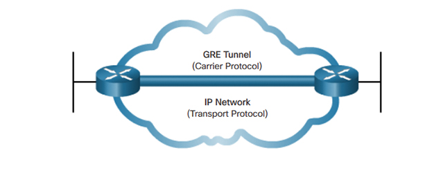

# Lý thuyết về Generic Routing Encapsulation ( GRE )

**Mục lục**
- [Lý thuyết về Generic Routing Encapsulation ( GRE )](#lý-thuyết-về-generic-routing-encapsulation--gre-)
- [1. Tổng quan về GRE ( Generic Routing Encapsulation )](#1-tổng-quan-về-gre--generic-routing-encapsulation-)
  - [1.1 Ưu điểm của GRE](#11-ưu-điểm-của-gre)
  - [1.2 Encapsulation và De-Encapsulation](#12-encapsulation-và-de-encapsulation)
- [2. GRE Frame Format](#2-gre-frame-format)
- [3. Phân loại GRE](#3-phân-loại-gre)
  - [3.1 Point to Point GRE](#31-point-to-point-gre)
  - [3.2 Point to Multipoint GRE](#32-point-to-multipoint-gre)
- [Nguồn tham khảo](#nguồn-tham-khảo)

# 1. Tổng quan về GRE ( Generic Routing Encapsulation )

**Generic Routing Encapsulation** là 1 giao thức thực hiện việc Tunneling giữa các Node trong một hệ thống Network tổng thể. Cho phép kết nối giữa các Node trong mạng Public cũng như Private Network.  GRE sẽ thực hiện chuyển tiếp gói tin một cách trực tiếp gói tin cần truyền tới đích cuối cùng.

GRE sẽ thực hiện đóng gói gói tin và thêm vào 1 GRE Header có độ dài khoảng 24 bytes ( Trong đó có thể thêm 16 bytes tùy chọn ) 

## 1.1 Ưu điểm của GRE

GRE cung cấp cho ngưởi sử dụng 1 số các ưu điểm sau :

1. GRE sử dụng ít tài nguyên hơn các kĩ thuật Tunnel khác
2. Cho phép kết nối các mạng bị giới hạn số Hop
3. Kết nối các mạng con gián tiếp
4. Cho phép đóng gói đa dạng các loại bản tin

## 1.2 Encapsulation và De-Encapsulation

Các giai đoạn đóng gói và bóc tách gói tin được diễn ra như sau :

1. Với Encapsulation ( đóng gói ) :
    - Switch có vai trò như một Tunnel Source Router, thực hiện chuyển gói tin ra Tunnel Interface
    - Tunnel Interface tiến hành đóng gói, tiến hành thêm một Outer IP Header mới cho gói tin
    - Gói tin được chuyển tiếp tới địa chỉ IP mới ( là địa chỉ IP trong Outer IP Header mới )
2. Với De-Encapsulation ( bóc tách ) :
    - Tại Tunnel Interface ở bên đối diện, sau khi nhận được gói tin sẽ tiên hành loại bỏ Outer IP Header và GRE Header
    - Gói tin được chuyển tới địa chỉ đích cuối cùng

# 2. GRE Frame Format

Như đã giới thiệu ở trên, thì GRE sẽ thực hiện thêm 20 byte địa chỉ IP mới ( Outer IP Header ) và thêm 5 byte GRE Header có nội dung như hình trên, trong đó :

- Checksum : Trường kiểm tra lỗi
- Offset : Trường thể hiện thứ tự trong phân mảnh ( Fragment )
- Key : Trường mã hóa GRE ( được kích hoạt nếu đặt là 1 )
- Sequence Number : Thứ tự của bản tin
- Routing : Thực hiện liệt kê Source Route Entries.

# 3. Phân loại GRE

GRE được chia làm 2 loại chính đó là 

1. P2P GRE ( Point to Point GRE )
2. mGRE ( Point to Multipoint GRE )

## 3.1 Point to Point GRE

Đối với mỗi Point to Point GRE thì số lượng địa chỉ cần cung cấp sẽ là khá nhiều. Do việc cung cấp địa chỉ IP phải diễn ra ở cả 2 chiều. Ví dụ :

→ Tại R2 và R3, mỗi Node đều phải cấu hình địa chỉ IP cho Tunnel nối tới R1. Tương tự tại R1, cần có đường Tunnel ngược lại với R2 và R3 → Gây ra sự phức tạp tại R1 khi mạng mở rộng

## 3.2 Point to Multipoint GRE

Được ra đời để khắc phục nhược điểm của P2P GRE đó là không có khả năng hoạt động khi bên đầu bên kia là một địa chỉ Multicast. Giao thức NHRP ( Next Hop Resolution Protocol ) được sử dụng để chuyển đổi địa chỉ Tunnel sang địa chỉ vật lý

---

# Nguồn tham khảo

[hocchudong/thuctap012017](https://github.com/hocchudong/thuctap012017/blob/master/TamNT/Virtualization/docs/6.Tim_hieu_GRE.md#1.2)