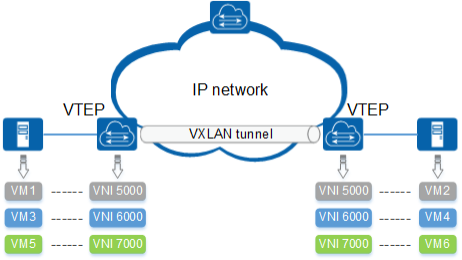

# Lý thuyết về VxLAN

**Mục lục**
- [Ly-thuyet-VxLan](#ly-thuyet-vxlan)
- [1. Tổng quan về VxLan](#1-tổng-quan-về-vxlan)
- [2. Các khái niệm cơ bản trong VxLAN](#2-các-khái-niệm-cơ-bản-trong-vxlan)
  - [2.1 VNI ( VxLAN Network Identifier) và VNI Frame Format :](#21-vni--vxlan-network-identifier-và-vni-frame-format-)
  - [2.2 Encapsulation và VTEP](#22-encapsulation-và-vtep)
- [3. Ưu điểm của VxLAN](#3-ưu-điểm-của-vxlan)
- [4. Các bước hoạt động của VxLAN](#4-các-bước-hoạt-động-của-vxlan)
  - [4.1 Các VM thực hiện tham gia vào Group Multicast](#41-các-vm-thực-hiện-tham-gia-vào-group-multicast)
  - [4.2 Quá trình xây dựng Forwarding Table](#42-quá-trình-xây-dựng-forwarding-table)
- [Nguồn tham khảo :](#nguồn-tham-khảo-)

# 1. Tổng quan về VxLan

***VxLan*** ( *Virtual extensible LAN* ) là công nghệ được ra đời để khắc phục những yếu điểm mà VLAN hiện thời có như bị giới hạn ở 4096 VLAN, VTP (Virutal Trunking Protocol) còn nhiều mặt giới hạn,yêu cầu dung lượng lớn về bảng của thiết bị chuyển mạch ( do mỗi máy yêu cầu 1 địa chỉ IP và 1 MAC riêng biệt),...

VxLAN sử dụng 24 bit để đánh dấu VLAN_ID ( Tức là sẽ có 2^24 giá trị khả dụng  ~ 16 triệu giá trị ). Như vậy, gần như ở khoảng thời gian gần hiện tại, thì con số này là đủ để sử dụng trong các mạng kích thước lớn.

VxLAN sử dụng IP ( Unicast và Multicast) như phương tiện truyền dẫn.

# 2. Các khái niệm cơ bản trong VxLAN

## 2.1 VNI ( VxLAN Network Identifier) và VNI Frame Format :

VxLAN hoạt động trên cơ chế Overlay một lớp mạng L2 trên lớp mạng L3 thông thường → Tạo nên 1 lớp Stack → Có thể đọc được các bản tin L2 và L3. Mỗi lớp như vậy được gọi là 1 Segment và mỗi Segment sẽ có 1 VNI được đánh dấu bằng cách sử dụng 24 bit. Chỉ có các máy thuộc cùng VxLAN Segment ( cũng có nghĩa là thuộc cùng 1 VNI ) thì mới có thể đọc được các bản tin thuộc Segment đó.

VxLAN cho phép cô lập Inner MAC sinh ra bởi các máy → Cho phép thực hiện Overlapping các địa chỉ MAC mà không gây lỗi ( Do các VNI là độc lập với nhau ). VNI nằm trong header được đóng gói với Inner MAC. Được biểu diễn thông qua hình sau :

→ Có thể thấy rằng, trong mục VxLAN Header thì sẽ có 8 bytes ( ~ 64 bits ) thì sẽ có 1 bits thứ 5 để đánh dấu hay chỉ ra rằng VNI Frame đó có gía trị và tại 24 bits ( từ bit 32 tới bit 56 ) sẽ được cung cấp cho VNI tạo ra 16 triệu địa chỉ VxLAN khác nhau. Các bits còn lại được sử dụng để dự trữ

## 2.2 Encapsulation và VTEP

Đây là 2 khái niệm cơ bản của VxLAN:

- VTEP : Đầu cuối trong Tunneling
- Encapsulation : Thực hiện đóng gói gói tin Ethernet thông thường trong một Header mới

Với mỗi Host tham gia vào 1 VxLAN thì chúng được coi là 1 VTEP ( Virtual Tunnel End Point ). Đây là các node có nhiệm vụ Encapsulation và De-Encapsulation ↔ có thể đọc và đóng gói bản tin trong 1 header mới 

VxLAN sẽ học các địa chỉ MAC của các VM thuộc Server, việc kết nối tới các VM này tới VTEP sẽ được hỗ trợ bởi mạng vật lý thông qua giao thức IP multicast. → Nhờ sự đóng gói này mà VTEP có thể tạo ra 1 lớp L2 trên L3 ( Overlay ) 

***Chú ý: VTEP có thể được thực hiện bởi phần mềm hoặc phần cứng. Có thể nằm trên Switch hoặc Server***

# 3. Ưu điểm của VxLAN

- Hỗ trợ được nhiều trường hợp cụ thể do có thể hoạt động tại cả L2 và L3
- Tính di động cao do được triển khai trên nền mạng IP có sẵn
- Tăng số lượng mạng VLAN khả dụng ( lên tới 16 triệu VLAN khác nhau )
- Nhờ hoạt động trên nền giao thức IP nên có thể có nhiều đường đi khác nhau tới đích ( trái với VLAN bình thường sẽ bị hạn chế bởi giao thức STP ( Spanning Tree Protocol ) )

# 4. Các bước hoạt động của VxLAN

Thực hiện xét mô hình dưới :

Trong đó : 

- Tại Host 1 : Có chứa 1 VM có địa chỉ L2 là MAC1 và VTEP IP của Server này là `10.20.10.10`
- Tại Host 4 : Có chứa 1 VM có địa chỉ L2 là MAC2 và VTEP IP của Server này là `10.20.10.13`
- Tại Host 2 và 3 : Không chứa VM và có địa chỉ thuộc dải mạng `10.20.10.0/12`
- Các lưu lượng mạng được chuyển qua 1 mạng chung

## 4.1 Các VM thực hiện tham gia vào Group Multicast

Thực hiện xét tại VM1 và VM2, quá trình tham gia vào Group Multicast của VM 1 được diễn ra như sau 

- VM 1 được kết nối tới 1 mạng Layer 2  trong đó có VxLAN ( VNI 5001 )
- VM 1 sẽ gửi 1 bản tin IGMP ( Internet Group Management Protocol ) để thực hiện yêu cầu tham gia vào nhóm IP Multicast

Các thủ tục tương tự được diễn ra tại VM2. Tuy nhiên ở đây cần chú ý, các Host 2 và Host 3 sẽ không gửi yêu cầu này do trên các Host đó không có VM cần kết nối tới VxLAN 5001 và trong khoảng thời gian sau này nếu vẫn chưa có 1 VM nào cần kết nối tới VxLAN 5001, thì trên 2 Host này cũng sẽ không nhận được các Frame Broadcast của VxLAN

Trong quá trình tiếp theo, sau khi đã thực hiện yêu cầu tham gia vào Group IP Multicast có địa chỉ `239.1.1.100` thì giả sử tại VM1 sẽ sinh ra 1 Frame Broadcast có các thông số sau :

- SA ( Source Addr ) : là địa chỉ của VTEP IP tại Host 1 ( VTEP1)
- DA ( Destination Addr ) : Địa chỉ đích là địa chỉ của nhóm IP Multicast

Tại VM2, sau khi nhận được Frame Broadcast này, thì nó sẽ thực hiện so sánh các bit VNI để so sánh xem có trùng với VxLAN mà nó đang hoạt động hay không. Nếu trùng lặp thì sẽ thực hiện De-Encapsulation gói tin và chuyển tới VM2

## 4.2 Quá trình xây dựng Forwarding Table

Trên mỗi Host tham gia vào VxLAN thì đều tồn tại 1 Forwarding Table có dạng 

Giả sử xét trong trường hợp VM1 tại Host1 muốn gửi 1 bản tin ARP Request tới Host 2

Quá trình được diễn ra :

- Đầu tiên tại VM1, sẽ gửi yêu cầu 1 bản tin ARP Request có các thông số
    - DA ( Destination Addr ) : Địa chỉ MAC đích ở đây là Broadcast ↔ FF:FF:FF:FF:FF:FF
    - SA ( Source Addr ) : Địa chỉ MAC nguồn là địa chỉ của VTEP1
- Sau đó tại VTEP1 sẽ thực hiện Encapsulation và gửi đi 1 bản tin có các thông số :
    - DA MAC ( Destination MAC Addr ) : Địa chỉ MAC đích là Multi MAC
    - SA MAC ( Source MAC Addr ) : Địa chỉ MAC nguồn là địa chỉ của VTEP1

     → Tại lớp L2 bình thường

    - DA ( Destination Addr ) : Địa chỉ MAC đích ở đây là Broadcast
    - SA ( Source Addr ) : Địa chỉ MAC nguồn là địa chỉ MAC1

    → Tại lớp L2 Overlay trên L3

    - VxLAN : VNI của VxLAN mà 2 VM đang hoạt động
- Tại VTEP2, nếu nó kiểm tra VNI mà phù hợp thì sẽ thực hiện chuyển tiếp cho VM2. Sau đó sẽ cập nhật Forwading Table

Sau đó, tại VM2 sẽ gửi bản tin trả lời ARP Request của VM 1:

- Các thông số trong bản tin này
    - DA MAC ( Destination MAC Addr ) : Địa chỉ MAC đích là VTEP1
    - SA MAC ( Source MAC Addr ) : Địa chỉ MAC nguồn là địa chỉ của VTEP1

     → Tại lớp L2 bình thường

    - DA ( Destination Addr ) : Địa chỉ MAC đích ở đây là MAC1
    - SA ( Source Addr ) : Địa chỉ MAC nguồn là địa chỉ của MAC2

    → Tại lớp L2 Overlay trên L3

    - VxLAN : VNI của VxLAN mà 2 VM đang hoạt động

Cuối cùng, tại VM1 cũng sẽ xây dựng được Forwarding Tabel sau khi VTEP thực hiện De-Encapsulation và chuyển cho VM1 :

---

# Nguồn tham khảo :

[hocchudong/thuctap012017](https://github.com/hocchudong/thuctap012017/blob/master/TamNT/Virtualization/docs/4.Tim_hieu_VXLAN.md#1.3)

[VXLAN Series - Multicast usage in VXLAN - Part 3 - VMware vSphere Blog](https://blogs.vmware.com/vsphere/2013/05/vxlan-series-multicast-usage-in-vxlan-part-3.html)

[https://cnttshop.vn/blogs/tin-tuc/vxlan-la-gi](https://cnttshop.vn/blogs/tin-tuc/vxlan-la-gi)