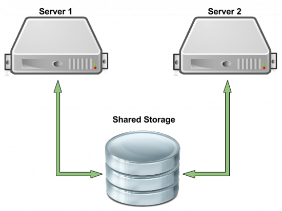
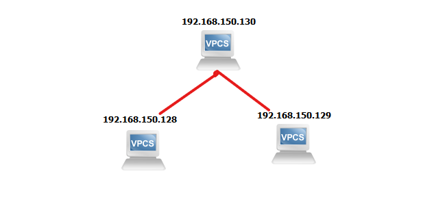

# Chương 2.5: Tổng quan về Shared Storage



Trong quá trình sử dụng các VM, sẽ có các trường hợp chúng ta muốn thực hiện chia sẻ 1 tập các file hoặc thư mục để các VM có thể sử dụng chung ( Do đặc tính của Hypervisor khiến cho các VM độc lập và không thể truy cập vào tài nguyên của các VM khác )

Để thực hiện mục đính đó thì chúng ta cần sử dụng các tiện ích mở rộng như : GlusterFS,NFS hoặc tận dụng khả năng DRBD,... Tất cả các tiện ích này đều cung cấp cho ngưởi sử dụng khả năng chia sẻ kho dữ liệu chung ( Shared Storage ). Ở chương này chúng ta sẽ thực hiện tìm hiểu 2 công cụ đó là **NFS** và **DRBD** .

**Mục lục**
 * [NFS](#nfs)
      * [Trên Server máy chủ](#trên-server-máy-chủ)
      * [Trên Server Clients :](#trên-server-clients-)
      * [Một số lưu ý với NFS Shared Storage](#một-số-lưu-ý-với-nfs-shared-storage)
 * [Tận dụng khả năng của DRBD để chia sẻ dữ liệu](#tận-dụng-khả-năng-của-drbd-để-chia-sẻ-dữ-liệu)
      * [Trên Server Node Primary :](#trên-server-node-primary-)
      * [Một số lưu ý đối với DRBD Shared Storage](#một-số-lưu-ý-đối-với-drbd-shared-storage)
 * [Nguồn tham khảo](#nguồn-tham-khảo)

# NFS


Là viết tắt của **Network File System** là hệ thống cho phép mount dữ liệu từ Server Remote. NFS cung cấp cách sử dụng và truy cập dữ liệu tương đối dễ dàng → Cho phép việc truy cập dữ liệu từ xa đối với nhiều máy chủ. 

Cơ chế hoạt động của NFS : **Master - Clients** . Trong đó Server Master sẽ thực hiện cung cấp và cấu hình các thư mục có thể được chia sẻ tới các Clients khác nhau. Cùng với đó là cung cáp các quyền mà Clients có thể được thực hiện với các thư mục được chia sẻ.

## Thực hiện cài đặt NFS trên Ubuntu 20.04

Xét mô hình như sau :



Với IP của Server máy chủ : `192.168.150.130`

 IP của Server Clients : `192.168.150.129` và `192.168.150.128`

### Trên Server máy chủ

NFS được cung cấp trên Repo chính thức của Ubuntu và chúng ta có thể mở của sổ Terminal và thực hiện câu lệnh sau để thực hiện tải package NFS:

```jsx
sudo apt install nfs-kernel-server -y
```

Quá trình cài đặt sẽ được diễn ra tự động. Sau khi cài đặt xong bạn thực hiện truy cập file `etc/exports` để thêm các thông số cấu hình chia sẻ, dưới đây là dạng file mặc định khi mở file lần đầu :

```jsx
# /etc/exports: the access control list for filesystems which may be exported
#		to NFS clients.  See exports(5).
#
# Example for NFSv2 and NFSv3:
# /srv/homes       hostname1(rw,sync,no_subtree_check) hostname2(ro,sync,no_subtree_check)
#
# Example for NFSv4:
# /srv/nfs4        gss/krb5i(rw,sync,fsid=0,crossmnt,no_subtree_check)
# /srv/nfs4/homes  gss/krb5i(rw,sync,no_subtree_check)
```

Bạn cần thêm vào cuối file này các thư mục cần chia sẻ lên Shared Storage, ở đây sử dụng ví dụ sau:

```jsx
/etc/default 192.168.150.0/24(rw,no_root_squash)
/home/vutuananh/Desktop/test 192.168.150.0/24(rw,sync,no_subtree_check,no_root_squash)
```

Trong đó:

- `/etc/default` và `/home/vutuananh/Desktop/test` : là các thư mục được sử dụng để chia sẻ
- `192.168.150.0/24` : Các địa chỉ được phép truy cập các thư mục này trên Shared Storage. Bạn có thể giới hạn chỉ 1 địa chỉ truy cập có thể truy cập các thư mục được chỉ định
    - Ví dụ `/etc/default 192.168.150.150(rw,no_root_squash)`

        → Chỉ máy có địa chỉ IP : 192.168.150.150 sẽ được truy cập vào thư mục `/etc/default`

- `(rw,sync,no_subtree_check,no_root_squash)` : Các quyền được cung cấp cho địa chỉ được cấu hình đối với thư mục được chỉ định
    - rw : Cho phép đọc và ghi trên NFS volume
    - sync : Đảm bảo việc ghi dữ liệu đã được thực hiện vào disk rồi sau đó mới cập nhật trạng thái ghi dữ liệu đã thành công.
    - no_subtree_check : Bỏ qua giai đoạn kiểm tra thư mục trên Server máy chủ → trong một số trường hợp có thể tăng khả năng ổn định
    - no_root_squash : mặc định trên các Server Clients thì sẽ không có quyền được chỉnh sửa file, option này sẽ cung cấp khả năng nói trên
    - Ngoài ra bạn có thể tham khảo bảng chú thích sau để hiểu thêm về các option khác :

        

Sau khi thực hiện chỉnh sửa cấu hình để thêm các thư mục, địa chỉ IP và các quyền được chỉ định. Chúng ta thực hiện lưu lại file cấu hình và khởi động lại tiện ích NFS :

```jsx
$ sudo exportfs -a
$ sudo systemctl restart nfs-kernel-server
```

Cuối cùng là chúng ta cần thực hiện cấu hình tường lửa để có thể cho phép các Clients sử dụng Shared Storage , ở đây sẽ ví dụ thực hiện cấu hình tường lửa `ufw` trên `ubuntu 20.04`:

```jsx
$ sudo ufw allow from 192.168.150.0/24 to any port nfs
$ sudo ufw enable
$ sudo ufw status
```

```jsx
Status: active

To                         Action      From
--                         ------      ----        
2049                       ALLOW       192.168.150.0/24         
```

*Quá trình cài đặt trên Server máy chủ đã kết thúc, chúng ta sẽ chuyển sang mục tiếp theo*

### Trên Server Clients :

*Do trong File cấu hình trên (*`etc/exports`) *chúng ta đã thực hiện chia sẻ 2 thư mục `/etc/default` và `/home/vutuananh/Desktop/test` với toàn bộ các địa chỉ trong dải mạng `192.168.150.0/24` nên các thao tác được liệt kê dưới đây sẽ được thực hiện trên cả 2 Server Clients là `192.168.150.128` và `192.168.150.129`*

Đầu tiên chúng ta cần phải thực hiện cài đặt package NFS thông qua cửa sổ lệnh Terminal với câu lệnh sau :

```jsx
sudo apt install nfs-common -y
```

Sau khi quá trình cài đặt hoàn tất thì chúng ta sẽ thực hiện tạo thư mục để lưu dữ liệu được chia sẻ

```jsx
sudo mkdir -p /var/nfs/images
```

*Đường dẫn này hoàn toàn có thể thay đổi, bạn không cần thiết phải tạo thư mục có dạng giống đường dẫn như thế này*

Tiếp đó , chúng ta sẽ thực mount phần dữ liệu Shared Storage được chia sẻ với địa chỉ của chúng ta thông qua :

```jsx
sudo mount 192.168.150.130:/home/vutuananh/Desktop/test /var/nfs/images/
```

Trong đó :

- `192.168.150.130` : Địa chỉ của Server máy chủ NFS
- `/home/vutuananh/Desktop/test` : Đường dẫn của thư mục được chia sẻ trong Shared Storage
- `/var/nfs/images/` : Thư mục để thực hiện lưu các dữ liệu được chia sẻ

Sau khi thực hiện thành công lệnh, chúng ta sẽ thu được các dữ liệu được chia sẻ:

```jsx
tuananh@localcomputer:/var/nfs/images$ ls
debian
```

*Trong đó debian chỉ là 1 file ví dụ có trong `/home/vutuananh/Desktop/test` tại server máy chủ*

**Quá trình thiết lập NFS Shared Storage đã hoàn tất**

### Một số lưu ý với NFS Shared Storage

- Nếu trong trường hợp Server Master mất kết nối tới các Clients thì dữ liệu được chia sẻ sẽ tạm thời không thể truy cập trên các Server Clients. Sau khi trở lại trạng thái Online thì các thư mục được chia sẻ sẽ có thể truy cập lại bình thường

    → Yêu cầu đảm bảo HA cho khối Server Master NFS

- Nếu tại bước thực hiện tại bước phía dưới không thành công :

    ```jsx
    sudo mount 192.168.150.130:/home/vutuananh/Desktop/test /var/nfs/images/
    ```

    → Bạn đã quên thực hiện cấu hình tường lửa

---

# Tận dụng khả năng của DRBD để chia sẻ dữ liệu


**Distributed Replicated Block Device** là một tiện ích mở rộng cho phép nâng cao tính sẵn sàng của hệ thống. DRBD cung cấp khả năng đồng bộ dữ liệu giữa 2 hoặc nhiều Server khác nhau. Tuy nhiên, các Server này lại độc lập với nhau. Trong đó 1 Server sẽ đóng vai trò là *Primary* thực hiện đọc,ghi và quản lý dữ liệu còn các Node ( hay Server ) sẽ đóng vai trò đồng bộ dữ liệu để đảm bảo tính đồng nhất giữa các Node.

DRBD cung cấp 3 giao thức đồng bộ dữ liệu khác nhau :

- Protocol A : Theo cơ chế ***Async*** - Không đồng bộ. Dữ liệu trên node Primary sẽ được thực hiện ghi mà không cần sự xác nhận từ các node Secondary
- Protocol B : Theo cơ chế ***Semi-Sync** -* Bán đồng bộ. Giao thức đồng bộ trên RAM, các thao tác ghi dữ liệu trên node Primary sẽ được thực hiện khi có yêu cầu; bản tin đồng bộ được gửi khi hoàn thành các thao tác
- Protocol C : Theo cơ chế ***Sync** -* Đồng bộ. Các thao tác ghi dữ liệu sẽ được ghi tại máy chủ; bản tin đồng bộ được gửi tới các node Secondary ; sau khi hoàn tất ghi dữ liệu trên các node Secondary thì dữ liệu sẽ được ghi trên node Primary

## Thực hiện cấu hình DRBD trên Ubuntu 20.04

Ta thực hiện xét mô hình sau :


Trong đó : 

IP của Node Primary : `192.168.150.128`

IP của Node Secondary : `192.168.150.129`

### Trên Server Node Primary :

Đầu tiên, ta thực hiện cài đặt Package DRBD thông qua cửa số lệnh Terminal :

```jsx
sudo apt-get install -y drbd-utils
```

Tiếp đó, chúng ta cần thực hiện chỉnh sửa file cấu hình phân giải địa chỉ tên miền tại đường dẫn `/etc/hosts` , bạn thực hiện thêm 2 dòng sau vào file này :

```jsx
192.168.150.128 Localhost 
192.168.150.129 localcomputer
```

Trong đó 

- `192.168.150.128` và `192.168.150.129` : là địa chỉ IP của 2 Server chúng ta đang sử dụng
- `[Localhost](http://Localhost)` : Tên hệ thống của máy có địa chỉ IP `192.168.150.128`
- `localcomputer` : Tên hệ thống của máy có địa chỉ IP `192.168.150.129`

    Việc lấy tên hệ thống được thực hiện bằng lệnh dưới thông qua cửa sổ Terminal:

    ```jsx
    $ uname -a
    ```

    Nhận được kết quả như sau:

    Linux **Localhost** 5.4.0-51-generic #56-Ubuntu SMP Mon Oct 5 14:28:49 UTC 2020 x86_64 x86_64 x86_64 GNU/Linux

    ⇒ Tên hệ thống của Server hiện tại là **Localhost**

    Với các Server khác bạn thực hiện tương tự để lấy được tên hệ thống chính xác !

Sau khi thực hiện thành công, chúng ta sẽ thực hiện chỉnh sửa file cấu hình của DRBD

```jsx
nvim /etc/drbd.conf
```

*Tại đây mình sử dụng NeoVim làm Text Editor, bạn có thể thực hiện chỉnh sửa file cấu hình bằng bất kì Text Editor nào khác* 

Thêm nội dung như sau vào file cấu hình :

```jsx
global{usage-count no;}
common{protocol C;}
resource r0{
  on Localhost{
    device /dev/drbd0;
    disk /dev/sdb;
    address 192.168.150.128;
    meta-disk internal;
  }
 on localcomputer{
    device /dev/drbd0;
    disk /dev/sdb;
    address 192.168.150.129;
    meta-disk internal;
  }
}
```

Trong đó :

- `global` : Mục cấu hình các biến toàn cục :
    - `usage-count` : Mục này cho phép nhà phát triển drbd biết được phiên bản OS cài đặt drbd
- `common` : Thuộc tính được cấu hình trong mục này này sẽ được tất cả các resource bên dưới kế thừa
    - `Protocol` : Loại giao thức được sử dụng
- `resource` : Cấu hình DRBD resource
    - `on Localhost` và `on localcomputer` : Tên hệ thống của các Server được xét trong mô hình
    - `device` : Thiết bị Block Device được sử dụng để đọc ghi dữ liệu
    - `disk` : Ổ đĩa mà dữ liệu sẽ được ghi lên
    - `address` : Địa chỉ IP của Server
    - `meta-disk` : Quyết định việc metadata của dữ liệu sẽ được lưu trữ tại đâu

**Lưu ý, các disk lưu dữ liệu tại các Server nên có kích thước bằng nhau**

Tiếp đó chúng ta cần tạo ra Mirror Device thông qua trình quản lý `drbdadm` :

```jsx
sudo drbdadm create-md r0 
```

*Trong đó r0 là tên resource có trong file cấu hình*

Sau đó ta thực hiện bật dịch vụ DRBD:

```jsx
systemctl start drbd.service
```

Tại mô hình đang xét, ta chọn server có địa chỉ IP `192.168.150.128` làm node Primary và sẽ được thực hiện thông qua lệnh sau :

```jsx
sudo drbdadm -- --overwrite-peer-data primary all
```

*Ta sẽ thực hiện chuyển trạng thái của Server này thành Primary và được áp dụng với mọi node trong mô hình đang được thực hiện*

*Ngoài ra bạn có thể xem trạng thái của Server thông qua lệnh sau:*

```jsx
watch -n1 cat /proc/drbd
```

Cuối cùng, bạn cần chuyển sang Server được sử dụng làm Node Secondary để thực hiện chỉ định nó :

```jsx
sudo drbdadm secondary r0 
```

Để thực hiện đọc ghi dữ liệu, bạn thực hiện lệnh dưới trong cửa sổ lệnh Terminal tại Node Primary

```jsx
sudo mount /dev/drbd0 /srv
```

*Bạn có thể chọn đường dẫn khác để mount dữ liệu để sử dụng*

**Quá trình cấu hình và cài đặt DRBD Shared Storage theo mô hình của chúng ta đã thành công**

### Một số lưu ý đối với DRBD Shared Storage

- Khi gặp phải trường hợp split brain giữa 2 Server ( 2 Server không nhận biết được nhau ), ta thực hiện khôi phục trạng thái như sau:
1. Bật dịch vụ DRBD tại cả 2 Server :

    ```jsx
    systemctl start drbd.service
    ```

2. Tại Server được sử dụng làm Node Secondary, thực hiện chỉ định làm node Secondary và loại bỏ các dữ liệu trên node :

    ```jsx
    drbdadm secondary all
    drbdadm disconnect all
    drbdadm -- --discard-my-data connect all
    ```

3. Tại Server được sử dụng làm Node Primary :

    ```jsx
    drbdadm primary all drbdadm disconnect all drbdadm connect all
    ```

- Khi gặp lỗi :

    'r0' not defined in your config (for this host).

    → Bạn đã thực hiện đặt sai tên hệ thống trong file `/etc/drbd.conf` 

---

### Nguồn tham khảo

[How to Install and Configure an NFS Server on Ubuntu 18.04](https://www.tecmint.com/install-nfs-server-on-ubuntu/)

[How To Set Up an NFS Mount on Ubuntu 18.04 | DigitalOcean](https://www.digitalocean.com/community/tutorials/how-to-set-up-an-nfs-mount-on-ubuntu-18-04)

[Ubuntu 18.04 LTS : Configure NFS Server : Server World](https://www.server-world.info/en/note?os=Ubuntu_18.04&p=nfs&f=1)

[hoangdh/ghichep-DRBD](https://github.com/hoangdh/ghichep-DRBD#3)

[How to Setup DRBD 9 on Ubuntu 16 - Globo.Tech](https://www.globo.tech/learning-center/setup-drbd-9-ubuntu-16/)

[Ubuntu Manpage: drbd.conf - Configuration file for DRBD's devices .](http://manpages.ubuntu.com/manpages/trusty/man5/drbd.conf.5.html)

[Ubuntu HA - DRBD | Server documentation | Ubuntu](https://ubuntu.com/server/docs/ubuntu-ha-drbd)
