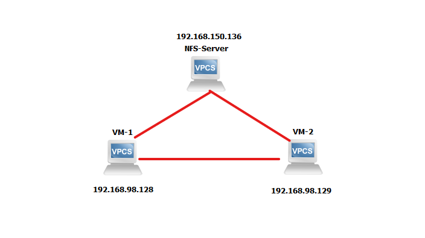

# LAB Migrate VM với QEMU/KVM kết hợp với Linux Bridge

**Mục lục**
 * [Mô hình bài LAB thực hiện :](#mô-hình-bài-lab-thực-hiện-)
 * [Thực hiện bài LAB](#thực-hiện-bài-lab)
      * [Thiết lập Linux Bridge](#thiết-lập-linux-bridge)
      * [Tạo VM từ Image nhận được từ NFS-Server :](#tạo-vm-từ-image-nhận-được-từ-nfs-server-)
      * [Thực hiện Migrate VM](#3-thực-hiện-migrate-vm)
 * [Các lỗi có thể gặp phải ( Sẽ tiếp tục Update )](#các-lỗi-có-thể-gặp-phải--sẽ-tiếp-tục-update-)

### Bài Lab thực hiện Live Mirgrate QEMU/KVM với Shared Storage sử dụng NFS trên Ubuntu 20.04

## Mô hình bài LAB thực hiện :



*Trong đó :*

Server có địa chỉ IP : `192.168.150.136` được sử dụng làm NFS Server thực hiện chia sẻ Image 

Server có địa chỉ IP : `192.168.98.128` là server hiện đang sử dụng VM ( **Ở các phần bên dưới bài viết sẽ được gọi là VM-1**)

Server có địa chỉ IP : `192.168.98.129` là server mà VM sẽ được chuyển tới( **Ở các phần bên duối bài viết sẽ được gọi là VM-2**)

*Yêu cầu :*

- Thiết lập NFS Storage giữa 2 Server

    ( Có thể tham khảo việc thiết lập NFS Shared Storage tại : 
[Chương 2.5: Tổng quan về Shared Storage](https://github.com/tuananh2508/LinuxVcc/blob/master/Virtualization/QEMU%26KVM/KVM%26QEMU/Chuong-2.5-Tong-quan-Shared-Storage.md) )

- 1 file Image VM  ( *đã được cấu hình User* ) chứa trên NFS Server
- Kết nối SSH giữa 2 Server sẽ sử dụng VM
- 1 đường kết nối mạng chung giữa 2 Server ( Ở đây là dải mạng `192.168.98.0` )
- Kiến thức cơ bản cũng như cách cấu hình Linux Bridge

***Chú ý : Bài Lab được thực hiện trên Ubuntu 20.04 !***

## Thực hiện bài LAB

Đầu tiên, do việc chúng ta sử dụng NFS Shared Storage, nên cần thực hiện mount Image của VM thực hiện LAB. Tại cả 2 Server, ta thực hiện các câu lệnh sau thông qua cửa sổ Terminal:

```jsx
root@localcomputer:/home/tuananh# mount 192.168.150.136:/home/tuananh/Desktop/Qemu /var/nfs/images/
```

*Lưu ý: Trong trường hợp không thực hiện Mount được bạn cần kiểm tra lại cấu hình tường lửa như trong chương hướng dẫn thiết lập NFS Server mình đã đề cập ở trên*

---

### Thiết lập Linux Bridge

Ở đây chúng ta sẽ thực hiện cấu hình Linux Bridge tại 2 Server VM -1 và 2 . Lý do chúng ta phải thiết lập điều này là bởi mặc định, khi khởi tạo VM, các giao diện mạng của VM sẽ được thiết lập sử dụng 1 Linux Bridge mặc định có tên là `virbr0` . Linux Bridge này mặc định có giao thức NAT khiến cho địa chỉ IP của máy ảo chúng ta là không cố định ( Persistent ). 

→ Dẫn đến việc gây ra Downtime trong quá trình Live Migrate ( là điều không được chấp nhận đối với QoS hiện nay ). Quá trình Live Migrate trong trường hợp nói tới ở trên vẫn thành công tuy nhiên  đối với **bản chất** hay **ý nghĩa** của việc Migrate là hoàn toàn sai. Do việc thực hiện Migrate để phục vụ 1 mục đích duy nhất chính là trong trường hợp xảy ra lỗi hệ thống vật lý, thì dịch vụ trên máy ảo được nói tới vẫn sẽ duy trì tại một hệ thống vật lý khác để đảm bảo QoS.

**Tại VM-1** , ta tiếp tục thực hiện liệt kê các giao diện mạng hiện thời đang có :

```jsx
root@localcomputer:/home/tuananh# ip a s
...
3: ens34: <BROADCAST,MULTICAST,UP,LOWER_UP> mtu 1500 qdisc fq_codel state UP group default qlen 1000
    link/ether 00:0c:29:72:79:58 brd ff:ff:ff:ff:ff:ff
    inet 192.168.98.128/24 brd 192.168.98.255 scope global dynamic noprefixroute ens34
       valid_lft 977sec preferred_lft 977sec
    inet6 fe80::db6:391c:a757:b45c/64 scope link noprefixroute 
       valid_lft forever preferred_lft forever
4: virbr0: <BROADCAST,MULTICAST,UP,LOWER_UP> mtu 1500 qdisc noqueue state UP group default qlen 1000
    link/ether 52:54:00:5d:2d:4b brd ff:ff:ff:ff:ff:ff
    inet 192.168.122.1/24 brd 192.168.122.255 scope global virbr0
       valid_lft forever preferred_lft forever
5: virbr0-nic: <BROADCAST,MULTICAST> mtu 1500 qdisc fq_codel master virbr0 state DOWN group default qlen 1000
    link/ether 52:54:00:5d:2d:4b brd ff:ff:ff:ff:ff:ff
6: vnet0: <BROADCAST,MULTICAST,UP,LOWER_UP> mtu 1500 qdisc fq_codel master virbr0 state UNKNOWN group default qlen 1000
    link/ether fe:54:00:a5:e0:3f brd ff:ff:ff:ff:ff:ff
    inet6 fe80::fc54:ff:fea5:e03f/64 scope link 
       valid_lft forever preferred_lft forever
```

*Trong đó `ens34` là giao diện mạng có dải mạng được sử dụng chung giữa 2 Server VM1/2 . `vnet0` là giao diện mạng của VM chúng ta vừa khởi tạo*

Sử dụng tiện ích `brctl` để thực hiện xem các Bridge hiện tại :

```bash
root@localcomputer:/home/tuananh# brctl show
bridge name	bridge id		        STP enabled	interfaces
virbr0		  8000.5254005d2d4b	  yes		      virbr0-nic
```

*Ta nhận thấy rằng, ở chế độ mặc định,  `virbr0` được tạo và được cấu hình tại `/etc/libvirt/qemu/networks/default.xml`*

Ta thực hiện tạo 1 Linux Bridge mới và thêm 2 giao diện `ens34` vào Bridge này:

```bash
root@localcomputer:/home/tuananh# brctl addbr testbr
root@localcomputer:/home/tuananh# brctl addif testbr ens34
root@localcomputer:/home/tuananh# brctl show
bridge name	bridge id		STP enabled	interfaces
testbr		8000.000c29727958	no		  ens34
virbr0		8000.5254005d2d4b	yes		  virbr0-nic
```

*Trong đó*

*Với câu lệnh 1 ta thực hiện tạo Linux Bridge tên là `testbr`*

*Với câu lệnh 2 ta thực hiện thêm giao diện `ens34` vào Bridge `test`* 

*Câu lệnh cuối cùng thực hiện kiểm tra lại trạng thái các Bridge*

Sau đó thực hiện 2 lệnh sau để xóa địa chỉ IP của interface `ens34` và yêu cầu địa chỉ IP cho Bridge `testbr` :

```bash
root@localcomputer:/home/tuananh# ip a flush ens34
root@localcomputer:/home/tuananh# dhclient testbr
```

Kiểm tra lại các giao diện mạng hiện thời trên máy :

```bash
root@localcomputer:/home/tuananh# ip a s
...
3: ens34: <BROADCAST,MULTICAST,UP,LOWER_UP> mtu 1500 qdisc fq_codel master testbr state UP group default qlen 1000
    link/ether 00:0c:29:72:79:58 brd ff:ff:ff:ff:ff:ff
    inet6 fe80::8894:188b:82c6:b472/64 scope link noprefixroute 
       valid_lft forever preferred_lft forever
4: virbr0: <NO-CARRIER,BROADCAST,MULTICAST,UP> mtu 1500 qdisc noqueue state DOWN group default qlen 1000
    link/ether 52:54:00:5d:2d:4b brd ff:ff:ff:ff:ff:ff
    inet 192.168.122.1/24 brd 192.168.122.255 scope global virbr0
       valid_lft forever preferred_lft forever
5: virbr0-nic: <BROADCAST,MULTICAST> mtu 1500 qdisc fq_codel master virbr0 state DOWN group default qlen 1000
    link/ether 52:54:00:5d:2d:4b brd ff:ff:ff:ff:ff:ff
6: testbr: <BROADCAST,MULTICAST,UP,LOWER_UP> mtu 1500 qdisc noqueue state UP group default qlen 1000
    link/ether 00:0c:29:72:79:58 brd ff:ff:ff:ff:ff:ff
    inet 192.168.98.128/24 brd 192.168.98.255 scope global dynamic testbr
       valid_lft 1797sec preferred_lft 1797sec
    inet6 fe80::20c:29ff:fe72:7958/64 scope link 
       valid_lft forever preferred_lft forever
```

*Trong đó* 

*Nhận thấy địa chỉ Mac của `ens34` và `testbr` là giống nhau (00:0c:29:72:79:58)*

*Tap interface của VM : fe:54:00:a5:e0:3f*

---

**Tại VM-2 ta thực hiện các bước như sau :**

Do tại VM-1, ta đã thực hiện tạo 1 Linux Bridge `testbr` nên tại VM-2 ta cũng phải tạo 1 Linux Bridge có tên tương tự , đầu tiên ta thực hiện liệt kê các giao diện mạng trên VM-2 :

```bash
root@client-1:/etc/libvirt/qemu# ip a s
...
3: ens38: <BROADCAST,MULTICAST,UP,LOWER_UP> mtu 1500 qdisc fq_codel state UP group default qlen 1000
    link/ether 00:0c:29:19:da:6e brd ff:ff:ff:ff:ff:ff
    inet 192.168.98.129/24 brd 192.168.98.255 scope global dynamic noprefixroute ens38
       valid_lft 1751sec preferred_lft 1751sec
    inet6 fe80::ba47:1362:f54:6251/64 scope link noprefixroute 
       valid_lft forever preferred_lft forever
4: virbr0: <NO-CARRIER,BROADCAST,MULTICAST,UP> mtu 1500 qdisc noqueue state DOWN group default qlen 1000
    link/ether 52:54:00:a8:7b:08 brd ff:ff:ff:ff:ff:ff
    inet 192.168.122.1/24 brd 192.168.122.255 scope global virbr0
       valid_lft forever preferred_lft forever
5: virbr0-nic: <BROADCAST,MULTICAST> mtu 1500 qdisc fq_codel master virbr0 state DOWN group default qlen 1000
    link/ether 52:54:00:a8:7b:08 brd ff:ff:ff:ff:ff:ff
```

Tiếp theo đó thực hiện :

```bash
root@client-1:/etc/libvirt/qemu# brctl addbr testbr
root@client-1:/etc/libvirt/qemu# brctl addif testbr ens38
```

*Trong đó `ens38` (tại VM-2 ) là Interface cùng dải mạng với `ens34`* ( tại VM-1) và **lưu ý tên Linux Bridge tại VM-2 BẮT BUỘC PHẢI CÙNG TÊN với Linux Bridge tại VM-1**

*Ta nhận được 1 Linux Bridge `testbr`*

```bash
root@client-1:/etc/libvirt/qemu# brctl show
bridge name	bridge id		         STP enabled	interfaces
testbr		8000.000c2919da6e        no		        ens38
virbr0		8000.525400a87b08	     yes		    virbr0-nic
```

**Tại VM-1 và 2, ta thực hiện thiết lập tường lửa** :

```bash
root@client-1:/home/tuananh# ufw allow 49152
root@localcomputer:/home/tuananh# ufw allow 49152
```

*Do ta sẽ thực hiện Migrate thông qua Port 49152, nếu không thực hiện thiết lập thì khi thực hiện việc Migrate ở bên dưới thì các Server sẽ từ chối ( Đơn giản là do việc từ chối truy cập Port )*

---

### Tạo VM từ Image nhận được từ NFS-Server :

**Cách 1 : Thiết lập VM thông qua `virt-manager`**

Ta thực hiện tạo máy ảo thông qua `virt-manager` từ **máy VM-1** để tự động hóa quá trình, cũng như giảm thiểu số lượng lỗi gặp phải :

```bash
tuananh@localcomputer:~$ sudo -s
[sudo] password for tuananh: 
root@localcomputer:/home/tuananh# virt-manager
```


Chúng ta chọn option *Import existing disk image* và chọn *Forward*


Tại bước này chúng ta thực hiện chọn Browse và tìm đường dẫn tới thư mục chứa Image được chia sẻ từ NFS Server:


Sau khi hoàn tất, ta chọn *Choose Volume* 


Tại mục này chúng ta thực hiện nhập tên OS , dưới đây là một số tên OS tiêu biểu để tham khảo:


Nếu không rõ về OS đang sử dụng với Image , bạn có thể nhập **Generic default và chọn Forward** Tại ví dụ này sẽ thực hiện nhập Debian 10. 


Tại đây có 2 mục 

- Memory : Mức RAM mà bạn cung cấp cho máy ảo
- CPUs : CPU ảo được cung cấp cho máy ảo

Sau khi điền các tham số phù hợp, tiếp tục tiến hành chọn *Forward*


Ở bước cuối cùng, bạn thực hiện đặt tên cho máy ảo, cũng như có thể thiết lập giao diện mạng  : **Thực hiện chọn giao diện Linux Bridge chúng ta đã khởi tạo ở bước 1***.* 

Sau khi hoàn tất, chúng ta chọn *Finish* để quá trình cài đặt diễn ra


*Màn hình nhận được khi kết thúc cài đặt !*

Kiểm tra lại 1 lần nữa trạng thái của VM :

```jsx
root@localcomputer:/home/tuananh# virsh list --all
 Id   Name       State
---------------------------
 1    debian10   running
 -    debian     shut off
```

**Cách 2: Thực hiện thiết lập VM thông qua cửa sổ Terminal**

Nếu bạn không muốn sử dụng giao diện GUI, bạn có thể cài đặt thông qua cửa sổ Terminal với câu lệnh :

```bash
root@localcomputer:/etc/libvirt/qemu# virt-install --name debian10 --ram 1024 --vcpus 1 --disk path=/var/nfs/images/kvm1.img --boot hd --network bridge=testbr
```

*Trong đó :*

- name : Tên VM
- ram : Lượng RAM cung cấp cho VM
- vcpus : CPU được cung cấp cho VM
- disk path : Đường dẫn tới file IMG của VM
- boot : Xác định việc boot VM sẽ được boot từ Hard Disk
- network : Xác định loại Network sẽ được sử dụng. Trong trường hợp của chúng ta là sử dụng Bridge tên là `testbr`

---

### Thực hiện Migrate VM

**Tại VM-1**, ta thực hiện truy cập máy ảo được tạo thông qua :

```bash
root@localcomputer:/home/tuananh# virsh console debian10
```

*Trong đó `Debian10` là tên VM được tạo tại mục 1*

Ta thực hiện liệt kê các giao diện mạng tại máy ảo `debian10` :

```bash
root@debian:~# ip a s
1: lo: <LOOPBACK,UP,LOWER_UP> mtu 65536 qdisc noqueue state UNKNOWN group default qlen 1000
    link/loopback 00:00:00:00:00:00 brd 00:00:00:00:00:00
    inet 127.0.0.1/8 scope host lo
       valid_lft forever preferred_lft forever
    inet6 ::1/128 scope host 
       valid_lft forever preferred_lft forever
2: enp1s0: <BROADCAST,MULTICAST,UP,LOWER_UP> mtu 1500 qdisc pfifo_fast state UP group default qlen 1000
    link/ether 52:54:00:44:c4:9a brd ff:ff:ff:ff:ff:ff
```

Sau khi truy cập ta thực hiện các lệnh sau để yêu cầu địa chỉ IP cho Interface của máy ảo :

```bash
root@debian:~# dhclient enp1s0
```

Kết quả nhận được

```bash
root@debian:~# ip a s
1: lo: <LOOPBACK,UP,LOWER_UP> mtu 65536 qdisc noqueue state UNKNOWN group default qlen 1000
    link/loopback 00:00:00:00:00:00 brd 00:00:00:00:00:00
    inet 127.0.0.1/8 scope host lo
       valid_lft forever preferred_lft forever
    inet6 ::1/128 scope host 
       valid_lft forever preferred_lft forever
2: enp1s0: <BROADCAST,MULTICAST,UP,LOWER_UP> mtu 1500 qdisc pfifo_fast state UP group default qlen 1000
    link/ether 52:54:00:d3:d9:ee brd ff:ff:ff:ff:ff:ff
    inet 192.168.98.133/24 brd 192.168.98.255 scope global dynamic enp1s0
       valid_lft 1080sec preferred_lft 1080sec
    inet6 fe80::5054:ff:fed3:d9ee/64 scope link 
       valid_lft forever preferred_lft forever
```

*VM này có địa chỉ mạng `192.168.98.133`* 

Tại 1 cửa sổ Terminal khác **trên VM-1**, ta thực hiện lệnh ping để kiểm tra tính ổn định của máy ảo thông qua lệnh ping :

```bash
root@localcomputer:/etc/libvirt/qemu# ping 192.168.98.133
PING 192.168.98.133 (192.168.98.133) 56(84) bytes of data.
64 bytes from 192.168.98.133: icmp_seq=1 ttl=64 time=0.438 ms
64 bytes from 192.168.98.133: icmp_seq=2 ttl=64 time=0.161 ms
64 bytes from 192.168.98.133: icmp_seq=3 ttl=64 time=0.231 ms
...
```

Sau đó thực hiện lệnh Migrate VM **trên VM-1** theo lệnh sau trên cửa sổ Terminal:

```bash
root@localcomputer:/home/tuananh# virsh migrate --live debian10 qemu+ssh://tuananh@192.168.98.129/system
```

Tại VM-2 , ta kiểm tra trạng thái của máy ảo được Migrate tới :

```bash
root@client-1:/etc/libvirt/qemu# virsh list --all
 Id   Name       State
--------------------------
 10   debian10   running
```

***⇒ Việc Migrate đã thành công***

Ta kiểm tra trạng thái ping tại cửa sổ đã tạo từ trước trên VM-1 :

```bash
...
64 bytes from 192.168.98.133: icmp_seq=336 ttl=64 time=1.31 ms
64 bytes from 192.168.98.133: icmp_seq=337 ttl=64 time=0.764 ms
64 bytes from 192.168.98.133: icmp_seq=338 ttl=64 time=0.384 ms
64 bytes from 192.168.98.133: icmp_seq=339 ttl=64 time=0.345 ms
64 bytes from 192.168.98.133: icmp_seq=340 ttl=64 time=0.361 ms
64 bytes from 192.168.98.133: icmp_seq=341 ttl=64 time=1.26 ms
^C
--- 192.168.98.133 ping statistics ---
341 packets transmitted, 341 received, 0% packet loss, time 344387ms
rtt min/avg/max/mdev = 0.117/0.923/18.452/1.314 ms
```

→ *Nhận thấy việc Migrate VM không gây ra Downtime với việc gửi và nhận 341 Ping Packets*

---

### Các lỗi có thể gặp phải ( Sẽ tiếp tục Update )

*Lỗi #1*

```bash
error: unable to connect to server at 'localcomputer:49152': Connection refused
```

Lỗi này xuất hiện tại 1 số trường hợp, gây ra bởi lỗi phân giải tên miền

Khắc phục lỗi #1

Ta cần thực hiện truy cập file `hosts` để thực hiện chỉnh sửa việc phân giải tên miền với quyền root :

```bash
root@client-1:/home/tuananh# nvim /etc/hosts
```

Thực hiện thêm dòng sau vào file ( Các thông số cũng như tên có thể thay đổi dựa trên trường hợp của bạn )

```bash
192.168.150.129 localcomputer
```
