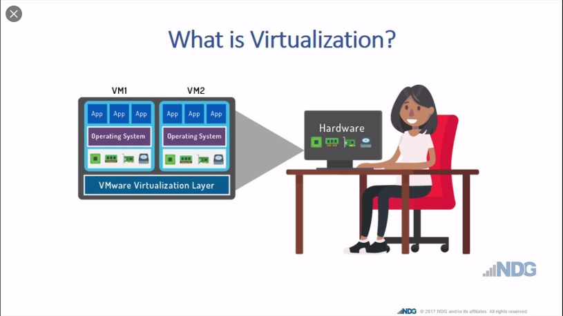

# Virtualization & Hypervisor

Ngày nay với sự phát triển ngày càng lớn của công nghệ ảo hóa, việc tìm hiểu về ảo hóa và công nghệ giám sát các hệ điều hành ảo ( Hypervisor ) là ngày càng cần thiết. Bất kể dù bạn có đang làm bất cứ công việc gì thì cũng ít nhất 1 lần sử dụng các ứng dụng của công nghệ ảo hóa. Với sự phát triển của nó, ảo hóa đang thu hút sự chú ý của hàng loạt các công ty lớn như Amazon, Microsoft hay VMWare, .... 
Thông qua bài này chúng ta sẽ tìm hiểu 2 khái niệm của công nghệ này là Virtualization và Hypervisor

# 1. Virtualization

### 1.1 Ảo hóa là gì ?

**Ý tưởng cơ bản :**

*Thực hiện phân chia phần cứng của 1 hệ thống để từ đó thiết kế được các hệ thống khác nhau trên nền phần cứng đã chia* 

Có thể có nhiều máy ảo khác nhau và mỗi máy ảo có thể sử dụng tùy mục đích khác nhau

Ảo hóa thường được phân chia thành các loại sau: Ảo hóa máy tính để bàn, ảo hóa hệ thống mạng, ảo hóa phần cứng

### 1.2 Ảo hóa máy tính để bàn

Thực hiện tách phần OS ra khỏi phần cứng ( Hardware ) 

Có thể hiểu đơn giản là ta thực hiện tạo 1 máy tính có mọi khả năng như máy tính bình thường. Máy tính được tạo ra gọi là máy Desktop ảo và được lưu trữ trên phần cứng thiết bị tại trung tâm dữ liệu

Một lợi ích đáng quan tâm là việc cho phép truy cập máy ảo thông qua các kết nối được bảo mật từ các điểm truy cập khác trên toàn cầu

### 1.3 Ảo hóa hệ thống mạng

Ảo hóa mạng là tiến trình hợp nhất tài nguyên phần cứng và phần ảo với nhau 

⇒ Tạo nên 1 hệ thống bao gồm N các  channel → Sau đó các Channel này được kết nối tới các hệ thống ( thiết bị ) khác nhau

Có thể được kết hợp cùng ảo hóa phần cứng để Tạo nên 1 hệ thống Hypervisor 

Các Hypervisor có khả năng kết hợp, giao tiếp với nhau để quản lý hệ thống mạng ảo này và thực hiện các giao thức mạng cấp cao như cân bằng tải ( Load Balancing )  và tường lửa ( Firewall) 

Tuy nhiên việc này tùy thuộc vào loại thiết bị và nhà cung cấp mạng sẽ thiết kế được hệ thống mạng ảo khác nhau

### 1.4 Ảo hóa phần cứng

**Ý tưởng cốt lõi** : 

*Tạo ra máy ảo để thực hiện mô phỏng máy chủ hoặc có thể độc lập*

Được chia làm 2 loại

1. Ảo hóa toàn phần : Phần cứng được ảo hóa toàn phần → Tạo được nhiều OS trên cùng 1 phần cứng → Tăng tính bảo mật khi nhiều User sử dụng 1 phần cứng
2. Ảo hóa 1 phần : Thường thì không đủ tài nguyên cho toàn bộ OS → Được sử dụng để tạo 1 môi trường ảo cho 1 App chạy → Ít tốn tài nguyên hơn việc tạo 1 máy ảo

**Nhược điểm :**

Phần cứng được ảo hóa có tốc độ chậm hơn phần thực

Bị giới hạn bởi thống số thực tế của máy chủ

**Ưu điểm :**

Linh hoạt và tiết kiệm khi mở rộng hệ thống

---

# 2. Hypervisor

### 2.1 Khái niệm

Là phần mềm thực hiện tạo và quản lý các máy ảo 

Cho phép các VM hay Guest truy cập phần Hardware do nó quản lý

Có nhiệm vụ giám sát và quản lý tài nguyên hệ thống, đảm bảo sự hoạt động của các VM

- Ví dụ : 1 VM được cấp 2GB bộ nhớ thì không được sử dụng quá 2GB được cấp phát
- Ví dụ : Các ứng dụng trên các VM khác nhau hoạt động mà không ảnh hưởng tới nhau

### 2.2 Phân loại

### 2.3 Hypervisor Native

Loại Hypervisor này được gọi là Hypervisor Type 1

Trong đó Hypervisor được host trực tiếp trên phần Hardware

Khởi động trước các OS khác trên hệ thống → Đảm bảo hiệu suất cao, không bị cạnh tranh tài nguyên

⇒ Được sử dụng để chạy các máy ảo 

⇒ Luôn chạy ngầm trên hệ thống

Thường thì chỉ có giao diện CLI chứ không có giao diện GUI

⇒ Phù hợp với các công ty lớn chuyên về Cloud Computing hay Database Center.

### 2.4 Hypervisor Hosted

Loại Hypervisor này còn được gọi là Hypervisor Type 2

Hypervisor sẽ được host trên 1 OS

Có chức năng tương tự *Native* (Nhưng chỉ quản lý các máy ảo thuộc OS đang host )

⇒ Ưu điểm lớn nhất mà nó đem lại là có thể thực hiện bật / tắt để giải phóng tài nguyên khi có yêu cầu

⇒ Phù hợp với các công ty nhỏ vừa

**Tuy nhiên ngày nay sự khác biệt này ngày càng được thu hẹp lại, ví dụ với hệ thống KVM ( Kernel Based Virtual Machine ) có thể trực tiếp host máy ảo và vẫn có thể sử dụng OS của nó 1 cách độc lập**

***Sự khác biệt giữa Container và VM***

Container : Tạo môi trường độc lập để chạy các ứng dụng trong container. Nhận thư viện và các file cần thiết để chạy các ứng dụng trong container. Chia sẻ nhân Kernel với OS hiện tại.

VM : Tự coi nó như là 1 hệ thống độc lập với các thư viện cùng với các file hệ thống khác. Có OS riêng độc lập với OS host .

---

## Tham khảo

[Ảo hóa là gì? Tại sao bạn nên sử dụng công nghệ này?](https://quantrimang.com/ao-hoa-la-gi-tai-sao-ban-nen-su-dung-cong-nghe-nay-157936)

[Hypervisor](https://www.thegioimaychu.vn/blog/thuat-ngu/hypervisor/)